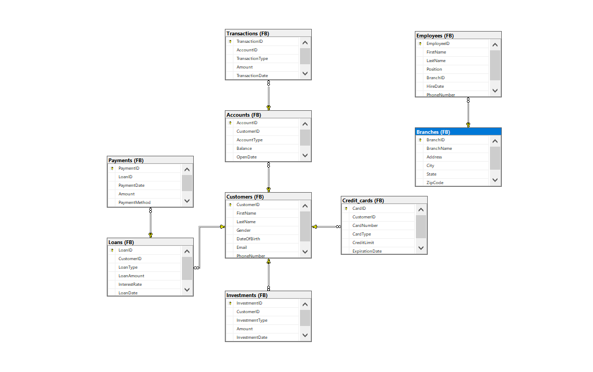

# Comprehensive Banking Data Analysis for Strategic Decision-Making


### PROJECT OVERVIEW

The primary objective of this project is to analyze a banking database to extract actionable insights that support strategic decision-making for bank management. The analysis covers various aspects of the bank's operations, including customer accounts, transactions, loans, investments, and employee data. The goal is to provide a holistic view of the bank's performance, customer behavior, and operational efficiency to drive targeted marketing, risk management, and resource optimization.

---------------------------------------------------------------------------------------------------------------------------------------------------------------------------------------------------------------------------------------------------------------------------------
### Key Business Goals
1.  #### Customer Insights:
     -  Identify high-value customers and their account balances.
     -  Understand customer transaction behavior and investment preferences.
     -  Segment customers based on account activity, balances, and investment amounts.
2.  #### Operational Efficiency:
     -  Analyze transaction volumes and patterns to optimize resource allocation.
     -  Monitor loan repayment status and identify potential defaults.
     -  Assess branch-specific performance and staffing needs.
3.  #### Risk Management:
     -  Evaluate credit risk by analyzing outstanding loan amounts and repayment trends
     -  Identify dormant accounts and inactive customers for reactivation strategies.
4.  #### Product and Service Optimization:
     -  Understand the popularity of different account types, loan products, and investment options.
     -  Tailor financial products and services based on customer segments and preferences.
5.  #### Strategic Planning:
     -  Track Year-over-Year growth in investments and loans.
     -  Plan marketing campaigns and customer retention strategies based on transaction and investment trends.
  
-----------------------------------------------------------------------------------------------------------------------------------------------------------------------------------------------------------------------------------------------------------------------------

### Scope of Analysis:

The analysis covers the following key areas of the banking database:
1.  #### Customer Accounts:
      -  Account balances, types, and activity.
      -  High-value customers and low-balance accounts.
2.  #### Transactions:
      -  Monthly transaction volumes and trends.
      -  Deposits, withdrawals, and credit card transactions.
3.  ####  Loans:
      -  Loan approvals, repayment status, and outstanding amounts.
      -  Interest rates and loan types.
4.  #### Investments:
      -  Customer investment profiles and trends.
      -  Popular investment types (e.g., stocks, mutual funds, bonds).
5.  #### Employees:
      - Branch-specific employee lists and roles.
      - Hiring trends and workforce composition.
6.  #### Credit Cards:
      -  Total credit cards issued and average credit limits.
      -  Expiring credit cards and customer notifications.
  
-----------------------------------------------------------------------------------------------------------------------------------------------------------------------------------------------------------------------------------------------------------------------------

#### Methodology:
The analysis is performed using SQL queries to extract, aggregate, and analyze data from the banking database. Key methodologies include:
-    **Data Aggregation**:Summarizing data (e.g., total deposits, average balances, transaction counts).
-    **Filtering and Segmentation**: Identifying specific customer segments (e.g., high-value customers, inactive accounts).
-    **Trend Analysis**: Tracking Year-over-Year growth in investments and loans.
-    **Conditional Logic**: Using CASE statements for customer segmentation and loan repayment status.
-    **Joins and Subqueries**: Combining data from multiple tables (e.g., customers, accounts, transactions).

-----------------------------------------------------------------------------------------------------------------------------------------------------------------------------------------------------------------------------------------------------------------------------

### Data source:

The database, Table  are found here [FianceDB](https://github.com/Idris-lawal/ABC-Bank/blob/main/Finance%20and%20bank.sql). Containing the codes of creating the database, tables and inserting values into the tables.





------------------------------------------------------------------------------------------------------------------------------------------------------------------------------------------------------------------------------

### Tools and Technologies:
- **Database**: Relational database ( Microsoft SQL Server)
- **SQL**: For querying and analyzing data.

------------------------------------------------------------------------------------------------------------------------------------------------------------------------------------------------------------------------------
### EXPLORATORY DATA ANALYSIS

1. ### Business Scenario Q1
     **Customer Account Balances Overview**
  The bank management wants to have a comprehensive view of all customers along with their account details and current balances. This information is crucial for identifying high-value customers, understanding the distribution of account balances,and planning targeted marketing campaigns. 

```sql
          SELECT C.CustomerID,CONCAT(C.FirstName,' ',C.LastName) As Fullname,a.AccountType,Round(Sum(isnull(a.Balance,0)),2) as current_balance
          ,DATEDIFF(YY,A.OpenDate,GETDATE()) as Years_of_account
          FROM FB.Customers C
          JOIN FB.Accounts A ON A.CustomerID = C.CustomerID
          GROUP BY C.CustomerID,C.FirstName,C.LastName,a.AccountType,DATEDIFF(YY,A.OpenDate,GETDATE())
          ORDER BY Fullname

```
### Below is the output of the query
#### Customer Account Details

| CustomerID | Fullname      | AccountNumber | AccountType | Current Balance | Years of Account |
|------------|---------------|---------------|-------------|-----------------|------------------|
| C0056      | Alex Brown    | A0645         | Checking    | 7897.81         | 22               |
| C0058      | Alex Brown    | A0543         | Savings     | 8961.45         | 14               |
| C0058      | Alex Brown    | A0248         | Savings     | 8611.61         | 15               |
| C0058      | Alex Brown    | A0608         | Checking    | 6862.93         | 6                |
| C0061      | Alex Brown    | A0230         | Credit      | 7967.77         | 4                |
| C0061      | Alex Brown    | A0290         | Credit      | 1455.61         | 23               |
| C0227      | Alex Brown    | A0026         | Checking    | 3568.44         | 12               |
| C0299      | Alex Brown    | A0382         | Checking    | 6980.09         | 22               |
| C0326      | Alex Brown    | A0476         | Savings     | 2335.95         | 13               |
| C0326      | Alex Brown    | A0309         | Credit      | 9176.24         | 14               |
| C0399      | Alex Brown    | A0899         | Credit      | 640.57          | 17               |
| C0399      | Alex Brown    | A0390         | Checking    | 1813.41         | 15               |
| C0416      | Alex Brown    | A0435         | Checking    | 2445.44         | 10               |
| C0482      | Alex Brown    | A0208         | Credit      | 6257.7          | 11               |
| C0489      | Alex Brown    | A0542         | Credit      | 5766.21         | 23               |
| C0514      | Alex Brown    | A0461         | Credit      | 0               | 4                |
| C0493      | Alex Brown    | A1000         | Savings     | 3316.5          | 8                |
| C0653      | Alex Brown    | A0633         | Savings     | 8601.05         | 14               |
| C0653      | Alex Brown    | A0926         | Savings     | 5067.67         | 5                |
| C0778      | Alex Brown    | A0568         | Savings     | 2122.08         | 19               |
| C0779      | Alex Brown    | A0984         | Savings     | 7962.09         | 8                |
| C0865      | Alex Brown    | A0859         | Checking    | 1697.22         | 21               |
| C0867      | Alex Brown    | A0457         | Credit      | 5280.83         | 17               |
| C0875      | Alex Brown    | A0748         | Credit      | 7209.57         | 8                |
| C0875      | Alex Brown    | A0894         | Savings     | 7421.53         | 9                |
| C0890      | Alex Brown    | A0420         | Checking    | 8992.96         | 17               |
| C0973      | Alex Brown    | A0215         | Credit      | 0               | 14               |
| C0973      | Alex Brown    | A0381         | Savings     | 2813.72         | 14               |
| C0973      | Alex Brown    | A0374         | Savings     | 8569.21         | 24               |
| C0973      | Alex Brown    | A0854         | Savings     | 3608.57         | 3                |
| C0978      | Alex Davis    | A0821         | Credit      | 8497.97         | 23               |
| C0978      | Alex Davis    | A0164         | Savings     | 7932.66         | 16               |
| C0863      | Alex Davis    | A0082         | Savings     | 5616.07         | 5                |
| C0912      | Alex Davis    | A0163         | Savings     | 3645.78         | 6                |
| C0931      | Alex Davis    | A0443         | Savings     | 4318.73         | 7                |
| C0934      | Alex Davis    | A0524         | Checking    | 9137.8          | 13               |
| C0799      | Alex Davis    | A0781         | Savings     | 6536.3          | 16               |
| C0788      | Alex Davis    | A0232         | Savings     | 7163.46         | 5                |
| C0667      | Alex Davis    | A0031         | Credit      | 494.4           | 19               |
| C0667      | Alex Davis    | A0254         | Checking    | 6996.3          | 5                |
| C0667      | Alex Davis    | A0451         | Credit      | 1312.22         | 5                |
| C0637      | Alex Davis    | A0724         | Credit      | 1475.07         | 17               |
| C0637      | Alex Davis    | A0915         | Credit      | 6644.16         | 18               |
| C0637      | Alex Davis    | A0105         | Credit      | 4219.4          | 18               |
| C0681      | Alex Davis    | A0076         | Credit      | 7838.76         | 9                |
| C0681      | Alex Davis    | A0338         | Checking    | 8190.03         | 5                |
| C0488      | Alex Davis    | A0768         | Checking    | 1331.68         | 22               |
| C0554      | Alex Davis    | A0653         | Savings     | 6564.11         | 12               |
| C0618      | Alex Davis    | A0803         | Checking    | 6773.5          | 9                |
| C0632      | Alex Davis    | A0301         | Checking    | 0               | 8                |
| C0632      | Alex Davis    | A0008         | Savings     | 9679.44         | 19               |
| C0632      | Alex Davis    | A0715         | Checking    | 9477.21         | 15               |
| C0632      | Alex Davis    | A0827         | Credit      | 3952.23         | 24               |
| C0632      | Alex Davis    | A0957         | Credit      | 6655.87         | 18               |
| C0417      | Alex Davis    | A0389         | Credit      | 473.66          | 8                |
| C0470      | Alex Davis    | A0363         | Checking    | 5776.09         | 23               |
| C0470      | Alex Davis    | A0222         | Credit      | 3669.54         | 17               |
| C0389      | Alex Davis    | A0998         | Credit      | 3761.47         | 4                |
| C0391      | Alex Davis    | A0891         | Checking    | 5059.52         | 12               |
| C0307      | Alex Davis    | A0716         | Credit      | 2853.26         | 12               |
| C0252      | Alex Davis    | A0820         | Checking    | 6145.95         | 20               |
| C0228      | Alex Davis    | A0108         | Credit      | 8904.21         | 25               |
| C0228      | Alex Davis    | A0155         | Checking    | 4633.21         | 14               |
| C0228      | Alex Davis    | A0243         | Checking    | 1804.43         | 7                |
| C0228      | Alex Davis    | A0263         | Credit      | 1807.25         | 10               |
| C0032      | Alex Davis    | A0351         | Savings     | 2693.28         | 7                |
| C0011      | Alex Doe      | A0486         | Savings     | 5868.02         | 21               |
| C0082      | Alex Doe      | A0120         | Savings     | 4486.49         | 9                |
| C0082      | Alex Doe      | A0532         | Credit      | 3593.75         | 10               |
| C0082      | Alex Doe      | A0851         | Savings     | 4906.1          | 12               |
| C0106      | Alex Doe      | A0769         | Credit      | 4451.89         | 5                |
| C0106      | Alex Doe      | A0850         | Credit      | 0               | 9                |
| C0154      | Alex Doe      | A0357         | Credit      | 601.97          | 5                |
| C0154      | Alex Doe      | A0143         | Checking    | 241.72          | 7                |
| C0170      | Alex Doe      | A0638         | Savings     | 5029.28         | 15               |
| C0170      | Alex Doe      | A0399         | Credit      | 2014.85         | 5                |
| C0170      | Alex Doe      | A0283         | Credit      | 1592.37         | 6                |
| C0174      | Alex Doe      | A0799         | Checking    | 9629.15         | 13               |
| C0184      | Alex Doe      | A0523         | Credit      | 1818.23         | 8                |
| C0293      | Alex Doe      | A0593         | Credit      | 4600.82         | 21               |
| C0318      | Alex Doe      | A0332         | Credit      | 1079.47         | 6                |
| C0318      | Alex Doe      | A0152         | Credit      | 820.98          | 22               |
| C0335      | Alex Doe      | A0012         | Credit      | 2666.09         | 17               |
| C0335      | Alex Doe      | A0160         | Savings     | 4003.93         | 20               |
| C0335      | Alex Doe      | A0247         | Savings     | 8484.82         | 9                |
| C0335      | Alex Doe      | A0708         | Checking    | 5756.83         | 13               |
| C0335      | Alex Doe      | A0958         | Checking    | 1808.18         | 15               |
| C0341      | Alex Doe      | A0517         | Checking    | 9541.36         | 7                |
| C0345      | Alex Doe      | A0872         | Savings     | 660.1           | 13               |
| C0345      | Alex Doe      | A0994         | Checking    | 2973.82         | 19               |
| C0364      | Alex Doe      | A0118         | Credit      | 2072.6          | 9                |
| C0566      | Alex Doe      | A0245         | Savings     | 6831.89         | 22               |
| C0566      | Alex Doe      | A0836         | Checking    | 0               | 4                |
| C0672      | Alex Doe      | A0315         | Savings     | 8207.42         | 18               |
| C0672      | Alex Doe      | A0940         | Checking    | 2366.42         | 14               |
| C0661      | Alex Doe      | A0185         | Credit      | 4771.49         | 4                |
| C0713      | Alex Doe      | A0917         | Credit      | 7944.85         | 6                |
| C0809      | Alex Doe      | A0166         | Savings     | 5420.62         | 17               |
| C0972      | Alex Doe      | A0094         | Savings     | 455.7           | 7                |
| C0972      | Alex Doe      | A0167         | Savings     | 5765.72         | 18               |
| C0964      | Alex Doe      | A0564         | Credit      | 1182.8          | 16               |
| C0964      | Alex Doe      | A0784         | Savings     | 2708.56         | 20               |
| C0987      | Alex Smith    | A0657         | Checking    | 8567.2          | 7                |
| C0987      | Alex Smith    | A0369         | Credit      | 4598.34         | 25               |
| C0987      | Alex Smith    | A0471         | Savings     | 5249.67         | 4                |
| C0836      | Alex Smith    | A0291         | Checking    | 4494.53         | 4                |
| C0922      | Alex Smith    | A0749         | Credit      | 430.62          | 8                |
| C0721      | Alex Smith    | A0668         | Checking    | 1697.97         | 17               |
| C0769      | Alex Smith    | A0577         | Checking    | 6801.04         | 11               |
| C0622      | Alex Smith    | A0003         | Checking    | 1473.64         | 15               |
| C0535      | Alex Smith    | A0787         | Credit      | 8097.98         | 14               |
| C0510      | Alex Smith    | A0085         | Credit      | 4370.89         | 9                |
| C0510      | Alex Smith    | A0735         | Credit      | 541.97          | 11               |
| C0340      | Alex Smith    | A0651         | Checking    | 6516.68         | 20               |
| C0306      | Alex Smith    | A0782         | Checking    | 247.76          | 15               |
| C0298      | Alex Smith    | A0737         | Checking    | 9599.05         | 17               |
| C0295      | Alex Smith    | A0502         | Credit      | 341.46          | 7                |
| C0296      | Alex Smith    | A0397         | Checking    | 9050.94         | 19               |
| C0296      | Alex Smith    | A0919         | Savings     | 8140.29         | 8                |
| C0186      | Alex Smith    | A0395         | Credit      | 3191.99         | 3                |
| C0195      | Alex Smith    | A0042         | Savings     | 1291.44         | 22               |
| C0195      | Alex Smith    | A0767         | Credit      | 220.87          | 3                |
| C0237      | Alex Taylor   | A0882         | Checking    | 1426.58         | 8                |
| C0034      | Alex Taylor   | A0438         | Credit      | 6996.64         | 3                |
| C0034      | Alex Taylor   | A0180         | Savings     | 0               | 21               |
| C0062      | Alex Taylor   | A0434         | Savings     | 520.57          | 8                |
| C0495      | Alex Taylor   | A0681         | Savings     | 3510.18         | 6                |
| C0609      | Alex Taylor   | A0045         | Savings     | 3030.1          | 19               |
| C0585      | Alex Taylor   | A0534         | Credit      | 8086.35         | 23               |
| C0694      | Alex Taylor   | A0818         | Savings     | 6622.74         | 8                |
| C0735      | Alex Taylor   | A0779         | Savings     | 6171.65         | 20               |
| C0735      | Alex Taylor   | A0498         | Savings     | 7800.9          | 19               |
| C0662      | Alex Taylor   | A0691         | Savings     | 8163.13         | 11               |
| C0662      | Alex Taylor   | A0992         | Checking    | 1117.13         | 8                |
| C0631      | Alex Taylor   | A0387         | Checking    | 5149.77         | 6                |
| C0648      | Alex Taylor   | A0956         | Credit      | 1953.75         | 12               |


### Business Scenario Q2
**High-Value Customers Identification** 
 The bank management wants to identify all customers who have a balance greater than $5,000 in their accounts. This information is critical for understanding the highvalue customer segment, offering them tailored financial products, and providing them with premium customer services.

 ```sql
          SELECT CONCAT(C.FirstName,' ',C.LastName) As Fullname,Round(Sum(isnull(a.Balance,0)),2) as current_balance
          FROM FB.Customers C
          JOIN FB.Accounts A ON A.CustomerID = C.CustomerID
          GROUP BY C.FirstName,C.LastName
          HAVING Round(Sum(isnull(a.Balance,0)),2) > 5000
          ORDER BY current_balance DESC
```
### Below is the output of the query

| Fullname         | Current Balance |
|------------------|-----------------|
| Michelle Davis   | 213754.49       |
| John Brown       | 211897.98       |
| Jane Smith       | 187904.3        |
| Alex Davis       | 182035.02       |
| John Taylor      | 171696.42       |
| Michelle Wilson  | 153490.18       |
| Alex Brown       | 153404.23       |
| Michael Smith    | 149636.47       |
| John Davis       | 146594.43       |
| John Wilson      | 143637.45       |
| Alice Smith      | 143513.8        |
| Jane Brown       | 142572.96       |
| Michael Doe      | 140859.24       |
| Michelle Taylor  | 140764.76       |
| Alex Doe         | 134358.29       |
| Alice Doe        | 133916.66       |
| Jane Taylor      | 133624.57       |
| John Smith       | 133321.48       |
| Jane Doe         | 127537.96       |
| Jane Davis       | 122645.12       |
| Alice Taylor     | 119542.23       |
| Michelle Smith   | 118616.07       |
| Alice Wilson     | 118012.37       |
| Michael Taylor   | 114756.27       |
| John Doe         | 110796.88       |
| Alice Davis      | 110683.47       |
| Alice Brown      | 109393.14       |
| Michelle Doe     | 107219.67       |
| Michael Wilson   | 103865.41       |
| Michael Davis    | 102483.44       |
| Jane Wilson      | 99852.36        |
| Alex Wilson      | 97154.63        |
| Michelle Brown   | 86088.53        |
| Alex Smith       | 84924.33        |
| Michael Brown    | 76635.13        |
| Alex Taylor      | 74198.39        |


The result above shows the list of customers whose balance is greater than 5000


### Business Scenario Q3

**Transactions in 2022**
The bank management wants to analyse all transactions made in the year 2022 to understand customer behaviour, transaction volumes, and financial flows during that period. This analysis will help in identifying trends, detecting anomalies, and planning future strategies.

```sql
	SELECT TransactionID,a.AccountID,CONCAT(C.FirstName,' ',C.LastName) As Fullname, T.TransactionType, Round(isnull(T.Amount,0),2) As Transaction_Amount,
			TransactionDate
	FROM [FB].[Transactions] T JOIN FB.Accounts A ON T.AccountID = A.AccountID
	JOIN FB.Customers C on c.CustomerID = A.CustomerID
	WHERE Year(TransactionDate) = '2022'
	ORDER BY MONTH(TransactionDate) 
	```


Below is the output of the script

| TransactionID | AccountID | Fullname         | TransactionType | Transaction_Amount | TransactionDate           |
|---------------|-----------|------------------|------------------|--------------------|--------------------------|
| T0394         | A0009     | Jane Doe         | Transfer         | 823.42             | 2022-01-09 06:28:10.000  |
| T0475         | A0691     | Alex Taylor      | Transfer         | 497.09             | 2022-01-31 08:19:52.000  |
| T0605         | A0744     | Jane Brown       | Withdrawal       | 598.59             | 2022-01-22 03:51:23.000  |
| T0661         | A0964     | John Smith       | Withdrawal       | 541.07             | 2022-01-22 05:39:51.000  |
| T0709         | A0297     | John Wilson      | Deposit          | 754.97             | 2022-01-25 23:31:35.000  |
| T0753         | A0718     | Michael Davis    | Deposit          | 998.21             | 2022-01-27 08:48:19.000  |
| T0831         | A0156     | John Taylor      | Payment          | 991.5              | 2022-01-29 08:28:35.000  |
| T0655         | A0334     | John Doe         | Transfer         | 227.55             | 2022-02-18 21:48:17.000  |
| T0373         | A0090     | Michelle Wilson  | Deposit          | 430.01             | 2022-02-12 20:13:03.000  |
| T0342         | A0596     | Alice Smith      | Transfer         | 888.17             | 2022-03-16 01:33:45.000  |
| T0199         | A0031     | Alex Davis       | Payment          | 174.53             | 2022-03-04 18:29:31.000  |
| T0638         | A0142     | Alice Davis      | Deposit          | 784.45             | 2022-03-16 08:34:23.000  |
| T0782         | A0102     | Michelle Taylor  | Withdrawal       | 636.26             | 2022-03-23 23:48:56.000  |
| T0573         | A0048     | Jane Brown       | Payment          | 655.17             | 2022-03-03 14:09:31.000  |
| T0583         | A0681     | Alex Taylor      | Transfer         | 253.34             | 2022-03-11 21:49:19.000  |
| T0935         | A0379     | Jane Davis       | Payment          | 669.29             | 2022-03-20 02:32:23.000  |
| T0824         | A0053     | Jane Smith       | Withdrawal       | 284.62             | 2022-03-21 15:29:29.000  |
| T0986         | A0909     | Michael Davis    | Withdrawal       | 395.47             | 2022-04-10 08:17:31.000  |
| T0300         | A0665     | Jane Smith       | Deposit          | 694.32             | 2022-04-14 10:01:25.000  |
| T0301         | A0326     | Alice Davis      | Payment          | 0                  | 2022-04-07 05:01:01.000  |
| T0104         | A0851     | Alex Doe         | Payment          | 393.25             | 2022-04-06 00:27:19.000  |
| T0434         | A0251     | Michael Smith    | Transfer         | 507.37             | 2022-05-30 15:55:32.000  |
| T0447         | A0858     | Alice Brown      | Transfer         | 834.63             | 2022-05-24 12:29:18.000  |
| T0367         | A0524     | Alex Davis       | Deposit          | 214.38             | 2022-05-02 16:25:50.000  |
| T0375         | A0436     | John Wilson      | Payment          | 824.57             | 2022-05-01 18:51:36.000  |
| T0377         | A0180     | Alex Taylor      | Transfer         | 143.82             | 2022-05-27 06:35:36.000  |
| T0543         | A0287     | John Taylor      | Transfer         | 935.76             | 2022-05-03 15:42:31.000  |
| T0544         | A0889     | Jane Taylor      | Payment          | 663.97             | 2022-05-14 16:53:31.000  |
| T0936         | A0844     | John Wilson      | Withdrawal       | 370.45             | 2022-05-07 19:09:32.000  |
| T0953         | A0898     | Jane Brown       | Withdrawal       | 808.21             | 2022-05-18 21:17:46.000  |
| T0510         | A0426     | Alex Wilson      | Withdrawal       | 780.37             | 2022-06-22 15:04:34.000  |
| T0414         | A0822     | Jane Taylor      | Payment          | 647.53             | 2022-06-16 19:50:48.000  |
| T0466         | A0402     | Alice Brown      | Withdrawal       | 749.35             | 2022-07-30 10:13:44.000  |
| T0478         | A0258     | Alice Smith      | Transfer         | 0                  | 2022-07-23 13:35:49.000  |
| T0779         | A0221     | Jane Davis       | Withdrawal       | 26.85              | 2022-07-09 10:29:50.000  |
| T0608         | A0146     | John Smith       | Transfer         | 556.65             | 2022-08-12 15:21:34.000  |
| T0293         | A0960     | Jane Davis       | Payment          | 258.88             | 2022-08-24 03:53:46.000  |
| T0396         | A0024     | Alice Wilson     | Deposit          | 917.59             | 2022-09-24 03:07:56.000  |
| T0515         | A0797     | Jane Brown       | Transfer         | 603.28             | 2022-09-03 15:04:54.000  |
| T0551         | A0970     | Alice Brown      | Withdrawal       | 211.66             | 2022-09-04 16:29:06.000  |
| T0796         | A0026     | Alex Brown       | Withdrawal       | 967.22             | 2022-10-08 13:48:55.000  |
| T0691         | A0003     | Alex Smith       | Payment          | 114.06             | 2022-10-14 17:35:36.000  |
| T0413         | A0969     | Jane Wilson      | Transfer         | 466.61             | 2022-10-12 19:28:23.000  |
| T0312         | A0095     | Alice Taylor     | Deposit          | 189.95             | 2022-10-22 20:56:24.000  |
| T0846         | A0386     | Alice Brown      | Deposit          | 410.65             | 2022-11-14 09:51:23.000  |

The table above shows the list of transactions performed in 2022 by customers

### Business Scenario Q4
**Monthly Deposit Summary**
The bank management wants to calculate the total amount deposited in all accounts for the month of May 2022. This information is essential for monitoring cash inflows, assessing the bank's liquidity position, and planning for future financial needs

```sql
	SELECT Round(Sum(isnull(Amount,0)),2) As _total_deposit_may
	FROM FB.Transactions 
	WHERE Year(TransactionDate)= '2022' and Month(TransactionDate) = 5 and TransactionType = 'Deposit'

```


### Business Scenario Q5
**Customer Loan Details**
The bank management wants to retrieve the details of all loans taken by a customer with ID “C0768”. This information is crucial for understanding the customer's borrowing behaviour, managing their credit risk, and providing them with tailored loan products.

```sql
		SELECT l.LoanID,L.CustomerID, CONCAT(C.FirstName,' ',C.LastName) As Fullname, L.LoanType,ROUND(LoanAmount,2) as loanAmount
				, Round(InterestRate,2) InterestRate, LoanDate
		FROM [FB].[Loans] L JOIN FB.Customers C on L.CustomerID = c.CustomerID 
		WHERE l.CustomerID = 'C0768'
```
