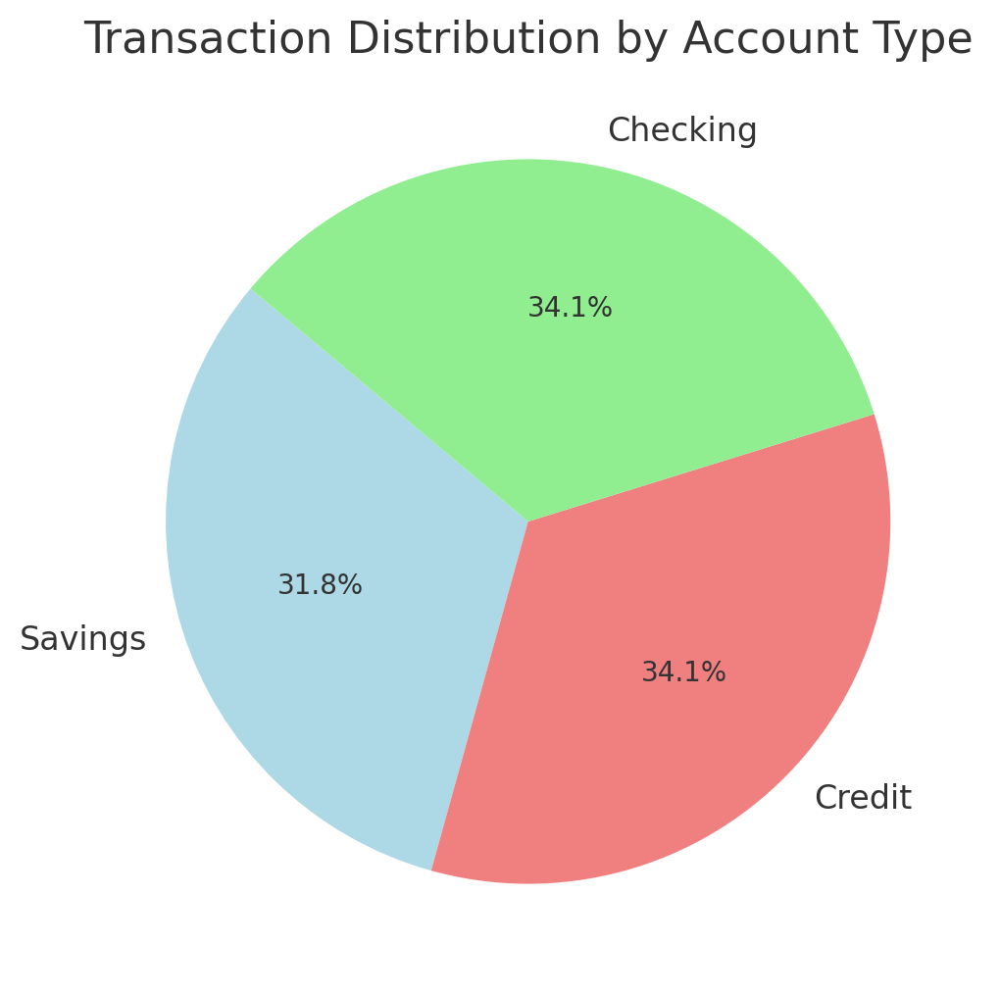

# Comprehensive Banking Data Analysis for Strategic Decision-Making


### PROJECT OVERVIEW

The primary objective of this project is to analyze a banking database to extract actionable insights that support strategic decision-making for bank management. The analysis covers various aspects of the bank's operations, including customer accounts, transactions, loans, investments, and employee data. The goal is to provide a holistic view of the bank's performance, customer behavior, and operational efficiency to drive targeted marketing, risk management, and resource optimization.

---------------------------------------------------------------------------------------------------------------------------------------------------------------------------------------------------------------------------------------------------------------------------------
### Key Business Goals
1.  #### Customer Insights:
     -  Identify high-value customers and their account balances.
     -  Understand customer transaction behavior and investment preferences.
     -  Segment customers based on account activity, balances, and investment amounts.
2.  #### Operational Efficiency:
     -  Analyze transaction volumes and patterns to optimize resource allocation.
     -  Monitor loan repayment status and identify potential defaults.
     -  Assess branch-specific performance and staffing needs.
3.  #### Risk Management:
     -  Evaluate credit risk by analyzing outstanding loan amounts and repayment trends
     -  Identify dormant accounts and inactive customers for reactivation strategies.
4.  #### Product and Service Optimization:
     -  Understand the popularity of different account types, loan products, and investment options.
     -  Tailor financial products and services based on customer segments and preferences.
5.  #### Strategic Planning:
     -  Track Year-over-Year growth in investments and loans.
     -  Plan marketing campaigns and customer retention strategies based on transaction and investment trends.
  
-----------------------------------------------------------------------------------------------------------------------------------------------------------------------------------------------------------------------------------------------------------------------------

### Scope of Analysis:

The analysis covers the following key areas of the banking database:
1.  #### Customer Accounts:
      -  Account balances, types, and activity.
      -  High-value customers and low-balance accounts.
2.  #### Transactions:
      -  Monthly transaction volumes and trends.
      -  Deposits, withdrawals, and credit card transactions.
3.  ####  Loans:
      -  Loan approvals, repayment status, and outstanding amounts.
      -  Interest rates and loan types.
4.  #### Investments:
      -  Customer investment profiles and trends.
      -  Popular investment types (e.g., stocks, mutual funds, bonds).
5.  #### Employees:
      - Branch-specific employee lists and roles.
      - Hiring trends and workforce composition.
6.  #### Credit Cards:
      -  Total credit cards issued and average credit limits.
      -  Expiring credit cards and customer notifications.
  
-----------------------------------------------------------------------------------------------------------------------------------------------------------------------------------------------------------------------------------------------------------------------------

#### Methodology:
The analysis is performed using SQL queries to extract, aggregate, and analyze data from the banking database. Key methodologies include:
-    **Data Aggregation**:Summarizing data (e.g., total deposits, average balances, transaction counts).
-    **Filtering and Segmentation**: Identifying specific customer segments (e.g., high-value customers, inactive accounts).
-    **Trend Analysis**: Tracking Year-over-Year growth in investments and loans.
-    **Conditional Logic**: Using CASE statements for customer segmentation and loan repayment status.
-    **Joins and Subqueries**: Combining data from multiple tables (e.g., customers, accounts, transactions).

-----------------------------------------------------------------------------------------------------------------------------------------------------------------------------------------------------------------------------------------------------------------------------

### Data source:

The database, Table  are found here [FianceDB](https://github.com/Idris-lawal/ABC-Bank/blob/main/Finance%20and%20bank.sql). Containing the codes of creating the database, tables and inserting values into the tables.


------------------------------------------------------------------------------------------------------------------------------------------------------------------------------------------------------------------------------

### Tools and Technologies:
- **Database**: Relational database ( Microsoft SQL Server)
- **SQL**: For querying and analyzing data.

------------------------------------------------------------------------------------------------------------------------------------------------------------------------------------------------------------------------------
### EXPLORATORY DATA ANALYSIS

1. ### Business Scenario Q1
     **Customer Account Balances Overview**
  The bank management wants to have a comprehensive view of all customers along with their account details and current balances. This information is crucial for identifying high-value customers, understanding the distribution of account balances,and planning targeted marketing campaigns. 

```sql
          SELECT C.CustomerID,CONCAT(C.FirstName,' ',C.LastName) As Fullname,a.AccountType,Round(Sum(isnull(a.Balance,0)),2) as current_balance
          ,DATEDIFF(YY,A.OpenDate,GETDATE()) as Years_of_account
          FROM FB.Customers C
          JOIN FB.Accounts A ON A.CustomerID = C.CustomerID
          GROUP BY C.CustomerID,C.FirstName,C.LastName,a.AccountType,DATEDIFF(YY,A.OpenDate,GETDATE())
          ORDER BY Fullname

```
### Below is the output of the query
#### Customer Account Details

| CustomerID | Fullname      | AccountNumber | AccountType | Current Balance | Years of Account |
|------------|---------------|---------------|-------------|-----------------|------------------|
| C0056      | Alex Brown    | A0645         | Checking    | 7897.81         | 22               |
| C0058      | Alex Brown    | A0543         | Savings     | 8961.45         | 14               |
| C0058      | Alex Brown    | A0248         | Savings     | 8611.61         | 15               |
| C0058      | Alex Brown    | A0608         | Checking    | 6862.93         | 6                |
| C0061      | Alex Brown    | A0230         | Credit      | 7967.77         | 4                |
| C0061      | Alex Brown    | A0290         | Credit      | 1455.61         | 23               |
| C0227      | Alex Brown    | A0026         | Checking    | 3568.44         | 12               |
| C0299      | Alex Brown    | A0382         | Checking    | 6980.09         | 22               |
| C0326      | Alex Brown    | A0476         | Savings     | 2335.95         | 13               |
| C0326      | Alex Brown    | A0309         | Credit      | 9176.24         | 14               |
| C0399      | Alex Brown    | A0899         | Credit      | 640.57          | 17               |
| C0399      | Alex Brown    | A0390         | Checking    | 1813.41         | 15               |
| C0416      | Alex Brown    | A0435         | Checking    | 2445.44         | 10               |
| C0482      | Alex Brown    | A0208         | Credit      | 6257.7          | 11               |
| C0489      | Alex Brown    | A0542         | Credit      | 5766.21         | 23               |
| C0514      | Alex Brown    | A0461         | Credit      | 0               | 4                |
| C0493      | Alex Brown    | A1000         | Savings     | 3316.5          | 8                |
| C0653      | Alex Brown    | A0633         | Savings     | 8601.05         | 14               |
| C0653      | Alex Brown    | A0926         | Savings     | 5067.67         | 5                |
| C0778      | Alex Brown    | A0568         | Savings     | 2122.08         | 19               |
| C0779      | Alex Brown    | A0984         | Savings     | 7962.09         | 8                |
| C0865      | Alex Brown    | A0859         | Checking    | 1697.22         | 21               |
| C0867      | Alex Brown    | A0457         | Credit      | 5280.83         | 17               |
| C0875      | Alex Brown    | A0748         | Credit      | 7209.57         | 8                |
| C0875      | Alex Brown    | A0894         | Savings     | 7421.53         | 9                |
| C0890      | Alex Brown    | A0420         | Checking    | 8992.96         | 17               |
| C0973      | Alex Brown    | A0215         | Credit      | 0               | 14               |
| C0973      | Alex Brown    | A0381         | Savings     | 2813.72         | 14               |
| C0973      | Alex Brown    | A0374         | Savings     | 8569.21         | 24               |
| C0973      | Alex Brown    | A0854         | Savings     | 3608.57         | 3                |
| C0978      | Alex Davis    | A0821         | Credit      | 8497.97         | 23               |
| C0978      | Alex Davis    | A0164         | Savings     | 7932.66         | 16               |
| C0863      | Alex Davis    | A0082         | Savings     | 5616.07         | 5                |
| C0912      | Alex Davis    | A0163         | Savings     | 3645.78         | 6                |
| C0931      | Alex Davis    | A0443         | Savings     | 4318.73         | 7                |
| C0934      | Alex Davis    | A0524         | Checking    | 9137.8          | 13               |
| C0799      | Alex Davis    | A0781         | Savings     | 6536.3          | 16               |
| C0788      | Alex Davis    | A0232         | Savings     | 7163.46         | 5                |
| C0667      | Alex Davis    | A0031         | Credit      | 494.4           | 19               |
| C0667      | Alex Davis    | A0254         | Checking    | 6996.3          | 5                |
| C0667      | Alex Davis    | A0451         | Credit      | 1312.22         | 5                |
| C0637      | Alex Davis    | A0724         | Credit      | 1475.07         | 17               |
| C0637      | Alex Davis    | A0915         | Credit      | 6644.16         | 18               |
| C0637      | Alex Davis    | A0105         | Credit      | 4219.4          | 18               |
| C0681      | Alex Davis    | A0076         | Credit      | 7838.76         | 9                |
| C0681      | Alex Davis    | A0338         | Checking    | 8190.03         | 5                |
| C0488      | Alex Davis    | A0768         | Checking    | 1331.68         | 22               |
| C0554      | Alex Davis    | A0653         | Savings     | 6564.11         | 12               |
| C0618      | Alex Davis    | A0803         | Checking    | 6773.5          | 9                |
| C0632      | Alex Davis    | A0301         | Checking    | 0               | 8                |
| C0632      | Alex Davis    | A0008         | Savings     | 9679.44         | 19               |
| C0632      | Alex Davis    | A0715         | Checking    | 9477.21         | 15               |
| C0632      | Alex Davis    | A0827         | Credit      | 3952.23         | 24               |
| C0632      | Alex Davis    | A0957         | Credit      | 6655.87         | 18               |
| C0417      | Alex Davis    | A0389         | Credit      | 473.66          | 8                |
| C0470      | Alex Davis    | A0363         | Checking    | 5776.09         | 23               |
| C0470      | Alex Davis    | A0222         | Credit      | 3669.54         | 17               |
| C0389      | Alex Davis    | A0998         | Credit      | 3761.47         | 4                |
| C0391      | Alex Davis    | A0891         | Checking    | 5059.52         | 12               |
| C0307      | Alex Davis    | A0716         | Credit      | 2853.26         | 12               |
| C0252      | Alex Davis    | A0820         | Checking    | 6145.95         | 20               |
| C0228      | Alex Davis    | A0108         | Credit      | 8904.21         | 25               |
| C0228      | Alex Davis    | A0155         | Checking    | 4633.21         | 14               |
| C0228      | Alex Davis    | A0243         | Checking    | 1804.43         | 7                |
| C0228      | Alex Davis    | A0263         | Credit      | 1807.25         | 10               |
| C0032      | Alex Davis    | A0351         | Savings     | 2693.28         | 7                |
| C0011      | Alex Doe      | A0486         | Savings     | 5868.02         | 21               |
| C0082      | Alex Doe      | A0120         | Savings     | 4486.49         | 9                |
| C0082      | Alex Doe      | A0532         | Credit      | 3593.75         | 10               |
| C0082      | Alex Doe      | A0851         | Savings     | 4906.1          | 12               |
| C0106      | Alex Doe      | A0769         | Credit      | 4451.89         | 5                |
| C0106      | Alex Doe      | A0850         | Credit      | 0               | 9                |
| C0154      | Alex Doe      | A0357         | Credit      | 601.97          | 5                |
| C0154      | Alex Doe      | A0143         | Checking    | 241.72          | 7                |
| C0170      | Alex Doe      | A0638         | Savings     | 5029.28         | 15               |
| C0170      | Alex Doe      | A0399         | Credit      | 2014.85         | 5                |
| C0170      | Alex Doe      | A0283         | Credit      | 1592.37         | 6                |
| C0174      | Alex Doe      | A0799         | Checking    | 9629.15         | 13               |
| C0184      | Alex Doe      | A0523         | Credit      | 1818.23         | 8                |
| C0293      | Alex Doe      | A0593         | Credit      | 4600.82         | 21               |
| C0318      | Alex Doe      | A0332         | Credit      | 1079.47         | 6                |
| C0318      | Alex Doe      | A0152         | Credit      | 820.98          | 22               |
| C0335      | Alex Doe      | A0012         | Credit      | 2666.09         | 17               |
| C0335      | Alex Doe      | A0160         | Savings     | 4003.93         | 20               |
| C0335      | Alex Doe      | A0247         | Savings     | 8484.82         | 9                |
| C0335      | Alex Doe      | A0708         | Checking    | 5756.83         | 13               |
| C0335      | Alex Doe      | A0958         | Checking    | 1808.18         | 15               |
| C0341      | Alex Doe      | A0517         | Checking    | 9541.36         | 7                |
| C0345      | Alex Doe      | A0872         | Savings     | 660.1           | 13               |
| C0345      | Alex Doe      | A0994         | Checking    | 2973.82         | 19               |
| C0364      | Alex Doe      | A0118         | Credit      | 2072.6          | 9                |
| C0566      | Alex Doe      | A0245         | Savings     | 6831.89         | 22               |
| C0566      | Alex Doe      | A0836         | Checking    | 0               | 4                |
| C0672      | Alex Doe      | A0315         | Savings     | 8207.42         | 18               |
| C0672      | Alex Doe      | A0940         | Checking    | 2366.42         | 14               |
| C0661      | Alex Doe      | A0185         | Credit      | 4771.49         | 4                |
| C0713      | Alex Doe      | A0917         | Credit      | 7944.85         | 6                |
| C0809      | Alex Doe      | A0166         | Savings     | 5420.62         | 17               |
| C0972      | Alex Doe      | A0094         | Savings     | 455.7           | 7                |
| C0972      | Alex Doe      | A0167         | Savings     | 5765.72         | 18               |
| C0964      | Alex Doe      | A0564         | Credit      | 1182.8          | 16               |
| C0964      | Alex Doe      | A0784         | Savings     | 2708.56         | 20               |
| C0987      | Alex Smith    | A0657         | Checking    | 8567.2          | 7                |
| C0987      | Alex Smith    | A0369         | Credit      | 4598.34         | 25               |
| C0987      | Alex Smith    | A0471         | Savings     | 5249.67         | 4                |
| C0836      | Alex Smith    | A0291         | Checking    | 4494.53         | 4                |
| C0922      | Alex Smith    | A0749         | Credit      | 430.62          | 8                |
| C0721      | Alex Smith    | A0668         | Checking    | 1697.97         | 17               |
| C0769      | Alex Smith    | A0577         | Checking    | 6801.04         | 11               |
| C0622      | Alex Smith    | A0003         | Checking    | 1473.64         | 15               |
| C0535      | Alex Smith    | A0787         | Credit      | 8097.98         | 14               |
| C0510      | Alex Smith    | A0085         | Credit      | 4370.89         | 9                |
| C0510      | Alex Smith    | A0735         | Credit      | 541.97          | 11               |
| C0340      | Alex Smith    | A0651         | Checking    | 6516.68         | 20               |
| C0306      | Alex Smith    | A0782         | Checking    | 247.76          | 15               |
| C0298      | Alex Smith    | A0737         | Checking    | 9599.05         | 17               |
| C0295      | Alex Smith    | A0502         | Credit      | 341.46          | 7                |
| C0296      | Alex Smith    | A0397         | Checking    | 9050.94         | 19               |
| C0296      | Alex Smith    | A0919         | Savings     | 8140.29         | 8                |
| C0186      | Alex Smith    | A0395         | Credit      | 3191.99         | 3                |
| C0195      | Alex Smith    | A0042         | Savings     | 1291.44         | 22               |
| C0195      | Alex Smith    | A0767         | Credit      | 220.87          | 3                |
| C0237      | Alex Taylor   | A0882         | Checking    | 1426.58         | 8                |
| C0034      | Alex Taylor   | A0438         | Credit      | 6996.64         | 3                |
| C0034      | Alex Taylor   | A0180         | Savings     | 0               | 21               |
| C0062      | Alex Taylor   | A0434         | Savings     | 520.57          | 8                |
| C0495      | Alex Taylor   | A0681         | Savings     | 3510.18         | 6                |
| C0609      | Alex Taylor   | A0045         | Savings     | 3030.1          | 19               |
| C0585      | Alex Taylor   | A0534         | Credit      | 8086.35         | 23               |
| C0694      | Alex Taylor   | A0818         | Savings     | 6622.74         | 8                |
| C0735      | Alex Taylor   | A0779         | Savings     | 6171.65         | 20               |
| C0735      | Alex Taylor   | A0498         | Savings     | 7800.9          | 19               |
| C0662      | Alex Taylor   | A0691         | Savings     | 8163.13         | 11               |
| C0662      | Alex Taylor   | A0992         | Checking    | 1117.13         | 8                |
| C0631      | Alex Taylor   | A0387         | Checking    | 5149.77         | 6                |
| C0648      | Alex Taylor   | A0956         | Credit      | 1953.75         | 12               |


### Business Scenario Q2
**High-Value Customers Identification** 
 The bank management wants to identify all customers who have a balance greater than $5,000 in their accounts. This information is critical for understanding the highvalue customer segment, offering them tailored financial products, and providing them with premium customer services.

 ```sql
          SELECT CONCAT(C.FirstName,' ',C.LastName) As Fullname,Round(Sum(isnull(a.Balance,0)),2) as current_balance
          FROM FB.Customers C
          JOIN FB.Accounts A ON A.CustomerID = C.CustomerID
          GROUP BY C.FirstName,C.LastName
          HAVING Round(Sum(isnull(a.Balance,0)),2) > 5000
          ORDER BY current_balance DESC
```
### Below is the output of the query

| Fullname         | Current Balance |
|------------------|-----------------|
| Michelle Davis   | 213754.49       |
| John Brown       | 211897.98       |
| Jane Smith       | 187904.3        |
| Alex Davis       | 182035.02       |
| John Taylor      | 171696.42       |
| Michelle Wilson  | 153490.18       |
| Alex Brown       | 153404.23       |
| Michael Smith    | 149636.47       |
| John Davis       | 146594.43       |
| John Wilson      | 143637.45       |
| Alice Smith      | 143513.8        |
| Jane Brown       | 142572.96       |
| Michael Doe      | 140859.24       |
| Michelle Taylor  | 140764.76       |
| Alex Doe         | 134358.29       |
| Alice Doe        | 133916.66       |
| Jane Taylor      | 133624.57       |
| John Smith       | 133321.48       |
| Jane Doe         | 127537.96       |
| Jane Davis       | 122645.12       |
| Alice Taylor     | 119542.23       |
| Michelle Smith   | 118616.07       |
| Alice Wilson     | 118012.37       |
| Michael Taylor   | 114756.27       |
| John Doe         | 110796.88       |
| Alice Davis      | 110683.47       |
| Alice Brown      | 109393.14       |
| Michelle Doe     | 107219.67       |
| Michael Wilson   | 103865.41       |
| Michael Davis    | 102483.44       |
| Jane Wilson      | 99852.36        |
| Alex Wilson      | 97154.63        |
| Michelle Brown   | 86088.53        |
| Alex Smith       | 84924.33        |
| Michael Brown    | 76635.13        |
| Alex Taylor      | 74198.39        |


The result above shows the list of customers whose balance is greater than 5000


### Business Scenario Q3

**Transactions in 2022**
The bank management wants to analyse all transactions made in the year 2022 to understand customer behaviour, transaction volumes, and financial flows during that period. This analysis will help in identifying trends, detecting anomalies, and planning future strategies.

```sql
	SELECT TransactionID,a.AccountID,CONCAT(C.FirstName,' ',C.LastName) As Fullname, T.TransactionType, Round(isnull(T.Amount,0),2) As Transaction_Amount,
			TransactionDate
	FROM [FB].[Transactions] T JOIN FB.Accounts A ON T.AccountID = A.AccountID
	JOIN FB.Customers C on c.CustomerID = A.CustomerID
	WHERE Year(TransactionDate) = '2022'
	ORDER BY MONTH(TransactionDate) 
```


Below is the output of the script

| TransactionID | AccountID | Fullname         | TransactionType | Transaction_Amount | TransactionDate           |
|---------------|-----------|------------------|------------------|--------------------|--------------------------|
| T0394         | A0009     | Jane Doe         | Transfer         | 823.42             | 2022-01-09 06:28:10.000  |
| T0475         | A0691     | Alex Taylor      | Transfer         | 497.09             | 2022-01-31 08:19:52.000  |
| T0605         | A0744     | Jane Brown       | Withdrawal       | 598.59             | 2022-01-22 03:51:23.000  |
| T0661         | A0964     | John Smith       | Withdrawal       | 541.07             | 2022-01-22 05:39:51.000  |
| T0709         | A0297     | John Wilson      | Deposit          | 754.97             | 2022-01-25 23:31:35.000  |
| T0753         | A0718     | Michael Davis    | Deposit          | 998.21             | 2022-01-27 08:48:19.000  |
| T0831         | A0156     | John Taylor      | Payment          | 991.5              | 2022-01-29 08:28:35.000  |
| T0655         | A0334     | John Doe         | Transfer         | 227.55             | 2022-02-18 21:48:17.000  |
| T0373         | A0090     | Michelle Wilson  | Deposit          | 430.01             | 2022-02-12 20:13:03.000  |
| T0342         | A0596     | Alice Smith      | Transfer         | 888.17             | 2022-03-16 01:33:45.000  |
| T0199         | A0031     | Alex Davis       | Payment          | 174.53             | 2022-03-04 18:29:31.000  |
| T0638         | A0142     | Alice Davis      | Deposit          | 784.45             | 2022-03-16 08:34:23.000  |
| T0782         | A0102     | Michelle Taylor  | Withdrawal       | 636.26             | 2022-03-23 23:48:56.000  |
| T0573         | A0048     | Jane Brown       | Payment          | 655.17             | 2022-03-03 14:09:31.000  |
| T0583         | A0681     | Alex Taylor      | Transfer         | 253.34             | 2022-03-11 21:49:19.000  |
| T0935         | A0379     | Jane Davis       | Payment          | 669.29             | 2022-03-20 02:32:23.000  |
| T0824         | A0053     | Jane Smith       | Withdrawal       | 284.62             | 2022-03-21 15:29:29.000  |
| T0986         | A0909     | Michael Davis    | Withdrawal       | 395.47             | 2022-04-10 08:17:31.000  |
| T0300         | A0665     | Jane Smith       | Deposit          | 694.32             | 2022-04-14 10:01:25.000  |
| T0301         | A0326     | Alice Davis      | Payment          | 0                  | 2022-04-07 05:01:01.000  |
| T0104         | A0851     | Alex Doe         | Payment          | 393.25             | 2022-04-06 00:27:19.000  |
| T0434         | A0251     | Michael Smith    | Transfer         | 507.37             | 2022-05-30 15:55:32.000  |
| T0447         | A0858     | Alice Brown      | Transfer         | 834.63             | 2022-05-24 12:29:18.000  |
| T0367         | A0524     | Alex Davis       | Deposit          | 214.38             | 2022-05-02 16:25:50.000  |
| T0375         | A0436     | John Wilson      | Payment          | 824.57             | 2022-05-01 18:51:36.000  |
| T0377         | A0180     | Alex Taylor      | Transfer         | 143.82             | 2022-05-27 06:35:36.000  |
| T0543         | A0287     | John Taylor      | Transfer         | 935.76             | 2022-05-03 15:42:31.000  |
| T0544         | A0889     | Jane Taylor      | Payment          | 663.97             | 2022-05-14 16:53:31.000  |
| T0936         | A0844     | John Wilson      | Withdrawal       | 370.45             | 2022-05-07 19:09:32.000  |
| T0953         | A0898     | Jane Brown       | Withdrawal       | 808.21             | 2022-05-18 21:17:46.000  |
| T0510         | A0426     | Alex Wilson      | Withdrawal       | 780.37             | 2022-06-22 15:04:34.000  |
| T0414         | A0822     | Jane Taylor      | Payment          | 647.53             | 2022-06-16 19:50:48.000  |
| T0466         | A0402     | Alice Brown      | Withdrawal       | 749.35             | 2022-07-30 10:13:44.000  |
| T0478         | A0258     | Alice Smith      | Transfer         | 0                  | 2022-07-23 13:35:49.000  |
| T0779         | A0221     | Jane Davis       | Withdrawal       | 26.85              | 2022-07-09 10:29:50.000  |
| T0608         | A0146     | John Smith       | Transfer         | 556.65             | 2022-08-12 15:21:34.000  |
| T0293         | A0960     | Jane Davis       | Payment          | 258.88             | 2022-08-24 03:53:46.000  |
| T0396         | A0024     | Alice Wilson     | Deposit          | 917.59             | 2022-09-24 03:07:56.000  |
| T0515         | A0797     | Jane Brown       | Transfer         | 603.28             | 2022-09-03 15:04:54.000  |
| T0551         | A0970     | Alice Brown      | Withdrawal       | 211.66             | 2022-09-04 16:29:06.000  |
| T0796         | A0026     | Alex Brown       | Withdrawal       | 967.22             | 2022-10-08 13:48:55.000  |
| T0691         | A0003     | Alex Smith       | Payment          | 114.06             | 2022-10-14 17:35:36.000  |
| T0413         | A0969     | Jane Wilson      | Transfer         | 466.61             | 2022-10-12 19:28:23.000  |
| T0312         | A0095     | Alice Taylor     | Deposit          | 189.95             | 2022-10-22 20:56:24.000  |
| T0846         | A0386     | Alice Brown      | Deposit          | 410.65             | 2022-11-14 09:51:23.000  |

The table above shows the list of transactions performed in 2022 by customers

### Business Scenario Q4
**Monthly Deposit Summary**
The bank management wants to calculate the total amount deposited in all accounts for the month of May 2022. This information is essential for monitoring cash inflows, assessing the bank's liquidity position, and planning for future financial needs

```sql
	SELECT Round(Sum(isnull(Amount,0)),2) As _total_deposit_may
	FROM FB.Transactions 
	WHERE Year(TransactionDate)= '2022' and Month(TransactionDate) = 5 and TransactionType = 'Deposit'

```

Below is the result of the scripts

| _total_deposit_may |
|--------------------|
| 214.38            |


### Business Scenario Q5
**Customer Loan Details**
The bank management wants to retrieve the details of all loans taken by a customer with ID “C0768”. This information is crucial for understanding the customer's borrowing behaviour, managing their credit risk, and providing them with tailored loan products.

```sql
		SELECT l.LoanID,L.CustomerID, CONCAT(C.FirstName,' ',C.LastName) As Fullname, L.LoanType,ROUND(LoanAmount,2) as loanAmount
				, Round(InterestRate,2) InterestRate, LoanDate
		FROM [FB].[Loans] L JOIN FB.Customers C on L.CustomerID = c.CustomerID 
		WHERE l.CustomerID = 'C0768'
```

Below is the output of the scripts above 
| LoanID | CustomerID | Fullname       | LoanType  | LoanAmount | InterestRate | LoanDate                   |
|--------|-----------|---------------|-----------|------------|--------------|----------------------------|
| L0597  | C0768     | Michael Brown | Mortgage  | 47841.77   | 7.34         | 2000-08-31 05:18:12.0000000 |
| L0769  | C0768     | Michael Brown | Student   | 34793.9    | 7.82         | 2014-05-08 06:09:17.0000000 |


###  Business Scenario Q6
**Branch-Specific Employee List**
The bank management wants to retrieve a list of all employees working in a branch having an ID “B0851”. This information is useful for branch managers to understand their team composition, manage human resources effectively, and plan for staffing needs

```sql
		SELECT E.* FROM FB.Branches B JOIN [FB].[Employees] E on E.BranchID = b.BranchID
		WHERE b.BranchID = 'B0851'
		
		SELECT * FROM FB.Employees 
		WHERE BranchID = 'B0851'
```
Below is the output of the error

| EmployeeID | FirstName | LastName | Position          | BranchID | HireDate                   | PhoneNumber |
|-----------|----------|---------|------------------|---------|--------------------------|------------|
| E0758     | James    | Jones   | Customer Service | B0851   | 2020-02-09 14:12:57.0000000 | 555-02758  |


### Business Scenario Q7
**Total Credit Cards Issued**
The bank management wants to determine the total number of credit cards issued by the bank. This information is important for understanding the bank's reach in the credit card market, evaluating the success of their credit card products, and planning future marketing campaigns.

```sql
	SELECT Count(distinct(CardID)) as Total_Number_Of_card  FROM [FB].[Credit_cards]
```
Below is the output of the query
| Total_Number_Of_Card |
|----------------------|
| 1000                |

The Bank has issued 1000 credit cards to the customers

### Business Scenario Q8
**Average Interest Rate for Loans**
The bank management wants to calculate the average interest rate for all loans. This information is essential for assessing the overall cost of borrowing for customers,comparing it with industry benchmarks, and making decisions about future loan product offerings and interest rate adjustments.

```sql 
	SELECT Round(Avg(isnull(InterestRate,0)),2) As Avg_interest_rate FROM FB.Loans
```

Below is the output

| Avg_Interest_Rate |
|------------------|
| 4.98            |

The bank gives average of 4.98% as interest rate


### Business Scenario Q9
**Active Customers in 2020**
The bank management wants to identify and retrieve the details of all customers who have made at least one transaction in the year 2020. This information is valuable for understanding customer activity, identifying engaged customers, and planning targeted marketing and customer retention strategies.

```sql
	SELECT CONCAT(c.FirstName,' ', C.LastName) aS FullName,A.AccountID, TransactionType,Round(SUM(isnull(t.Amount,0)),2) as Transaction_Amount, TransactionDate
	FROM FB.Transactions T JOIN FB.Accounts A on a.AccountID = T.AccountID
	JOIN fb.Customers c ON c.CustomerID = a.CustomerID
	WHERE TransactionDate BETWEEN '2020-01-01' AND '2020-12-31'
	GROUP BY CONCAT(c.FirstName,' ', C.LastName),A.AccountID, TransactionDate,TransactionType
	HAVING Count(t.TransactionID) >= 0
```
Belew is the output 

| FullName        | AccountID | TransactionType | Transaction_Amount | TransactionDate           |
|-----------------|-----------|-----------------|--------------------|---------------------------|
| Alex Brown      | A0374     | Payment         | 569.31             | 2020-06-11 15:11:40.0000000 |
| Alex Brown      | A0568     | Transfer        | 720.72             | 2020-01-16 05:37:44.0000000 |
| Alex Davis      | A0338     | Transfer        | 281.88             | 2020-10-02 15:46:22.0000000 |
| Alex Davis      | A0998     | Transfer        | 860.26             | 2020-09-10 03:09:08.0000000 |
| Alex Smith      | A0577     | Withdrawal      | 168.77             | 2020-12-11 20:31:39.0000000 |
| Alex Taylor     | A0293     | Payment         | 421.49             | 2020-01-16 21:34:30.0000000 |
| Alex Taylor     | A0434     | Transfer        | 689.97             | 2020-09-09 11:58:09.0000000 |
| Alex Taylor     | A0779     | Payment         | 393.18             | 2020-07-08 16:59:07.0000000 |
| Alex Taylor     | A0956     | Deposit         | 287.5              | 2020-01-01 03:02:18.0000000 |
| Alex Wilson     | A0203     | Payment         | 404.47             | 2020-08-02 15:10:13.0000000 |
| Alex Wilson     | A0658     | Deposit         | 971.27             | 2020-09-20 19:39:19.0000000 |
| Alice Brown     | A0858     | Payment         | 522.34             | 2020-08-21 06:51:40.0000000 |
| Alice Smith     | A0049     | Payment         | 731.46             | 2020-08-14 13:30:11.0000000 |
| Alice Smith     | A0596     | Withdrawal      | 458.06             | 2020-01-31 06:26:01.0000000 |
| Alice Smith     | A0621     | Transfer        | 976.39             | 2020-11-02 15:04:15.0000000 |
| Alice Taylor    | A0262     | Payment         | 802.13             | 2020-07-12 18:17:43.0000000 |
| Alice Taylor    | A0312     | Transfer        | 432.04             | 2020-01-18 03:22:56.0000000 |
| Jane Brown      | A0305     | Withdrawal      | 950.94             | 2020-12-06 06:30:39.0000000 |
| Jane Doe        | A0879     | Deposit         | 167.29             | 2020-01-29 07:17:36.0000000 |
| Jane Doe        | A0938     | Payment         | 852.74             | 2020-12-02 08:29:43.0000000 |
| Jane Smith      | A0947     | Withdrawal      | 328.08             | 2020-08-03 15:02:06.0000000 |
| Jane Wilson     | A0088     | Deposit         | 528.98             | 2020-02-17 06:01:45.0000000 |
| Jane Wilson     | A0812     | Payment         | 596.79             | 2020-05-07 09:00:34.0000000 |
| John Brown      | A0360     | Deposit         | 789.56             | 2020-01-20 19:14:23.0000000 |
| John Brown      | A0637     | Deposit         | 0                  | 2020-11-07 08:54:15.0000000 |
| John Brown      | A0701     | Transfer        | 556.33             | 2020-12-02 13:52:00.0000000 |
| John Brown      | A0910     | Transfer        | 780.33             | 2020-10-06 06:46:31.0000000 |
| John Davis      | A0098     | Deposit         | 372.57             | 2020-08-31 02:37:50.0000000 |
| John Davis      | A0536     | Transfer        | 915.05             | 2020-06-19 07:42:20.0000000 |
| John Davis      | A0676     | Transfer        | 914.84             | 2020-11-07 12:31:46.0000000 |
| John Davis      | A0810     | Withdrawal      | 918.93             | 2020-09-24 13:00:29.0000000 |
| John Davis      | A0982     | Transfer        | 517.39             | 2020-06-11 01:32:55.0000000 |
| John Davis      | A0982     | Payment         | 165.34             | 2020-09-11 03:06:15.0000000 |
| John Doe        | A0722     | Withdrawal      | 14.02              | 2020-08-24 03:35:25.0000000 |
| John Smith      | A0373     | Payment         | 72.25              | 2020-02-02 18:16:22.0000000 |
| John Smith      | A0846     | Payment         | 32.11              | 2020-07-14 23:01:57.0000000 |
| John Taylor     | A0078     | Transfer        | 567.44             | 2020-09-11 19:49:43.0000000 |
| John Taylor     | A0139     | Withdrawal      | 83.21              | 2020-07-03 14:55:55.0000000 |
| John Taylor     | A0372     | Payment         | 736.46             | 2020-08-08 23:38:01.0000000 |
| John Wilson     | A0800     | Payment         | 0                  | 2020-07-04 14:32:23.0000000 |
| Michael Brown   | A0680     | Withdrawal      | 50.34              | 2020-10-24 18:10:34.0000000 |
| Michael Brown   | A0930     | Transfer        | 459.68             | 2020-02-09 21:08:13.0000000 |
| Michael Doe     | A0463     | Withdrawal      | 361.36             | 2020-06-28 06:37:43.0000000 |
| Michael Taylor  | A0839     | Withdrawal      | 31.91              | 2020-05-29 03:11:41.0000000 |
| Michael Wilson  | A0284     | Transfer        | 974.53             | 2020-12-29 07:02:26.0000000 |
| Michael Wilson  | A0376     | Payment         | 775.92             | 2020-09-20 10:42:47.0000000 |
| Michael Wilson  | A0747     | Payment         | 818.38             | 2020-08-17 00:56:34.0000000 |
| Michelle Davis  | A0467     | Deposit         | 294.24             | 2020-03-20 01:58:01.0000000 |
| Michelle Davis  | A0570     | Transfer        | 697.08             | 2020-03-01 04:54:35.0000000 |
| Michelle Doe    | A0383     | Withdrawal      | 60.83              | 2020-10-05 20:37:08.0000000 |
| Michelle Taylor | A0629     | Transfer        | 752.21             | 2020-03-07 21:47:50.0000000 |
| Michelle Wilson | A0855     | Withdrawal      | 303.95             | 2020-08-31 06:24:37.0000000 |
| Michelle Wilson | A0936     | Deposit         | 417.1              | 2020-01-12 21:08:19.0000000 |


above table shows the list of customers that are active between january 2020 and December 2022 as well as their respective accounr details , transaction type, amount and transaction date 


### Business Scenario Q10
**Inactive Accounts Between 2019 and 2023**
The bank management wants to identify all accounts that have had no transactions between the years 2019 and 2023. This information is important for understanding long-term account inactivity, identifying dormant accounts, and planning strategies to reactivate these accounts.

```sql
	SELECT a.AccountID,a.CustomerID,a.AccountType,Accountbal= Round(isnull(a.Balance,0),2),a.OpenDate
	FROM FB.Accounts a
	WHERE a.AccountID NOT IN (SELECT t.AccountID FROM FB.Transactions t
	WHERE t.TransactionDate >= '2019-01-01'
	AND t.TransactionDate < '2024-01-01' )
```
there are 830 unactive customer between 2019 and 2023

Below is the output 

| AccountID | CustomerID | AccountType | Accountbal | OpenDate               |
|-----------|------------|-------------|------------|------------------------|
| A0001     | C0666      | Credit      | 4426.25    | 2009-06-22 14:15:18.0000000 |
| A0002     | C0604      | Savings     | 8570.57    | 2008-09-01 11:11:41.0000000 |
| A0004     | C0005      | Credit      | 669.76     | 2000-06-14 14:47:37.0000000 |
| A0006     | C0965      | Credit      | 3930.91    | 2006-02-13 23:11:49.0000000 |
| A0007     | C0527      | Checking    | 5365.45    | 2015-04-08 22:50:14.0000000 |
| A0008     | C0632      | Savings     | 9679.44    | 2006-03-19 05:07:32.0000000 |
| A0010     | C0315      | Credit      | 7860.53    | 2006-04-27 02:39:33.0000000 |
| A0011     | C0349      | Credit      | 6741.67    | 2019-02-22 15:08:15.0000000 |
| A0012     | C0335      | Credit      | 2666.09    | 2008-01-11 07:05:19.0000000 |
| A0013     | C0780      | Checking    | 7952.41    | 2013-03-11 10:35:01.0000000 |
| A0014     | C0432      | Checking    | 3515.13    | 2022-07-01 12:56:27.0000000 |
| A0015     | C0316      | Savings     | 1454.33    | 2019-11-21 17:59:33.0000000 |
| A0016     | C0384      | Credit      | 7748.48    | 2003-08-20 10:48:56.0000000 |
| A0017     | C0597      | Savings     | 6102.06    | 2004-03-13 00:49:14.0000000 |
| A0018     | C0334      | Checking    | 6662.81    | 2010-06-27 20:51:46.0000000 |
| A0019     | C0040      | Checking    | 0          | 2012-12-12 18:52:59.0000000 |
| A0020     | C0989      | Savings     | 201.3      | 2003-05-14 11:36:21.0000000 |
| A0021     | C0372      | Savings     | 5965.05    | 2016-10-06 07:57:46.0000000 |
| A0022     | C0678      | Savings     | 5305.79    | 2005-06-05 04:46:20.0000000 |
| A0023     | C0328      | Checking    | 1708.84    | 2006-05-08 15:02:35.0000000 |
| A0025     | C0878      | Checking    | 4073.35    | 2011-08-28 17:09:02.0000000 |
| A0027     | C0073      | Credit      | 5916.82    | 2007-02-22 14:09:00.0000000 |
| A0028     | C0958      | Savings     | 4217.39    | 2015-04-15 09:29:16.0000000 |
| A0029     | C0755      | Credit      | 3766.23    | 2004-10-11 20:49:17.0000000 |
| A0030     | C0313      | Credit      | 2021.69    | 2016-07-04 20:10:51.0000000 |
| A0032     | C0222      | Checking    | 8532.62    | 2010-05-06 11:17:50.0000000 |
| A0033     | C0950      | Savings     | 7980.97    | 2007-11-30 08:41:09.0000000 |
| A0034     | C0446      | Credit      | 1455.29    | 2016-04-05 12:10:28.0000000 |
| A0035     | C0365      | Savings     | 8703.89    | 2019-10-12 15:56:52.0000000 |
| A0036     | C0432      | Checking    | 3365.19    | 2020-12-06 17:15:12.0000000 |
| A0037     | C0017      | Savings     | 2652.18    | 2008-01-21 22:27:39.0000000 |
| A0038     | C0705      | Credit      | 0          | 2005-10-26 20:47:59.0000000 |
| A0039     | C0517      | Checking    | 0          | 2003-06-23 22:00:23.0000000 |
| A0040     | C0278      | Checking    | 9968.89    | 2016-10-30 05:55:54.0000000 |
| A0041     | C0361      | Credit      | 5406.46    | 2003-01-02 22:11:56.0000000 |
| A0042     | C0195      | Savings     | 1291.44    | 2003-01-27 15:42:33.0000000 |
| A0043     | C0756      | Checking    | 792.08     | 2016-06-02 15:13:22.0000000 |
| A0044     | C0215      | Checking    | 1935.22    | 2020-05-17 00:59:01.0000000 |
| A0045     | C0609      | Savings     | 3030.1     | 2006-01-04 18:33:58.0000000 |
| A0046     | C0390      | Savings     | 1573.97    | 2000-10-02 12:40:12.0000000 |
| A0047     | C0552      | Savings     | 5790.91    | 2007-02-09 15:01:57.0000000 |
| A0050     | C0021      | Credit      | 8748.31    | 2015-02-04 08:35:40.0000000 |
| A0051     | C0064      | Credit      | 3282.56    | 2019-06-17 00:48:25.0000000 |
| A0052     | C0148      | Checking    | 9231.97    | 2004-02-21 21:09:00.0000000 |
| A0054     | C0628      | Credit      | 5773.43    | 2008-10-03 20:14:19.0000000 |
| A0055     | C0059      | Savings     | 3860.21    | 2021-01-11 09:19:08.0000000 |
| A0056     | C0460      | Checking    | 674.69     | 2004-02-05 05:38:33.0000000 |
| A0057     | C0279      | Savings     | 1413.34    | 2006-12-24 17:16:26.0000000 |
| A0059     | C0128      | Credit      | 8177.24    | 2013-10-02 16:57:58.0000000 |
| A0060     | C0829      | Savings     | 8542.6     | 2002-07-30 00:40:03.0000000 |
| A0061     | C0147      | Credit      | 742.76     | 2014-01-05 23:48:38.0000000 |
| A0062     | C0642      | Savings     | 4703.2     | 2019-10-27 10:20:52.0000000 |
| A0063     | C0575      | Savings     | 9049.71    | 2007-08-17 00:56:12.0000000 |
| A0064     | C0006      | Checking    | 4362.97    | 2021-10-15 13:43:02.0000000 |
| A0065     | C0158      | Savings     | 7763.42    | 2000-12-28 03:00:50.0000000 |
| A0066     | C0628      | Savings     | 1588.03    | 2017-10-15 21:25:20.0000000 |
| A0067     | C0762      | Checking    | 1359.93    | 2020-06-06 09:22:43.0000000 |
| A0068     | C0454      | Checking    | 213.63     | 2009-05-01 20:36:42.0000000 |
| A0069     | C0878      | Checking    | 4859.3     | 2009-03-09 12:56:15.0000000 |
| A0070     | C0677      | Credit      | 8414.89    | 2016-08-27 16:13:26.0000000 |
| A0071     | C0856      | Credit      | 610.16     | 2001-05-27 18:39:56.0000000 |
| A0072     | C0573      | Savings     | 2016.83    | 2000-09-14 21:41:08.0000000 |
| A0073     | C0456      | Checking    | 9472.16    | 2007-07-18 21:43:02.0000000 |
| A0074     | C0844      | Credit      | 9111.97    | 2020-06-19 04:54:03.0000000 |
| A0075     | C0534      | Checking    | 7406.15    | 2016-01-08 14:43:55.0000000 |
| A0076     | C0681      | Credit      | 7838.76    | 2016-07-10 06:21:09.0000000 |
| A0077     | C0390      | Checking    | 1116.63    | 2000-10-13 07:31:10.0000000 |
| A0079     | C0491      | Credit      | 6443.89    | 2012-08-11 16:58:02.0000000 |
| A0080     | C0360      | Checking    | 6902.44    | 2018-05-30 17:00:56.0000000 |
| A0081     | C0980      | Savings     | 2656.74    | 2001-03-15 01:43:03.0000000 |
| A0082     | C0863      | Savings     | 5616.07    | 2020-06-15 22:50:31.0000000 |
| A0083     | C0697      | Checking    | 2795.96    | 2009-08-07 10:59:14.0000000 |
| A0084     | C0892      | Credit      | 7336.24    | 2013-08-25 02:27:11.0000000 |
| A0085     | C0510      | Credit      | 4370.89    | 2016-05-12 18:12:26.0000000 |
| A0086     | C0066      | Checking    | 2736.76    | 2019-06-05 22:10:22.0000000 |
| A0089     | C0834      | Savings     | 4168.57    | 2009-10-01 13:58:27.0000000 |
| A0091     | C0494      | Savings     | 6918.71    | 2019-09-05 02:19:38.0000000 |
| A0092     | C0368      | Savings     | 6968.94    | 2020-01-19 05:58:09.0000000 |
| A0093     | C0166      | Savings     | 9828.15    | 2004-07-20 11:42:21.0000000 |
| A0094     | C0972      | Savings     | 455.7      | 2018-04-06 04:44:16.0000000 |
| A0096     | C0274      | Savings     | 9312.96    | 2003-07-15 09:03:06.0000000 |
| A0097     | C0613      | Savings     | 1691.2     | 2006-05-01 11:05:25.0000000 |
| A0099     | C0687      | Credit      | 3849.09    | 2013-05-02 14:41:25.0000000 |
| A0100     | C0316      | Credit      | 1687.65    | 2016-04-03 13:03:10.0000000 |
| A0101     | C0603      | Checking    | 151.66     | 2012-03-22 21:35:12.0000000 |
| A0103     | C0527      | Savings     | 0          | 2014-04-09 20:43:34.0000000 |
| A0104     | C0487      | Checking    | 1493.39    | 2001-09-16 18:09:25.0000000 |
| A0105     | C0637      | Credit      | 4219.4     | 2007-03-17 23:50:55.0000000 |
| A0106     | C0414      | Checking    | 6705.59    | 2003-07-22 08:58:30.0000000 |
| A0107     | C0821      | Checking    | 2579.71    | 2017-09-01 09:15:23.0000000 |
| A0108     | C0228      | Credit      | 8904.21    | 2000-09-02 02:55:17.0000000 |
| A0109     | C0759      | Checking    | 1248.99    | 2007-09-14 12:48:38.0000000 |
| A0110     | C0206      | Savings     | 8820.9     | 2020-11-11 03:41:21.0000000 |
| A0111     | C0444      | Credit      | 7652.26    | 2018-10-09 05:27:49.0000000 |
| A0112     | C0226      | Credit      | 0          | 2016-11-30 02:18:55.0000000 |
| A0114     | C0462      | Credit      | 3742.19    | 2009-10-16 21:35:39.0000000 |
| A0115     | C0066      | Savings     | 1861.64    | 2017-12-24 16:37:06.0000000 |
| A0116     | C0072      | Checking    | 5681.58    | 2006-10-17 02:48:32.0000000 |
| A0117     | C0935      | Checking    | 4165.1     | 2000-04-25 00:37:20.0000000 |
| A0118     | C0364      | Credit      | 2072.6     | 2016-12-30 07:03:47.0000000 |
| A0119     | C0975      | Checking    | 1022.72    | 2013-03-10 16:23:36.0000000 |
| A0121     | C0565      | Credit      | 5002.39    | 2003-10-24 17:39:27.0000000 |
| A0122     | C0529      | Checking    | 2662.59    | 2019-05-02 02:23:32.0000000 |
| A0123     | C0776      | Savings     | 3685.98    | 2022-02-22 09:16:04.0000000 |


### Business Scenario Q11

**Total Loan Payments in 2015**
The bank management wants to calculate the total amount of payments made towards loans in the year 2015. This information is essential for understanding the cash flow related to loan repayments, assessing the bank's financial performance for that year, and making strategic decisions based on loan repayment trends.

```sql
	
		SELECT  Round(sum(isnull(Amount,0)),2) as payment FROM FB.Payments
		WHERE YEAR(Paymentdate) = '2015'
```

| Totalpayment |
|-------------|
| 24792.89    |

The above table shows the total loan payment made by customer in 2015


###  Business Scenario Q12

**Customer Investments in Mutual Funds**
The bank management wants to retrieve the details of all investments made by customers in mutual funds. This information is valuable for understanding the investment preferences of customers, assessing the performance of mutual fund products, and planning targeted investment offerings.

```sql
		SELECT C.CustomerID, CONCAT(C.FirstName,' ', C.LastName) As FULLNAME, Email
		FROM FB.Investments I JOIN FB.Customers C on I.CustomerID = C.CustomerID
		WHERE InvestmentType = 'Mutual Funds'
```

| CustomerID | FULLNAME         | Email                      |
|------------|-----------------|----------------------------|
| C0007      | Jane Doe        | jane.doe@example.com       |
| C0013      | Alex Smith      | alex.smith@example.com     |
| C0013      | Alex Smith      | alex.smith@example.com     |
| C0014      | Michael Brown   | michael.brown@example.com  |
| C0022      | John Wilson     | john.wilson@example.com    |
| C0024      | Alice Doe       | alice.doe@example.com      |
| C0028      | Alice Smith     | alice.smith@example.com    |
| C0030      | Jane Doe        | jane.doe@example.com       |
| C0033      | Michael Doe     | michael.doe@example.com    |
| C0038      | John Taylor     | john.taylor@example.com    |
| C0041      | Michelle Wilson | michelle.wilson@example.com|
| C0047      | Michelle Wilson | michelle.wilson@example.com|
| C0053      | John Davis      | john.davis@example.com     |
| C0053      | John Davis      | john.davis@example.com     |
| C0059      | Jane Smith      | jane.smith@example.com     |
| C0061      | Alex Brown      | alex.brown@example.com     |
| C0063      | Jane Taylor     | jane.taylor@example.com    |
| C0067      | Alex Smith      | alex.smith@example.com     |
| C0069      | John Brown      | john.brown@example.com     |
| C0077      | Michelle Taylor | michelle.taylor@example.com|
| C0082      | Alex Doe        | alex.doe@example.com       |
| C0085      | John Smith      | john.smith@example.com     |
| C0086      | John Davis      | john.davis@example.com     |
| C0093      | John Brown      | john.brown@example.com     |
| C0110      | John Brown      | john.brown@example.com     |
| C0124      | Jane Brown      | jane.brown@example.com     |
| C0126      | John Brown      | john.brown@example.com     |
| C0128      | John Wilson     | john.wilson@example.com    |
| C0129      | Michelle Smith  | michelle.smith@example.com |
| C0129      | Michelle Smith  | michelle.smith@example.com |
| C0131      | Michael Doe     | michael.doe@example.com    |
| C0132      | Jane Doe        | jane.doe@example.com       |
| C0134      | Alex Wilson     | alex.wilson@example.com    |
| C0137      | Jane Taylor     | jane.taylor@example.com    |
| C0140      | Michelle Doe    | michelle.doe@example.com   |
| C0143      | Michelle Wilson | michelle.wilson@example.com|
| C0151      | Michael Davis   | michael.davis@example.com  |
| C0153      | Alex Doe        | alex.doe@example.com       |
| C0159      | Alice Doe       | alice.doe@example.com      |
| C0180      | Jane Davis      | jane.davis@example.com     |


The table above shows the list of customers that invested in mutual funds

### Business Scenario Q13
**Transaction Count by Account Type**
The bank management wants to find the total number of transactions for each account type (Checking, Savings, Credit). This information is important for understanding the transaction activity across different types of accounts, identifying popular account types, and making strategic decisions related to product offerings and customer engagement

```sql
		SELECT A.AccountType , Count(T.TransactionID) As Trasaction_number
		FROM FB.Accounts A  JOIN FB.Transactions T on A.AccountID = T.AccountID
		Group by A.AccountType
```

| AccountType | Transaction_number |
|------------|-------------------|
| Savings    | 318               |
| Credit     | 341               |
| Checking   | 341               |

The table above shows the count od transactions by account Type, below is the graphical representations




### Business Scenario Q14
**Employee Count by Branch**
The bank management wants to list all branches along with the number of employees working in each branch. This information is essential for understanding branch staffing levels, identifying branches that may need additional staffing, and optimising human resource allocation.

```sql
		SELECT B.BranchID,b.BranchName,Count(E.EmployeeID) AS Employee_cnt
		FROM FB.Branches B JOIN FB.Employees E on B.BranchID = E.BranchID
		GROUP BY B.BranchID,b.BranchName
```

Below is the output of the scripts 

| BranchID | BranchName      | Employee_cnt |
|----------|---------------|-------------|
| B0002    | West Branch   | 1           |
| B0003    | South Branch  | 1           |
| B0004    | Central Branch | 2           |
| B0008    | South Branch  | 1           |
| B0009    | North Branch  | 2           |
| B0010    | North Branch  | 1           |
| B0011    | South Branch  | 1           |
| B0012    | North Branch  | 1           |
| B0015    | South Branch  | 1           |
| B0016    | North Branch  | 1           |
| B0017    | East Branch   | 1           |
| B0020    | Central Branch | 1           |
| B0022    | East Branch   | 4           |
| B0023    | Central Branch | 1           |
| B0027    | North Branch  | 1           |
| B0029    | Central Branch | 2           |
| B0030    | Central Branch | 2           |
| B0031    | East Branch   | 6           |
| B0032    | North Branch  | 2           |
| B0033    | Central Branch | 1           |
| B0035    | East Branch   | 1           |
| B0036    | South Branch  | 1           |
| B0037    | South Branch  | 3           |
| B0039    | North Branch  | 1           |
| B0041    | North Branch  | 4           |
| B0042    | North Branch  | 2           |
| B0045    | Central Branch | 1           |
| B0046    | Central Branch | 2           |
| B0048    | South Branch  | 2           |
| B0049    | East Branch   | 1           |
| B0050    | East Branch   | 2           |
| B0051    | Central Branch | 1           |
| B0052    | South Branch  | 2           |
| B0053    | Central Branch | 1           |
| B0055    | Central Branch | 2           |
| B0057    | Central Branch | 2           |
| B0059    | North Branch  | 3           |
| B0060    | North Branch  | 1           |
| B0062    | West Branch   | 2           |
| B0063    | West Branch   | 1           |
| B0065    | East Branch   | 3           |
| B0066    | North Branch  | 2           |
| B0069    | Central Branch | 2           |
| B0070    | North Branch  | 1           |
| B0071    | Central Branch | 2           |
| B0073    | North Branch  | 2           |
| B0074    | South Branch  | 1           |
| B0075    | Central Branch | 1           |
| B0076    | Central Branch | 1           |
| B0077    | West Branch   | 1           |
| B0080    | East Branch   | 1           |
| B0081    | East Branch   | 3           |
| B0084    | South Branch  | 1           |
| B0085    | East Branch   | 1           |
| B0088    | West Branch   | 1           |
| B0089    | North Branch  | 1           |
| B0091    | North Branch  | 1           |
| B0093    | North Branch  | 1           |
| B0094    | West Branch   | 1           |
| B0097    | North Branch  | 1           |
| B0098    | Central Branch | 1           |
| B0102    | Central Branch | 1           |
| B0103    | East Branch   | 3           |
| B0105    | South Branch  | 1           |
| B0106    | North Branch  | 1           |
| B0107    | North Branch  | 3           |
| B0108    | East Branch   | 2           |
| B0109    | Central Branch | 5           |
| B0110    | East Branch   | 1           |
| B0112    | West Branch   | 1           |
| B0113    | East Branch   | 3           |
| B0114    | East Branch   | 1           |
| B0116    | West Branch   | 2           |
| B0117    | West Branch   | 1           |
| B0120    | Central Branch | 2           |
| B0121    | South Branch  | 1           |
| B0123    | North Branch  | 4           |
| B0124    | Central Branch | 1           |
| B0125    | Central Branch | 2           |
| B0127    | North Branch  | 1           |
| B0128    | North Branch  | 2           |
| B0130    | South Branch  | 2           |
| B0131    | North Branch  | 1           |
| B0132    | South Branch  | 1           |
| B0134    | South Branch  | 1           |
| B0136    | West Branch   | 1           |
| B0139    | Central Branch | 1           |
| B0141    | North Branch  | 3           |
| B0142    | North Branch  | 2           |
| B0143    | Central Branch | 1           |
| B0144    | East Branch   | 1           |
| B0145    | South Branch  | 3           |
| B0148    | Central Branch | 3           |
| B0149    | West Branch   | 1           |
| B0151    | West Branch   | 1           |
| B0152    | South Branch  | 2           |
| B0153    | West Branch   | 1           |
| B0154    | West Branch   | 2           |
| B0157    | North Branch  | 1           |
| B0160    | West Branch   | 3           |
| B0161    | East Branch   | 1           |
| B0163    | North Branch  | 1           |
| B0164    | East Branch   | 3           |
| B0166    | East Branch   | 1           |
| B0167    | North Branch  | 1           |
| B0168    | West Branch   | 2           |
| B0170    | North Branch  | 2           |
| B0171    | East Branch   | 1           |
| B0172    | Central Branch | 1           |
| B0173    | East Branch   | 1           |
| B0174    | South Branch  | 1           |
| B0175    | North Branch  | 1           |
| B0177    | West Branch   | 1           |
| B0179    | South Branch  | 1           |
| B0182    | East Branch   | 1           |
| B0183    | East Branch   | 1           |
| B0184    | North Branch  | 2           |
| B0185    | East Branch   | 1           |
| B0186    | West Branch   | 1           |
| B0189    | North Branch  | 5           |
| B0190    | North Branch  | 1           |
| B0192    | North Branch  | 1           |
| B0193    | West Branch   | 3           |
| B0194    | Central Branch | 2           |
| B0195    | Central Branch | 1           |
| B0196    | West Branch   | 1           |
| B0197    | East Branch   | 2           |
| B0199    | South Branch  | 1           |
| B0200    | West Branch   | 2           |


### Business Scenario Q15
**Total Outstanding Loan Amount by Customer**
The bank management wants to calculate the total outstanding loan amount for each customer. This information is crucial for assessing individual customer debt levels, managing credit risk, and making informed decisions about loan approvals and customer credit limits.

```sql
		SELECT c.CustomerID, CONCAT(c.FirstName,' ',c.LastName) As FullName, C.Email, Round(SUM(isnull(l.LoanAmount,0)),2) As Outstanding_Loan_amount
		FROM FB.Loans L JOIN FB.Customers C on l.CustomerID = c.CustomerID 
		GROUP BY c.CustomerID, c.FirstName,c.LastName, C.Email
```
Below is the output of the script

| CustomerID | FullName          | Email                     | Outstanding_Loan_amount |
|------------|-------------------|---------------------------|-------------------------|
| C0003      | John Doe          | john.doe@example.com      | 11144.17                |
| C0005      | Alice Brown       | alice.brown@example.com   | 45438.03                |
| C0007      | Jane Doe          | jane.doe@example.com      | 46020.59                |
| C0008      | John Doe          | john.doe@example.com      | 44316.68                |
| C0009      | John Davis        | john.davis@example.com    | 71219.09                |
| C0010      | Jane Brown        | jane.brown@example.com    | 32117.33                |
| C0011      | Alex Doe          | alex.doe@example.com      | 26478.12                |
| C0012      | Michael Doe       | michael.doe@example.com   | 59453.14                |
| C0018      | John Smith        | john.smith@example.com    | 42015.31                |
| C0020      | Alice Taylor      | alice.taylor@example.com  | 16148.9                 |
| C0021      | Michael Taylor    | michael.taylor@example.com| 59242.64                |
| C0022      | John Wilson       | john.wilson@example.com   | 39552.37                |
| C0026      | Alice Wilson      | alice.wilson@example.com  | 49594.08                |
| C0028      | Alice Smith       | alice.smith@example.com   | 37845.07                |
| C0029      | John Smith        | john.smith@example.com    | 36337.79                |
| C0030      | Jane Doe          | jane.doe@example.com      | 31622.76                |
| C0033      | Michael Doe       | michael.doe@example.com   | 31421.52                |
| C0034      | Alex Taylor       | alex.taylor@example.com   | 6976.57                 |
| C0035      | Jane Davis        | jane.davis@example.com    | 38388.62                |
| C0036      | Michael Taylor    | michael.taylor@example.com| 25906.02                |
| C0038      | John Taylor       | john.taylor@example.com   | 37607.98                |
| C0040      | Alice Wilson      | alice.wilson@example.com  | 49068.74                |
| C0041      | Michelle Wilson   | michelle.wilson@example.com| 77534.43               |
| C0044      | John Taylor       | john.taylor@example.com   | 22519.46                |
| C0045      | Michael Smith     | michael.smith@example.com | 30200.84                |
| C0048      | John Brown        | john.brown@example.com    | 27168.31                |
| C0049      | Jane Taylor       | jane.taylor@example.com   | 29534.08                |
| C0051      | John Davis        | john.davis@example.com    | 26705.2                 |
| C0052      | Jane Davis        | jane.davis@example.com    | 41726.05                |
| C0053      | John Davis        | john.davis@example.com    | 28143.13                |
| C0054      | Jane Doe          | jane.doe@example.com      | 67053.46                |
| C0055      | Michael Davis     | michael.davis@example.com | 26769.88                |
| C0056      | Alex Brown        | alex.brown@example.com    | 121592.75               |
| C0057      | Michelle Wilson   | michelle.wilson@example.com| 19143.84               |
| C0059      | Jane Smith        | jane.smith@example.com    | 34435.61                |
| C0060      | Jane Davis        | jane.davis@example.com    | 76737.61                |
| C0061      | Alex Brown        | alex.brown@example.com    | 48157.12                |
| C0062      | Alex Taylor       | alex.taylor@example.com   | 13703.26                |
| C0063      | Jane Taylor       | jane.taylor@example.com   | 23160.31                |
| C0066      | Michelle Doe      | michelle.doe@example.com  | 13597.51                |
| C0067      | Alex Smith        | alex.smith@example.com    | 81111.44                |
| C0068      | John Smith        | john.smith@example.com    | 42118.35                |
| C0073      | Michelle Davis    | michelle.davis@example.com| 47039.29                |
| C0074      | Michelle Davis    | michelle.davis@example.com| 27841.84                |
| C0075      | Alice Smith       | alice.smith@example.com   | 92069.33                |
| C0076      | Alex Davis        | alex.davis@example.com    | 29691.66                |
| C0078      | John Davis        | john.davis@example.com    | 53264.47                |
| C0080      | Alice Doe         | alice.doe@example.com     | 88526.32                |
| C0082      | Alex Doe          | alex.doe@example.com      | 19364.05                |
| C0084      | Jane Taylor       | jane.taylor@example.com   | 48089.8                 |
| C0085      | John Smith        | john.smith@example.com    | 29751.33                |
| C0086      | John Davis        | john.davis@example.com    | 49782.02                |
| C0087      | Michael Smith     | michael.smith@example.com | 95763.06                |
| C0088      | Michael Brown     | michael.brown@example.com | 29991.37                |
| C0090      | Michael Doe       | michael.doe@example.com   | 76448.57                |
| C0091      | Alice Taylor      | alice.taylor@example.com  | 32292.72                |
| C0092      | Michelle Doe      | michelle.doe@example.com  | 49866.28                |
| C0093      | John Brown        | john.brown@example.com    | 20182.01                |
| C0095      | Michelle Smith    | michelle.smith@example.com| 38830.31                |
| C0096      | John Wilson       | john.wilson@example.com   | 44778.73                |
| C0097      | Michelle Brown    | michelle.brown@example.com| 10374.56                |
| C0098      | Michael Davis     | michael.davis@example.com | 36124.36                |
| C0099      | Alice Doe         | alice.doe@example.com     | 19487.29                |
| C0100      | Alex Taylor       | alex.taylor@example.com   | 45193.86                |
| C0101      | Michelle Davis    | michelle.davis@example.com| 35649.36                |
| C0102      | Michelle Doe      | michelle.doe@example.com  | 5457.67                 |
| C0103      | Alex Taylor       | alex.taylor@example.com   | 62222.33                |
| C0104      | John Taylor       | john.taylor@example.com   | 22085.4                 |
| C0106      | Alex Doe          | alex.doe@example.com      | 41236                   |
| C0108      | Michelle Doe      | michelle.doe@example.com  | 70109.53                |
| C0113      | John Brown        | john.brown@example.com    | 10399.53                |
| C0114      | Michael Doe       | michael.doe@example.com   | 32652.68                |
| C0119      | Michael Brown     | michael.brown@example.com | 32768.46                |
| C0120      | Michael Wilson    | michael.wilson@example.com| 8882.38                 |
| C0122      | Michelle Wilson   | michelle.wilson@example.com| 9330.59                |
| C0123      | Alice Doe         | alice.doe@example.com     | 8116.99                 |
| C0124      | Jane Brown        | jane.brown@example.com    | 28277.21                |
| C0125      | Alice Smith       | alice.smith@example.com   | 34962.42                |
| C0126      | John Brown        | john.brown@example.com    | 50913.08                |
| C0131      | Michael Doe       | michael.doe@example.com   | 22229.54                |
| C0132      | Jane Doe          | jane.doe@example.com      | 33636.39                |
| C0133      | Alice Smith       | alice.smith@example.com   | 23299.2                 |
| C0134      | Alex Wilson       | alex.wilson@example.com   | 133382.29               |
| C0135      | Alice Brown       | alice.brown@example.com   | 42364.51                |
| C0136      | Alice Wilson      | alice.wilson@example.com  | 22149.57                |
| C0137      | Jane Taylor       | jane.taylor@example.com   | 26009.39                |
| C0138      | John Wilson       | john.wilson@example.com   | 77058.53                |
| C0140      | Michelle Doe      | michelle.doe@example.com  | 66906.56                |
| C0141      | Alice Smith       | alice.smith@example.com   | 37662.99                |
| C0142      | Alice Brown       | alice.brown@example.com   | 13483.65                |
| C0143      | Michelle Wilson   | michelle.wilson@example.com| 16318.04               |
| C0146      | John Doe          | john.doe@example.com      | 50604.56                |
| C0147      | Michael Doe       | michael.doe@example.com   | 9987.27                 |
| C0149      | John Davis        | john.davis@example.com    | 20786.41                |
| C0150      | Alice Doe         | alice.doe@example.com     | 13589.25                |
| C0151      | Michael Davis     | michael.davis@example.com | 44358.1                 |
| C0152      | Alice Wilson      | alice.wilson@example.com  | 9063.41                 |
| C0153      | Alex Doe          | alex.doe@example.com      | 23757.01                |
| C0155      | Alice Brown       | alice.brown@example.com   | 6913.18                 |
| C0156      | John Wilson       | john.wilson@example.com   | 40622.19                |
| C0157      | Jane Taylor       | jane.taylor@example.com   | 31017.55                |
| C0159      | Alice Doe         | alice.doe@example.com     | 25638.16                |
| C0161      | Michael Smith     | michael.smith@example.com | 22994.52                |
| C0162      | Alice Davis       | alice.davis@example.com   | 21306.53                |
| C0164      | Michael Smith     | michael.smith@example.com | 37185.24                |
| C0165      | John Smith        | john.smith@example.com    | 23743.64                |
| C0166      | John Taylor       | john.taylor@example.com   | 14219.85                |
| C0167      | Jane Smith        | jane.smith@example.com    | 50764.03                |
| C0168      | Michael Davis     | michael.davis@example.com | 8601.44                 |
| C0169      | Alice Taylor      | alice.taylor@example.com  | 60664.41                |
| C0170      | Alex Doe          | alex.doe@example.com      | 39804.37                |
| C0171      | Michael Wilson    | michael.wilson@example.com| 23547.66                |
| C0172      | Jane Smith        | jane.smith@example.com    | 26787.61                |
| C0173      | Alice Doe         | alice.doe@example.com     | 39233.68                |
| C0174      | Alex Doe          | alex.doe@example.com      | 47789.44                |
| C0178      | Jane Wilson       | jane.wilson@example.com   | 93764.5                 |
| C0180      | Jane Davis        | jane.davis@example.com    | 15300.05                |
| C0181      | Michelle Doe      | michelle.doe@example.com  | 45937.65                |
| C0182      | Michael Smith     | michael.smith@example.com | 69033.92                |
| C0183      | Jane Smith        | jane.smith@example.com    | 97729.27                |
| C0184      | Alex Doe          | alex.doe@example.com      | 19834.22                |
| C0185      | Michelle Brown    | michelle.brown@example.com| 74937.06                |
| C0186      | Alex Smith        | alex.smith@example.com    | 15396.43                |
| C0189      | John Wilson       | john.wilson@example.com   | 13544.56                |
| C0190      | Michael Taylor    | michael.taylor@example.com| 24184.71                |
| C0191      | Michael Wilson    | michael.wilson@example.com| 28862.07                |
| C0192      | John Davis        | john.davis@example.com    | 30192.18                |
| C0193      | Alex Brown        | alex.brown@example.com    | 61145.32                |
| C0194      | John Taylor       | john.taylor@example.com   | 26797.71                |
| C0195      | Alex Smith        | alex.smith@example.com    | 20013.14                |
| C0196      | Jane Doe          | jane.doe@example.com      | 86147.96                |
| C0197      | Alice Doe         | alice.doe@example.com     | 49355.47                |
| C0198      | Alice Davis       | alice.davis@example.com   | 27303.52                |
| C0199      | Jane Davis        | jane.davis@example.com    | 15311.96                |
| C0200      | Alice Davis       | alice.davis@example.com   | 43789.44                |
| C0203      | John Wilson       | john.wilson@example.com   | 23935.49                |
| C0204      | John Taylor       | john.taylor@example.com   | 50200.55                |
| C0206      | Michelle Davis    | michelle.davis@example.com| 30234.23                |
| C0207      | Alice Taylor      | alice.taylor@example.com  | 11769.91                |
| C0210      | Michelle Smith    | michelle.smith@example.com| 88354.89                |
| C0211      | Jane Smith        | jane.smith@example.com    | 36237.18                |
| C0213      | John Davis        | john.davis@example.com    | 32962.1                 |
| C0214      | John Brown        | john.brown@example.com    | 53100.45                |
| C0215      | Jane Doe          | jane.doe@example.com      | 54449.85                |
| C0217      | Jane Brown        | jane.brown@example.com    | 33554.33                |
| C0218      | Michelle Davis    | michelle.davis@example.com| 17558.06                |
| C0219      | Alice Taylor      | alice.taylor@example.com  | 36261.11                |
| C0220      | John Wilson       | john.wilson@example.com   | 34968.43                |
| C0226      | Michael Smith     | michael.smith@example.com | 25159.33                |
| C0227      | Alex Brown        | alex.brown@example.com    | 29749.32                |
| C0228      | Alex Davis        | alex.davis@example.com    | 43479.7                 |
| C0229      | Michael Smith     | michael.smith@example.com | 30913.42                |
| C0230      | Alex Taylor       | alex.taylor@example.com   | 55859.04                |
| C0232      | Alice Davis       | alice.davis@example.com   | 105334.13               |
| C0233      | Michael Wilson    | michael.wilson@example.com| 24978.02                |
| C0234      | Michael Smith     | michael.smith@example.com | 11223.13                |
| C0235      | Jane Wilson       | jane.wilson@example.com   | 36413.45                |

The Table above shows the list of customers with outstanding loan balance


### Business Scenario Q16
**Customers with Multiple Account Types**
The bank management wants to retrieve the details of all customers who have more than one type of account. This information is important for understanding customer engagement, identifying cross-selling opportunities, and analysing the diversity of customer portfolios.

```sql
		SELECT * FROM Fb.Customers
		WHERE CustomerID IN
					(SELECT CustomerID FROM FB.Accounts
					 GROUP BY CustomerID
					 Having Count(Distinct AccountType) >1
					 )
```

Below is the output of the script showing the list of customer with multiple accountType

| CustomerID | FirstName | LastName | Gender | DateOfBirth | Email                     | PhoneNumber |
|------------|-----------|----------|--------|-------------|---------------------------|-------------|
| C0005      | Alice     | Brown    | M      | 1975-02-07  | alice.brown@example.com   | 555-01005   |
| C0009      | John      | Davis    | F      | 1978-01-19  | john.davis@example.com    | 555-01009   |
| C0021      | Michael   | Taylor   | F      | 1987-08-26  | michael.taylor@example.com| 555-01021   |
| C0022      | John      | Wilson   | M      | 1979-03-17  | john.wilson@example.com   | 555-01022   |
| C0025      | Alice     | Brown    | M      | 1980-01-17  | alice.brown@example.com   | 555-01025   |
| C0031      | Jane      | Doe      | M      | 1988-05-01  | jane.doe@example.com      | 555-01031   |
| C0034      | Alex      | Taylor   | F      | 1979-09-10  | alex.taylor@example.com   | 555-01034   |
| C0038      | John      | Taylor   | M      | 1987-03-30  | john.taylor@example.com   | 555-01038   |
| C0042      | Jane      | Wilson   | F      | 1971-03-03  | jane.wilson@example.com   | 555-01042   |
| C0046      | Michelle  | Smith    | F      | 1983-06-18  | michelle.smith@example.com| 555-01046   |
| C0057      | Michelle  | Wilson   | M      | 1981-07-15  | michelle.wilson@example.com| 555-01057  |
| C0058      | Alex      | Brown    | F      | 1977-08-10  | alex.brown@example.com    | 555-01058   |
| C0065      | Michelle  | Brown    | F      | 1976-04-22  | michelle.brown@example.com| 555-01065   |
| C0066      | Michelle  | Doe      | M      | 1984-02-29  | michelle.doe@example.com  | 555-01066   |
| C0071      | Alex      | Wilson   | F      | 1972-09-06  | alex.wilson@example.com   | 555-01071   |
| C0072      | Jane      | Smith    | M      | 1980-07-27  | jane.smith@example.com    | 555-01072   |
| C0074      | Michelle  | Davis    | F      | 1985-06-13  | michelle.davis@example.com| 555-01074   |
| C0079      | Michael   | Taylor   | F      | 1982-12-25  | michael.taylor@example.com| 555-01079   |
| C0081      | Michael   | Smith    | M      | 1986-11-14  | michael.smith@example.com | 555-01081   |
| C0082      | Alex      | Doe      | F      | 1980-12-08  | alex.doe@example.com      | 555-01082   |
| C0083      | John      | Brown    | F      | 1971-06-30  | john.brown@example.com    | 555-01083   |
| C0088      | Michael   | Brown    | M      | 1976-12-19  | michael.brown@example.com | 555-01088   |
| C0090      | Michael   | Doe      | M      | 1976-01-23  | michael.doe@example.com   | 555-01090   |
| C0092      | Michelle  | Doe      | F      | 1987-05-02  | michelle.doe@example.com  | 555-01092   |
| C0097      | Michelle  | Brown    | M      | 1981-02-06  | michelle.brown@example.com| 555-01097   |
| C0101      | Michelle  | Davis    | F      | 1986-09-16  | michelle.davis@example.com| 555-01101   |
| C0109      | Jane      | Davis    | M      | 1978-01-05  | jane.davis@example.com    | 555-01109   |
| C0110      | John      | Brown    | M      | 1987-01-15  | john.brown@example.com    | 555-01110   |
| C0119      | Michael   | Brown    | F      | 1982-02-18  | michael.brown@example.com | 555-01119   |
| C0128      | John      | Wilson   | M      | 1985-09-12  | john.wilson@example.com   | 555-01128   |
| C0138      | John      | Wilson   | M      | 1984-09-29  | john.wilson@example.com   | 555-01138   |
| C0142      | Alice     | Brown    | M      | 1981-10-09  | alice.brown@example.com   | 555-01142   |
| C0147      | Michael   | Doe      | F      | 1981-05-26  | michael.doe@example.com   | 555-01147   |
| C0148      | Michael   | Smith    | F      | 1973-05-22  | michael.smith@example.com | 555-01148   |
| C0149      | John      | Davis    | F      | 1973-08-18  | john.davis@example.com    | 555-01149   |
| C0151      | Michael   | Davis    | M      | 1984-10-22  | michael.davis@example.com | 555-01151   |
| C0152      | Alice     | Wilson   | M      | 1971-08-12  | alice.wilson@example.com  | 555-01152   |
| C0154      | Alex      | Doe      | M      | 1989-05-17  | alex.doe@example.com      | 555-01154   |
| C0169      | Alice     | Taylor   | M      | 1987-07-12  | alice.taylor@example.com  | 555-01169   |
| C0170      | Alex      | Doe      | M      | 1979-03-31  | alex.doe@example.com      | 555-01170   |
| C0172      | Jane      | Smith    | M      | 1987-05-27  | jane.smith@example.com    | 555-01172   |
| C0195      | Alex      | Smith    | F      | 1971-11-28  | alex.smith@example.com    | 555-01195   |
| C0197      | Alice     | Doe      | F      | 1988-08-23  | alice.doe@example.com     | 555-01197   |
| C0204      | John      | Taylor   | M      | 1974-03-06  | john.taylor@example.com   | 555-01204   |
| C0205      | Michael   | Wilson   | F      | 1970-03-12  | michael.wilson@example.com| 555-01205   |
| C0213      | John      | Davis    | F      | 1982-12-26  | john.davis@example.com    | 555-01213   |
| C0215      | Jane      | Doe      | M      | 1975-06-21  | jane.doe@example.com      | 555-01215   |
| C0217      | Jane      | Brown    | M      | 1982-03-26  | jane.brown@example.com    | 555-01217   |
| C0219      | Alice     | Taylor   | F      | 1989-06-30  | alice.taylor@example.com  | 555-01219   |
| C0226      | Michael   | Smith    | F      | 1974-02-02  | michael.smith@example.com | 555-01226   |
| C0228      | Alex      | Davis    | M      | 1989-07-03  | alex.davis@example.com    | 555-01228   |
| C0233      | Michael   | Wilson   | F      | 1975-07-19  | michael.wilson@example.com| 555-01233   |
| C0244      | Michael   | Davis    | M      | 1973-05-17  | michael.davis@example.com | 555-01244   |
| C0264      | Jane      | Davis    | M      | 1986-05-07  | jane.davis@example.com    | 555-01264   |
| C0267      | Alice     | Davis    | F      | 1984-04-06  | alice.davis@example.com   | 555-01267   |
| C0269      | Jane      | Taylor   | F      | 1987-11-05  | jane.taylor@example.com   | 555-01269   |
| C0270      | Michelle  | Wilson   | F      | 1982-08-10  | michelle.wilson@example.com| 555-01270  |
| C0279      | Jane      | Taylor   | M      | 1972-02-02  | jane.taylor@example.com   | 555-01279   |
| C0296      | Alex      | Smith    | F      | 1987-04-20  | alex.smith@example.com    | 555-01296   |
| C0304      | Jane      | Doe      | M      | 1974-10-27  | jane.doe@example.com      | 555-01304   |
| C0310      | Jane      | Smith    | M      | 1989-05-01  | jane.smith@example.com    | 555-01310   |
| C0316      | Alice     | Davis    | M      | 1985-01-15  | alice.davis@example.com   | 555-01316   |
| C0325      | John      | Doe      | F      | 1984-12-03  | john.doe@example.com      | 555-01325   |
| C0326      | Alex      | Brown    | M      | 1988-10-11  | alex.brown@example.com    | 555-01326   |
| C0327      | Alice     | Wilson   | F      | 1981-04-27  | alice.wilson@example.com  | 555-01327   |
| C0335      | Alex      | Doe      | F      | 1976-09-21  | alex.doe@example.com      | 555-01335   |
| C0338      | Michelle  | Doe      | F      | 1977-03-27  | michelle.doe@example.com  | 555-01338   |
| C0345      | Alex      | Doe      | F      | 1974-07-13  | alex.doe@example.com      | 555-01345   |
| C0346      | Alice     | Davis    | F      | 1980-09-10  | alice.davis@example.com   | 555-01346   |
| C0347      | Michelle  | Davis    | M      | 1980-12-29  | michelle.davis@example.com| 555-01347   |
| C0350      | John      | Wilson   | F      | 1985-08-10  | john.wilson@example.com   | 555-01350   |
| C0361      | Michelle  | Wilson   | F      | 1980-04-10  | michelle.wilson@example.com| 555-01361  |
| C0363      | Michelle  | Davis    | M      | 1982-12-19  | michelle.davis@example.com| 555-01363   |
| C0365      | Michelle  | Davis    | M      | 1974-06-24  | michelle.davis@example.com| 555-01365   |
| C0368      | John      | Wilson   | M      | 1984-12-25  | john.wilson@example.com   | 555-01368   |
| C0372      | John      | Wilson   | F      | 1974-10-29  | john.wilson@example.com   | 555-01372   |
| C0376      | Alice     | Davis    | M      | 1980-10-22  | alice.davis@example.com   | 555-01376   |
| C0377      | Alice     | Smith    | F      | 1977-10-05  | alice.smith@example.com   | 555-01377   |
| C0378      | Michael   | Smith    | F      | 1986-07-17  | michael.smith@example.com | 555-01378   |
| C0382      | Michael   | Doe      | M      | 1970-11-22  | michael.doe@example.com   | 555-01382   |
| C0384      | Jane      | Wilson   | M      | 1970-06-23  | jane.wilson@example.com   | 555-01384   |
| C0388      | John      | Taylor   | M      | 1978-02-17  | john.taylor@example.com   | 555-01388   |
| C0390      | Alice     | Doe      | F      | 1987-01-15  | alice.doe@example.com     | 555-01390   |
| C0395      | Alice     | Brown    | F      | 1971-08-01  | alice.brown@example.com   | 555-01395   |
| C0399      | Alex      | Brown    | F      | 1977-08-04  | alex.brown@example.com    | 555-01399   |
| C0404      | Jane      | Brown    | M      | 1983-01-28  | jane.brown@example.com    | 555-01404   |
| C0412      | Jane      | Wilson   | F      | 1974-07-20  | jane.wilson@example.com   | 555-01412   |
| C0414      | John      | Brown    | F      | 1983-11-27  | john.brown@example.com    | 555-01414   |
| C0419      | Jane      | Davis    | M      | 1979-04-16  | jane.davis@example.com    | 555-01419   |
| C0422      | Michael   | Doe      | M      | 1976-07-30  | michael.doe@example.com   | 555-01422   |
| C0430      | Michelle  | Smith    | M      | 1975-11-16  | michelle.smith@example.com| 555-01430   |
| C0431      | Jane      | Davis    | F      | 1977-02-10  | jane.davis@example.com    | 555-01431   |
| C0432      | Michelle  | Taylor   | F      | 1970-09-26  | michelle.taylor@example.com| 555-01432  |
| C0438      | Alice     | Smith    | M      | 1974-11-11  | alice.smith@example.com   | 555-01438   |
| C0450      | Michelle  | Brown    | F      | 1989-10-27  | michelle.brown@example.com| 555-01450   |
| C0451      | Michelle  | Wilson   | M      | 1975-11-01  | michelle.wilson@example.com| 555-01451  |
| C0456      | Michelle  | Davis    | M      | 1987-05-09  | michelle.davis@example.com| 555-01456   |
| C0460      | John      | Davis    | M      | 1980-08-17  | john.davis@example.com    | 555-01460   |
| C0464      | John      | Davis    | F      | 1971-09-06  | john.davis@example.com    | 555-01464   |
| C0470      | Alex      | Davis    | M      | 1988-02-27  | alex.davis@example.com    | 555-01470   |
| C0475      | Jane      | Doe      | M      | 1984-12-25  | jane.doe@example.com      | 555-01475   |


### Business Scenario Q17
**Total Number of Loans Approved in 2017**
The bank management wants to find the total number of loans approved in the year 2017. This information is essential for assessing the bank's lending activity for that	year, understanding market demand, and planning future loan offerings and strategies

```sql
		SELECT Count(loanID) As total_Loan_approve_2017 
		FROM FB.Loans 
		WHERE YEAR(LoanDate) = '2017'
```

| Total_Loan_Approve_2017 |
|-------------------------|
| 57                      |


57 loan requests was approved in 2017

### Business Scenario Q18
**Average Balance of Savings Accounts**
The bank management wants to calculate the average balance of all savings accounts. This information is important for understanding the typical balance held by customers in savings accounts, assessing the bank's liquidity, and making informed decisions about interest rates and savings account products.

```sql
		SELECT Round(AVG(isnull(Balance,0)),2) As Avg_saving_bal
		FROM FB.Accounts
		WHERE AccountType = 'Savings'
```

| Avg_Saving_Bal |
|----------------|
| 4621.4        |

The average saving balance is $4621.4

### Business Scenario Q19
**Customers with Stock Investments**
The bank management wants to retrieve the details of all customers who have investments in stocks. This information is valuable for understanding customer investment behaviour, identifying customers interested in equity markets, and planning targeted marketing campaigns for stock-related financial products.

```sql
		SELECT C.CustomerID, CONCAT(c.FirstName,' ',c.LastName) as Fullname, c.Email
		FROM FB.Investments I JOIN FB.Customers C on I.CustomerID = c.CustomerID
		WHERE InvestmentType = 'Stocks'
```

| CustomerID | Fullname           | Email                     |
|------------|--------------------|---------------------------|
| C0010      | Jane Brown         | jane.brown@example.com    |
| C0011      | Alex Doe           | alex.doe@example.com      |
| C0023      | Michelle Wilson    | michelle.wilson@example.com|
| C0023      | Michelle Wilson    | michelle.wilson@example.com|
| C0025      | Alice Brown        | alice.brown@example.com   |
| C0025      | Alice Brown        | alice.brown@example.com   |
| C0028      | Alice Smith        | alice.smith@example.com   |
| C0031      | Jane Doe           | jane.doe@example.com      |
| C0032      | Alex Davis         | alex.davis@example.com    |
| C0036      | Michael Taylor     | michael.taylor@example.com|
| C0036      | Michael Taylor     | michael.taylor@example.com|
| C0037      | Alice Doe          | alice.doe@example.com     |
| C0042      | Jane Wilson        | jane.wilson@example.com   |
| C0044      | John Taylor        | john.taylor@example.com   |
| C0045      | Michael Smith      | michael.smith@example.com |
| C0045      | Michael Smith      | michael.smith@example.com |
| C0057      | Michelle Wilson    | michelle.wilson@example.com|
| C0059      | Jane Smith         | jane.smith@example.com    |
| C0060      | Jane Davis         | jane.davis@example.com    |
| C0061      | Alex Brown         | alex.brown@example.com    |
| C0062      | Alex Taylor        | alex.taylor@example.com   |
| C0065      | Michelle Brown     | michelle.brown@example.com|
| C0071      | Alex Wilson        | alex.wilson@example.com   |
| C0072      | Jane Smith         | jane.smith@example.com    |
| C0077      | Michelle Taylor    | michelle.taylor@example.com|
| C0084      | Jane Taylor        | jane.taylor@example.com   |
| C0087      | Michael Smith      | michael.smith@example.com |
| C0092      | Michelle Doe       | michelle.doe@example.com  |
| C0099      | Alice Doe          | alice.doe@example.com     |
| C0100      | Alex Taylor        | alex.taylor@example.com   |
| C0102      | Michelle Doe       | michelle.doe@example.com  |
| C0105      | Alice Smith        | alice.smith@example.com   |
| C0112      | John Smith         | john.smith@example.com    |
| C0116      | Michael Smith      | michael.smith@example.com |
| C0122      | Michelle Wilson    | michelle.wilson@example.com|
| C0122      | Michelle Wilson    | michelle.wilson@example.com|
| C0123      | Alice Doe          | alice.doe@example.com     |
| C0123      | Alice Doe          | alice.doe@example.com     |
| C0135      | Alice Brown        | alice.brown@example.com   |
| C0135      | Alice Brown        | alice.brown@example.com   |
| C0136      | Alice Wilson       | alice.wilson@example.com  |
| C0139      | Michelle Brown     | michelle.brown@example.com|
| C0150      | Alice Doe          | alice.doe@example.com     |
| C0156      | John Wilson        | john.wilson@example.com   |
| C0156      | John Wilson        | john.wilson@example.com   |
| C0157      | Jane Taylor        | jane.taylor@example.com   |
| C0158      | Michael Davis      | michael.davis@example.com |
| C0161      | Michael Smith      | michael.smith@example.com |
| C0171      | Michael Wilson     | michael.wilson@example.com|
| C0173      | Alice Doe          | alice.doe@example.com     |
| C0173      | Alice Doe          | alice.doe@example.com     |
| C0183      | Jane Smith         | jane.smith@example.com    |
| C0184      | Alex Doe           | alex.doe@example.com      |
| C0184      | Alex Doe           | alex.doe@example.com      |
| C0189      | John Wilson        | john.wilson@example.com   |
| C0190      | Michael Taylor     | michael.taylor@example.com|
| C0200      | Alice Davis        | alice.davis@example.com   |
| C0200      | Alice Davis        | alice.davis@example.com   |
| C0204      | John Taylor        | john.taylor@example.com   |
| C0205      | Michael Wilson     | michael.wilson@example.com|
| C0205      | Michael Wilson     | michael.wilson@example.com|
| C0207      | Alice Taylor       | alice.taylor@example.com  |
| C0208      | Jane Smith         | jane.smith@example.com    |
| C0210      | Michelle Smith     | michelle.smith@example.com|
| C0214      | John Brown         | john.brown@example.com    |
| C0217      | Jane Brown         | jane.brown@example.com    |
| C0224      | John Doe           | john.doe@example.com      |
| C0226      | Michael Smith      | michael.smith@example.com |
| C0234      | Michael Smith      | michael.smith@example.com |
| C0236      | Alice Taylor       | alice.taylor@example.com  |
| C0238      | Alice Smith        | alice.smith@example.com   |
| C0239      | Alex Wilson        | alex.wilson@example.com   |
| C0240      | Alex Taylor        | alex.taylor@example.com   |
| C0242      | Michael Wilson     | michael.wilson@example.com|
| C0246      | Michelle Wilson    | michelle.wilson@example.com|
| C0248      | Michelle Brown     | michelle.brown@example.com|
| C0259      | John Taylor        | john.taylor@example.com   |
| C0261      | Michelle Brown     | michelle.brown@example.com|
| C0263      | Alice Brown        | alice.brown@example.com   |
| C0267      | Alice Davis        | alice.davis@example.com   |
| C0271      | Alex Davis         | alex.davis@example.com    |
| C0279      | Jane Taylor        | jane.taylor@example.com   |
| C0283      | Michael Brown      | michael.brown@example.com |
| C0285      | Michelle Wilson    | michelle.wilson@example.com|
| C0287      | Michelle Wilson    | michelle.wilson@example.com|
| C0290      | Michael Taylor     | michael.taylor@example.com|
| C0297      | Jane Brown         | jane.brown@example.com    |
| C0305      | Michael Doe        | michael.doe@example.com   |
| C0314      | Jane Wilson        | jane.wilson@example.com   |
| C0318      | Alex Doe           | alex.doe@example.com      |
| C0320      | Jane Davis         | jane.davis@example.com    |
| C0321      | Michael Smith      | michael.smith@example.com |
| C0323      | Alice Brown        | alice.brown@example.com   |
| C0328      | John Wilson        | john.wilson@example.com   |
| C0335      | Alex Doe           | alex.doe@example.com      |
| C0338      | Michelle Doe       | michelle.doe@example.com  |
| C0340      | Alex Smith         | alex.smith@example.com    |
| C0344      | Alice Wilson       | alice.wilson@example.com  |
| C0347      | Michelle Davis     | michelle.davis@example.com|
| C0362      | Michelle Davis     | michelle.davis@example.com|
| C0364      | Alex Doe           | alex.doe@example.com      |
| C0375      | Jane Davis         | jane.davis@example.com    |
| C0386      | Alice Brown        | alice.brown@example.com   |
| C0391      | Alex Davis         | alex.davis@example.com    |
| C0393      | Michelle Wilson    | michelle.wilson@example.com|
| C0403      | Alex Davis         | alex.davis@example.com    |
| C0404      | Jane Brown         | jane.brown@example.com    |
| C0406      | Jane Wilson        | jane.wilson@example.com   |
| C0422      | Michael Doe        | michael.doe@example.com   |
| C0423      | Michael Smith      | michael.smith@example.com |
| C0424      | Michelle Smith     | michelle.smith@example.com|
| C0428      | Alice Doe          | alice.doe@example.com     |
| C0442      | Alex Wilson        | alex.wilson@example.com   |
| C0450      | Michelle Brown     | michelle.brown@example.com|
| C0455      | Michael Doe        | michael.doe@example.com   |
| C0456      | Michelle Davis     | michelle.davis@example.com|
| C0457      | Jane Wilson        | jane.wilson@example.com   |
| C0460      | John Davis         | john.davis@example.com    |
| C0465      | Jane Davis         | jane.davis@example.com    |
| C0471      | Alex Davis         | alex.davis@example.com    |
| C0471      | Alex Davis         | alex.davis@example.com    |
| C0476      | Alex Davis         | alex.davis@example.com    |
| C0477      | Alice Taylor       | alice.taylor@example.com  |
| C0487      | Jane Doe           | jane.doe@example.com      |
| C0489      | Alex Brown         | alex.brown@example.com    |
| C0492      | Michelle Wilson    | michelle.wilson@example.com|
| C0496      | Alice Wilson       | alice.wilson@example.com  |
| C0500      | John Taylor        | john.taylor@example.com   |
| C0501      | Michelle Davis     | michelle.davis@example.com|
| C0503      | Jane Doe           | jane.doe@example.com      |
| C0506      | Alice Davis        | alice.davis@example.com   |
| C0522      | Alice Wilson       | alice.wilson@example.com  |
| C0528      | Michael Taylor     | michael.taylor@example.com|
| C0531      | Michael Wilson     | michael.wilson@example.com|
| C0537      | Alice Wilson       | alice.wilson@example.com  |
| C0544      | Michelle Taylor    | michelle.taylor@example.com|
| C0547      | John Doe           | john.doe@example.com      |
| C0549      | Alice Davis        | alice.davis@example.com   |
| C0554      | Alex Davis         | alex.davis@example.com    |
| C0558      | Jane Smith         | jane.smith@example.com    |
| C0566      | Alex Doe           | alex.doe@example.com      |
| C0567      | Alice Davis        | alice.davis@example.com   |
| C0569      | John Wilson        | john.wilson@example.com   |
| C0570      | Michelle Wilson    | michelle.wilson@example.com|
| C0571      | John Davis         | john.davis@example.com    |
| C0573      | Michelle Doe       | michelle.doe@example.com  |
| C0581      | Michael Doe        | michael.doe@example.com   |
| C0584      | Michelle Wilson    | michelle.wilson@example.com|
| C0591      | John Brown         | john.brown@example.com    |
| C0601      | Jane Smith         | jane.smith@example.com    |
| C0605      | Michael Wilson     | michael.wilson@example.com|
| C0609      | Alex Taylor        | alex.taylor@example.com   |
| C0616      | Jane Davis         | jane.davis@example.com    |
| C0618      | Alex Davis         | alex.davis@example.com    |
| C0619      | Michael Smith      | michael.smith@example.com |
| C0621      | Michelle Wilson    | michelle.wilson@example.com|
| C0626      | John Brown         | john.brown@example.com    |
| C0636      | Michelle Wilson    | michelle.wilson@example.com|
| C0652      | Jane Smith         | jane.smith@example.com    |
| C0653      | Alex Brown         | alex.brown@example.com    |
| C0658      | Michelle Smith     | michelle.smith@example.com|
| C0660      | Jane Brown         | jane.brown@example.com    |
| C0665      | Jane Wilson        | jane.wilson@example.com   |
| C0670      | Alice Doe          | alice.doe@example.com     |
| C0671      | Michael Doe        | michael.doe@example.com   |
| C0672      | Alex Doe           | alex.doe@example.com      |
| C0673      | Alice Doe          | alice.doe@example.com     |
| C0680      | Michael Smith      | michael.smith@example.com |
| C0680      | Michael Smith      | michael.smith@example.com |
| C0684      | Michael Smith      | michael.smith@example.com |
| C0696      | Michael Doe        | michael.doe@example.com   |
| C0698      | John Brown         | john.brown@example.com    |
| C0699      | Alice Brown        | alice.brown@example.com   |
| C0706      | Michael Davis      | michael.davis@example.com |
| C0714      | Michael Smith      | michael.smith@example.com |
| C0717      | Alice Doe          | alice.doe@example.com     |
| C0718      | Alice Wilson       | alice.wilson@example.com  |
| C0718      | Alice Wilson       | alice.wilson@example.com  |
| C0721      | Alex Smith         | alex.smith@example.com    |
| C0723      | John Smith         | john.smith@example.com    |
| C0724      | John Brown         | john.brown@example.com    |
| C0726      | Alex Wilson        | alex.wilson@example.com   |
| C0731      | Jane Davis         | jane.davis@example.com    |
| C0732      | Jane Smith         | jane.smith@example.com    |
| C0742      | John Brown         | john.brown@example.com    |
| C0742      | John Brown         | john.brown@example.com    |
| C0743      | Michelle Smith     | michelle.smith@example.com|
| C0744      | John Smith         | john.smith@example.com    |
| C0747      | Michael Smith      | michael.smith@example.com |
| C0754      | Michelle Doe       | michelle.doe@example.com  |
| C0755      | John Smith         | john.smith@example.com    |
| C0755      | John Smith         | john.smith@example.com    |
| C0759      | Alice Wilson       | alice.wilson@example.com  |
| C0766      | Alice Brown        | alice.brown@example.com   |
| C0777      | Michelle Doe       | michelle.doe@example.com  |
| C0784      | Michael Wilson     | michael.wilson@example.com|
| C0787      | Michael Davis      | michael.davis@example.com |
| C0792      | Michael Wilson     | michael.wilson@example.com|
| C0795      | Michelle Davis     | michelle.davis@example.com|
| C0800      | Jane Doe           | jane.doe@example.com      |
| C0805      | John Taylor        | john.taylor@example.com   |
| C0806      | Michelle Davis     | michelle.davis@example.com|
| C0813      | Michael Brown      | michael.brown@example.com |
| C0817      | Michelle Taylor    | michelle.taylor@example.com|
| C0820      | Michelle Taylor    | michelle.taylor@example.com|
| C0827      | Michael Brown      | michael.brown@example.com |
| C0829      | Alice Wilson       | alice.wilson@example.com  |
| C0835      | Alex Wilson        | alex.wilson@example.com   |
| C0835      | Alex Wilson        | alex.wilson@example.com   |
| C0844      | Michael Brown      | michael.brown@example.com |
| C0847      | Michelle Wilson    | michelle.wilson@example.com|
| C0858      | John Taylor        | john.taylor@example.com   |
| C0861      | John Brown         | john.brown@example.com    |
| C0864      | Michael Smith      | michael.smith@example.com |
| C0867      | Alex Brown         | alex.brown@example.com    |
| C0868      | Michelle Taylor    | michelle.taylor@example.com|

The table above shows the list of customers with stocks investment

### Business Scenario Q20
**Total Interest Earned on Loans in 2012**
The bank management wants to calculate the total interest earned on all loans in the year 2012. This information is crucial for understanding the revenue generated from loan interest during that period, evaluating the profitability of the bank's lending activities, and making informed financial planning and strategic decisions.

```sql
		SELECT ROUND(SUM(ISNULL(InterestRate,0)),2) As Total_interest_2012
		FROM FB.Loans
		Where LoanDate BETWEEN '2012-01-01' AND '2012-12-31'
		
		
		SELECT ROUND(SUM(ISNULL(InterestRate,0)),2) As Total_interest_2012
		FROM FB.Loans
		Where YEAR(LoanDate) = '2012' 
```

| Total_Interest_2012 |
|---------------------|
| 216.85             |

The total interest earned on loan in 2012 is $216.85

### Business Scenario Q22
**Employees Hired in 2018**
The bank management wants to retrieve the details of all employees who were hired in the year 2018. This information is important for understanding hiring trends, analysing employee retention, and planning future hiring strategies.

```sql
		SELECT * FROM FB.Employees
		WHERE YEAR(HireDate) = '2018'
		Order by HireDate
```

| EmployeeID | FirstName | LastName  | Position         | BranchID | HireDate                  | PhoneNumber |
|------------|-----------|-----------|------------------|----------|---------------------------|-------------|
| E0423      | Laura     | Jones     | Customer Service | B0654    | 2018-01-13 21:29:05.0000000 | 555-02423   |
| E0043      | David     | Johnson   | Teller           | B0278    | 2018-01-14 12:32:02.0000000 | 555-02043   |
| E0859      | James     | Williams  | Teller           | B0189    | 2018-01-14 14:33:00.0000000 | 555-02859   |
| E0807      | Sarah     | Johnson   | Customer Service | B0041    | 2018-01-20 04:08:51.0000000 | 555-02807   |
| E0653      | James     | Garcia    | Loan Officer     | B0486    | 2018-01-22 07:18:35.0000000 | 555-02653   |
| E0193      | Sarah     | Martinez  | Teller           | B0655    | 2018-02-04 07:11:58.0000000 | 555-02193   |
| E0320      | Maria     | Hernandez | Teller           | B0969    | 2018-02-06 04:45:46.0000000 | 555-02320   |
| E0037      | Sarah     | Martinez  | Teller           | B0582    | 2018-02-09 21:33:27.0000000 | 555-02037   |
| E0655      | David     | Johnson   | Customer Service | B0434    | 2018-02-12 06:33:42.0000000 | 555-02655   |
| E0007      | David     | Williams  | Manager          | B0629    | 2018-02-13 10:13:17.0000000 | 555-02007   |
| E0742      | Maria     | Hernandez | Customer Service | B0373    | 2018-02-14 22:31:49.0000000 | 555-02742   |
| E0218      | Sarah     | Martinez  | Teller           | B0886    | 2018-02-16 14:00:15.0000000 | 555-02218   |
| E0700      | Laura     | Johnson   | Teller           | B0889    | 2018-02-26 06:32:25.0000000 | 555-02700   |
| E0656      | Laura     | Martinez  | Manager          | B0372    | 2018-03-11 06:36:33.0000000 | 555-02656   |
| E0006      | Maria     | Martinez  | Manager          | B0240    | 2018-03-12 10:00:41.0000000 | 555-02006   |
| E0456      | Sarah     | Hernandez | Customer Service | B0136    | 2018-03-25 19:00:28.0000000 | 555-02456   |
| E0103      | Maria     | Johnson   | Customer Service | B0976    | 2018-03-31 07:43:42.0000000 | 555-02103   |
| E0392      | Maria     | Garcia    | Customer Service | B0123    | 2018-04-08 07:42:29.0000000 | 555-02392   |
| E0309      | James     | Hernandez | Teller           | B0015    | 2018-04-28 05:56:17.0000000 | 555-02309   |
| E0014      | David     | Williams  | Loan Officer     | B0512    | 2018-05-03 11:12:48.0000000 | 555-02014   |
| E0329      | James     | Hernandez | Loan Officer     | B0746    | 2018-05-18 06:21:33.0000000 | 555-02329   |
| E0605      | David     | Hernandez | Loan Officer     | B0898    | 2018-05-21 19:53:50.0000000 | 555-02605   |
| E0761      | Robert    | Garcia    | Customer Service | B0816    | 2018-06-12 21:01:59.0000000 | 555-02761   |
| E0628      | Sarah     | Jones     | Loan Officer     | B0665    | 2018-06-14 06:45:18.0000000 | 555-02628   |
| E0546      | James     | Martinez  | Teller           | B0059    | 2018-06-15 01:59:48.0000000 | 555-02546   |
| E0540      | Sarah     | Hernandez | Customer Service | B0322    | 2018-06-24 08:37:54.0000000 | 555-02540   |
| E0230      | Robert    | Williams  | Customer Service | B0303    | 2018-07-13 22:16:58.0000000 | 555-02230   |
| E0131      | James     | Johnson   | Manager          | B0369    | 2018-07-14 03:56:16.0000000 | 555-02131   |
| E0399      | David     | Jones     | Loan Officer     | B0208    | 2018-07-21 04:58:29.0000000 | 555-02399   |
| E0481      | Sarah     | Hernandez | Manager          | B0671    | 2018-08-01 06:13:00.0000000 | 555-02481   |
| E0232      | Maria     | Johnson   | Loan Officer     | B0236    | 2018-08-01 15:43:10.0000000 | 555-02232   |
| E0536      | David     | Jones     | Customer Service | B0148    | 2018-08-04 15:45:37.0000000 | 555-02536   |
| E0837      | Robert    | Hernandez | Teller           | B0041    | 2018-08-10 08:07:19.0000000 | 555-02837   |
| E0876      | Sarah     | Hernandez | Loan Officer     | B0612    | 2018-08-14 19:03:53.0000000 | 555-02876   |
| E0778      | James     | Williams  | Loan Officer     | B0521    | 2018-08-21 08:25:35.0000000 | 555-02778   |
| E0752      | James     | Martinez  | Manager          | B0222    | 2018-08-27 01:27:33.0000000 | 555-02752   |
| E0975      | Sarah     | Martinez  | Teller           | B0842    | 2018-08-27 09:23:39.0000000 | 555-02975   |
| E0093      | Sarah     | Hernandez | Customer Service | B0898    | 2018-09-10 21:31:15.0000000 | 555-02093   |
| E0855      | Robert    | Jones     | Manager          | B0873    | 2018-09-17 17:07:50.0000000 | 555-02855   |
| E0734      | Maria     | Williams  | Customer Service | B0870    | 2018-09-17 18:52:23.0000000 | 555-02734   |
| E0767      | James     | Williams  | Customer Service | B0235    | 2018-09-20 20:19:34.0000000 | 555-02767   |
| E0188      | Laura     | Jones     | Loan Officer     | B0954    | 2018-10-08 07:11:26.0000000 | 555-02188   |
| E0836      | James     | Hernandez | Customer Service | B0523    | 2018-10-12 17:52:18.0000000 | 555-02836   |
| E0644      | David     | Williams  | Manager          | B0710    | 2018-11-02 10:54:40.0000000 | 555-02644   |
| E0332      | Robert    | Johnson   | Loan Officer     | B0152    | 2018-11-07 18:04:08.0000000 | 555-02332   |
| E0996      | James     | Williams  | Customer Service | B0605    | 2018-11-09 15:12:18.0000000 | 555-02996   |
| E0207      | James     | Garcia    | Customer Service | B0697    | 2018-11-10 20:16:48.0000000 | 555-02207   |
| E0318      | David     | Martinez  | Teller           | B0030    | 2018-11-18 04:56:26.0000000 | 555-02318   |
| E0970      | Robert    | Martinez  | Manager          | B0139    | 2018-11-18 05:37:24.0000000 | 555-02970   |
| E0937      | Laura     | Garcia    | Customer Service | B0514    | 2018-11-22 07:32:17.0000000 | 555-02937   |
| E0245      | David     | Hernandez | Loan Officer     | B0767    | 2018-11-24 11:15:57.0000000 | 555-02245   |
| E0458      | Maria     | Martinez  | Loan Officer     | B0031    | 2018-11-30 18:20:26.0000000 | 555-02458   |
| E0971      | Laura     | Hernandez | Loan Officer     | B0366    | 2018-12-04 07:27:35.0000000 | 555-02971   |
| E0843      | David     | Johnson   | Manager          | B0350    | 2018-12-16 11:36:29.0000000 | 555-02843   |
| E0348      | David     | Jones     | Teller           | B0042    | 2018-12-16 11:56:10.0000000 | 555-02348   |
| E0883      | James     | Johnson   | Customer Service | B0199    | 2018-12-18 05:07:08.0000000 | 555-02883   |
| E0387      | Maria     | Garcia    | Manager          | B0915    | 2018-12-18 19:44:41.0000000 | 555-02387   |

The above shows the list of employees employed in 2018

### Business Scenario Q23
**Total Amount of Investments Made by All Customers**
The bank management wants to calculate the total amount of investments made by all customers. This information is crucial for understanding the overall investment activity,evaluating the bank's investment product performance, and making strategic decisions regarding investment offerings.

```sql
	SELECT Round(Sum(Isnull(Amount,0)),2) Total_Amount_Investment FROM FB.Investments
```
| Total_Amount_Investment |
|-------------------------|
| 25375317.73            |

The total amount Of investment made by all customers is $25375317.73


### Business Scenario Q24
**Customers with Multiple Loans**
The bank management wants to retrieve the details of all customers who have more than one loan. This information is important for understanding customer borrowing behaviour, identifying high-risk customers, and providing targeted financial services.
```sql
		SELECT * FROM FB.Customers
		WHERE CustomerID in 
				(SELECT CustomerID FROM FB.Loans
				GROUP BY CustomerID
				HAVING Count(distinct(LoanType))>1
				)
```

| CustomerID | FirstName | LastName | Gender | DateOfBirth | Email                     | PhoneNumber |
|------------|-----------|----------|--------|-------------|---------------------------|-------------|
| C0008      | John      | Doe      | F      | 1972-12-06  | john.doe@example.com      | 555-01008   |
| C0009      | John      | Davis    | F      | 1978-01-19  | john.davis@example.com    | 555-01009   |
| C0010      | Jane      | Brown    | M      | 1986-08-11  | jane.brown@example.com    | 555-01010   |
| C0012      | Michael   | Doe      | M      | 1976-03-22  | michael.doe@example.com   | 555-01012   |
| C0021      | Michael   | Taylor   | F      | 1987-08-26  | michael.taylor@example.com| 555-01021   |
| C0026      | Alice     | Wilson   | F      | 1976-08-06  | alice.wilson@example.com  | 555-01026   |
| C0029      | John      | Smith    | F      | 1976-11-21  | john.smith@example.com    | 555-01029   |
| C0044      | John      | Taylor   | M      | 1985-10-17  | john.taylor@example.com   | 555-01044   |
| C0048      | John      | Brown    | M      | 1983-10-31  | john.brown@example.com    | 555-01048   |
| C0054      | Jane      | Doe      | M      | 1970-10-01  | jane.doe@example.com      | 555-01054   |
| C0056      | Alex      | Brown    | F      | 1989-05-10  | alex.brown@example.com    | 555-01056   |
| C0060      | Jane      | Davis    | M      | 1981-01-30  | jane.davis@example.com    | 555-01060   |
| C0067      | Alex      | Smith    | F      | 1977-04-14  | alex.smith@example.com    | 555-01067   |
| C0074      | Michelle  | Davis    | F      | 1985-06-13  | michelle.davis@example.com| 555-01074   |
| C0075      | Alice     | Smith    | F      | 1972-09-10  | alice.smith@example.com   | 555-01075   |
| C0078      | John      | Davis    | F      | 1982-08-02  | john.davis@example.com    | 555-01078   |
| C0080      | Alice     | Doe      | F      | 1987-08-26  | alice.doe@example.com     | 555-01080   |
| C0082      | Alex      | Doe      | F      | 1980-12-08  | alex.doe@example.com      | 555-01082   |
| C0087      | Michael   | Smith    | F      | 1988-06-15  | michael.smith@example.com | 555-01087   |
| C0090      | Michael   | Doe      | M      | 1976-01-23  | michael.doe@example.com   | 555-01090   |
| C0091      | Alice     | Taylor   | M      | 1973-10-15  | alice.taylor@example.com  | 555-01091   |
| C0095      | Michelle  | Smith    | F      | 1980-05-26  | michelle.smith@example.com| 555-01095   |
| C0103      | Alex      | Taylor   | F      | 1985-05-27  | alex.taylor@example.com   | 555-01103   |
| C0108      | Michelle  | Doe      | M      | 1976-10-08  | michelle.doe@example.com  | 555-01108   |
| C0131      | Michael   | Doe      | M      | 1977-11-11  | michael.doe@example.com   | 555-01131   |
| C0132      | Jane      | Doe      | F      | 1973-05-06  | jane.doe@example.com      | 555-01132   |
| C0134      | Alex      | Wilson   | F      | 1982-12-21  | alex.wilson@example.com   | 555-01134   |
| C0140      | Michelle  | Doe      | M      | 1983-06-15  | michelle.doe@example.com  | 555-01140   |
| C0141      | Alice     | Smith    | M      | 1986-10-24  | alice.smith@example.com   | 555-01141   |
| C0142      | Alice     | Brown    | M      | 1981-10-09  | alice.brown@example.com   | 555-01142   |
| C0146      | John      | Doe      | F      | 1970-03-01  | john.doe@example.com      | 555-01146   |
| C0151      | Michael   | Davis    | M      | 1984-10-22  | michael.davis@example.com | 555-01151   |
| C0167      | Jane      | Smith    | M      | 1972-10-23  | jane.smith@example.com    | 555-01167   |
| C0169      | Alice     | Taylor   | M      | 1987-07-12  | alice.taylor@example.com  | 555-01169   |
| C0178      | Jane      | Wilson   | M      | 1972-02-13  | jane.wilson@example.com   | 555-01178   |
| C0182      | Michael   | Smith    | F      | 1987-10-13  | michael.smith@example.com | 555-01182   |
| C0183      | Jane      | Smith    | F      | 1984-06-19  | jane.smith@example.com    | 555-01183   |
| C0184      | Alex      | Doe      | F      | 1972-05-21  | alex.doe@example.com      | 555-01184   |
| C0193      | Alex      | Brown    | M      | 1989-05-27  | alex.brown@example.com    | 555-01193   |
| C0194      | John      | Taylor   | M      | 1981-09-29  | john.taylor@example.com   | 555-01194   |
| C0196      | Jane      | Doe      | M      | 1988-01-29  | jane.doe@example.com      | 555-01196   |
| C0199      | Jane      | Davis    | F      | 1975-05-22  | jane.davis@example.com    | 555-01199   |
| C0204      | John      | Taylor   | M      | 1974-03-06  | john.taylor@example.com   | 555-01204   |
| C0206      | Michelle  | Davis    | M      | 1973-08-01  | michelle.davis@example.com| 555-01206   |
| C0210      | Michelle  | Smith    | F      | 1989-01-08  | michelle.smith@example.com| 555-01210   |
| C0214      | John      | Brown    | F      | 1974-05-27  | john.brown@example.com    | 555-01214   |
| C0218      | Michelle  | Davis    | M      | 1974-11-10  | michelle.davis@example.com| 555-01218   |
| C0230      | Alex      | Taylor   | F      | 1988-07-01  | alex.taylor@example.com   | 555-01230   |
| C0232      | Alice     | Davis    | M      | 1978-10-22  | alice.davis@example.com   | 555-01232   |
| C0237      | Alex      | Taylor   | F      | 1979-06-16  | alex.taylor@example.com   | 555-01237   |
| C0239      | Alex      | Wilson   | F      | 1985-03-01  | alex.wilson@example.com   | 555-01239   |
| C0241      | Michael   | Smith    | M      | 1981-08-02  | michael.smith@example.com | 555-01241   |
| C0242      | Michael   | Wilson   | F      | 1987-05-08  | michael.wilson@example.com| 555-01242   |
| C0245      | Michael   | Taylor   | F      | 1979-03-05  | michael.taylor@example.com| 555-01245   |
| C0253      | John      | Brown    | F      | 1979-12-29  | john.brown@example.com    | 555-01253   |
| C0256      | Jane      | Brown    | F      | 1973-03-13  | jane.brown@example.com    | 555-01256   |
| C0263      | Alice     | Brown    | M      | 1986-07-21  | alice.brown@example.com   | 555-01263   |
| C0270      | Michelle  | Wilson   | F      | 1982-08-10  | michelle.wilson@example.com| 555-01270  |
| C0277      | Alice     | Davis    | M      | 1981-02-15  | alice.davis@example.com   | 555-01277   |
| C0291      | Michelle  | Taylor   | F      | 1979-02-02  | michelle.taylor@example.com| 555-01291  |
| C0294      | Jane      | Smith    | M      | 1974-06-25  | jane.smith@example.com    | 555-01294   |
| C0295      | Alex      | Smith    | F      | 1989-11-10  | alex.smith@example.com    | 555-01295   |
| C0296      | Alex      | Smith    | F      | 1987-04-20  | alex.smith@example.com    | 555-01296   |
| C0299      | Alex      | Brown    | F      | 1986-01-30  | alex.brown@example.com    | 555-01299   |
| C0306      | Alex      | Smith    | F      | 1983-05-16  | alex.smith@example.com    | 555-01306   |
| C0313      | Alice     | Smith    | M      | 1971-10-11  | alice.smith@example.com   | 555-01313   |
| C0319      | Michael   | Davis    | F      | 1988-02-16  | michael.davis@example.com | 555-01319   |
| C0320      | Jane      | Davis    | M      | 1987-01-17  | jane.davis@example.com    | 555-01320   |
| C0326      | Alex      | Brown    | M      | 1988-10-11  | alex.brown@example.com    | 555-01326   |
| C0327      | Alice     | Wilson   | F      | 1981-04-27  | alice.wilson@example.com  | 555-01327   |
| C0333      | Alex      | Taylor   | M      | 1982-12-09  | alex.taylor@example.com   | 555-01333   |
| C0339      | Michelle  | Wilson   | M      | 1974-03-17  | michelle.wilson@example.com| 555-01339  |
| C0340      | Alex      | Smith    | F      | 1970-12-15  | alex.smith@example.com    | 555-01340   |
| C0352      | Jane      | Doe      | F      | 1975-01-21  | jane.doe@example.com      | 555-01352   |
| C0358      | Alex      | Wilson   | M      | 1988-11-08  | alex.wilson@example.com   | 555-01358   |
| C0363      | Michelle  | Davis    | M      | 1982-12-19  | michelle.davis@example.com| 555-01363   |
| C0371      | Alice     | Brown    | M      | 1986-10-15  | alice.brown@example.com   | 555-01371   |
| C0372      | John      | Wilson   | F      | 1974-10-29  | john.wilson@example.com   | 555-01372   |
| C0373      | John      | Doe      | M      | 1974-03-24  | john.doe@example.com      | 555-01373   |
| C0378      | Michael   | Smith    | F      | 1986-07-17  | michael.smith@example.com | 555-01378   |
| C0379      | Jane      | Taylor   | M      | 1986-07-22  | jane.taylor@example.com   | 555-01379   |
| C0382      | Michael   | Doe      | M      | 1970-11-22  | michael.doe@example.com   | 555-01382   |
| C0384      | Jane      | Wilson   | M      | 1970-06-23  | jane.wilson@example.com   | 555-01384   |
| C0385      | Michelle  | Wilson   | M      | 1980-12-15  | michelle.wilson@example.com| 555-01385  |
| C0386      | Alice     | Brown    | F      | 1984-09-15  | alice.brown@example.com   | 555-01386   |
| C0394      | Alex      | Smith    | F      | 1986-12-29  | alex.smith@example.com    | 555-01394   |
| C0396      | Alex      | Doe      | F      | 1985-11-01  | alex.doe@example.com      | 555-01396   |
| C0399      | Alex      | Brown    | F      | 1977-08-04  | alex.brown@example.com    | 555-01399   |
| C0407      | John      | Davis    | F      | 1988-09-27  | john.davis@example.com    | 555-01407   |
| C0408      | Alice     | Taylor   | F      | 1980-08-07  | alice.taylor@example.com  | 555-01408   |
| C0410      | Jane      | Davis    | M      | 1987-11-21  | jane.davis@example.com    | 555-01410   |
| C0411      | John      | Smith    | M      | 1980-10-23  | john.smith@example.com    | 555-01411   |
| C0427      | Jane      | Davis    | F      | 1973-11-20  | jane.davis@example.com    | 555-01427   |
| C0439      | Alex      | Smith    | F      | 1989-01-25  | alex.smith@example.com    | 555-01439   |
| C0440      | Michelle  | Taylor   | M      | 1986-06-13  | michelle.taylor@example.com| 555-01440  |
| C0442      | Alex      | Wilson   | M      | 1976-09-19  | alex.wilson@example.com   | 555-01442   |
| C0452      | Michael   | Taylor   | F      | 1982-05-15  | michael.taylor@example.com| 555-01452   |
| C0456      | Michelle  | Davis    | M      | 1987-05-09  | michelle.davis@example.com| 555-01456   |
| C0466      | John      | Davis    | M      | 1977-07-27  | john.davis@example.com    | 555-01466   |
| C0467      | Alice     | Davis    | F      | 1976-12-02  | alice.davis@example.com   | 555-01467   |
| C0474      | Michelle  | Wilson   | F      | 1981-12-28  | michelle.wilson@example.com| 555-01474  |

The table above shows the list of the customers  with multiple loans

### Business Scenario Q25
**Accounts with Low Balances**
The bank management wants to list all accounts that have a balance less than $500.This information is important for identifying accounts that may require attention, such as those at risk of becoming inactive or needing additional financial products and services to encourage higher balances.

```sql
		SELECT * FROM FB.Customers
		WHERE CustomerID IN
				(SELECT distinct CustomerID FROM FB.Accounts
				Where Balance < 500
				)
```

| CustomerID | FirstName | LastName | Gender | DateOfBirth | Email                     | PhoneNumber |
|------------|-----------|----------|--------|-------------|---------------------------|-------------|
| C0050      | Jane      | Brown    | M      | 1978-04-20  | jane.brown@example.com    | 555-01050   |
| C0071      | Alex      | Wilson   | F      | 1972-09-06  | alex.wilson@example.com   | 555-01071   |
| C0101      | Michelle  | Davis    | F      | 1986-09-16  | michelle.davis@example.com| 555-01101   |
| C0108      | Michelle  | Doe      | M      | 1976-10-08  | michelle.doe@example.com  | 555-01108   |
| C0109      | Jane      | Davis    | M      | 1978-01-05  | jane.davis@example.com    | 555-01109   |
| C0148      | Michael   | Smith    | F      | 1973-05-22  | michael.smith@example.com | 555-01148   |
| C0149      | John      | Davis    | F      | 1973-08-18  | john.davis@example.com    | 555-01149   |
| C0154      | Alex      | Doe      | M      | 1989-05-17  | alex.doe@example.com      | 555-01154   |
| C0157      | Jane      | Taylor   | F      | 1979-07-12  | jane.taylor@example.com   | 555-01157   |
| C0179      | Michelle  | Brown    | F      | 1970-11-09  | michelle.brown@example.com| 555-01179   |
| C0195      | Alex      | Smith    | F      | 1971-11-28  | alex.smith@example.com    | 555-01195   |
| C0295      | Alex      | Smith    | F      | 1989-11-10  | alex.smith@example.com    | 555-01295   |
| C0306      | Alex      | Smith    | F      | 1983-05-16  | alex.smith@example.com    | 555-01306   |
| C0337      | Alice     | Taylor   | F      | 1980-06-04  | alice.taylor@example.com  | 555-01337   |
| C0346      | Alice     | Davis    | F      | 1980-09-10  | alice.davis@example.com   | 555-01346   |
| C0353      | Michael   | Wilson   | M      | 1985-03-23  | michael.wilson@example.com| 555-01353   |
| C0378      | Michael   | Smith    | F      | 1986-07-17  | michael.smith@example.com | 555-01378   |
| C0417      | Alex      | Davis    | M      | 1973-04-29  | alex.davis@example.com    | 555-01417   |
| C0450      | Michelle  | Brown    | F      | 1989-10-27  | michelle.brown@example.com| 555-01450   |
| C0454      | Michelle  | Davis    | F      | 1973-06-24  | michelle.davis@example.com| 555-01454   |
| C0511      | Alice     | Taylor   | M      | 1975-12-14  | alice.taylor@example.com  | 555-01511   |
| C0565      | Jane      | Taylor   | F      | 1989-10-23  | jane.taylor@example.com   | 555-01565   |
| C0598      | Michelle  | Davis    | M      | 1971-02-15  | michelle.davis@example.com| 555-01598   |
| C0603      | Alice     | Wilson   | F      | 1971-08-10  | alice.wilson@example.com  | 555-01603   |
| C0610      | Michelle  | Wilson   | M      | 1978-09-28  | michelle.wilson@example.com| 555-01610  |
| C0667      | Alex      | Davis    | M      | 1983-12-17  | alex.davis@example.com    | 555-01667   |
| C0734      | Michael   | Doe      | M      | 1974-10-02  | michael.doe@example.com   | 555-01734   |
| C0739      | John      | Brown    | M      | 1972-09-20  | john.brown@example.com    | 555-01739   |
| C0804      | Alice     | Smith    | M      | 1979-01-22  | alice.smith@example.com   | 555-01804   |
| C0826      | Michelle  | Taylor   | F      | 1989-05-23  | michelle.taylor@example.com| 555-01826  |
| C0854      | Michael   | Doe      | F      | 1976-11-29  | michael.doe@example.com   | 555-01854   |
| C0873      | Jane      | Taylor   | M      | 1984-04-15  | jane.taylor@example.com   | 555-01873   |
| C0876      | Jane      | Taylor   | M      | 1974-07-20  | jane.taylor@example.com   | 555-01876   |
| C0922      | Alex      | Smith    | M      | 1988-08-30  | alex.smith@example.com    | 555-01922   |
| C0972      | Alex      | Doe      | M      | 1975-06-07  | alex.doe@example.com      | 555-01972   |
| C0988      | Michael   | Wilson   | F      | 1973-03-22  | michael.wilson@example.com| 555-01988   |
| C0989      | Jane      | Brown    | F      | 1984-07-26  | jane.brown@example.com    | 555-01989   |

the above shows the customer with low balances less than $500 


### Business Scenario Q26
**Total Amount of Withdrawals in January 2013**
The bank management wants to calculate the total amount of withdrawals made in January 2013. This information is essential for understanding cash outflows, assessing liquidity needs, and planning for financial management and customer service strategies.

```sql
		SELECT Round(Sum(isnull(Amount,0)),2) As Total_withdrawal_Transact FROM FB.Transactions
		WHERE TransactionType = 'Withdrawal' and TransactionDate BETWEEN '2013-01-01' AND '2013-01-31'
```

| Total_Withdrawal_Transact |
|---------------------------|
| 755.89                   |

The total Amount of withdrawal in January 2013 is $755.89

### Business Scenario Q27
**Customers Making Payments Using Bank Transfers**
The bank management wants to retrieve the details of all customers who have made payments using bank transfers. This information is important for understanding	customer payment preferences, identifying trends in payment methods, and planning targeted services and promotions for bank transfer users.

```sql
		SELECT * FROM FB.Customers 
		WHERE CustomerID IN
				(SELECT Distinct CustomerID FROM FB.Payments P JOIN FB.Loans L  ON L.LoanID = P.LoanID
				WHERE PaymentMethod = 'Bank Transfer'
				)
```

| CustomerID | FirstName | LastName | Gender | DateOfBirth | Email                     | PhoneNumber |
|------------|-----------|----------|--------|-------------|---------------------------|-------------|
| C0008      | John      | Doe      | F      | 1972-12-06  | john.doe@example.com      | 555-01008   |
| C0010      | Jane      | Brown    | M      | 1986-08-11  | jane.brown@example.com    | 555-01010   |
| C0012      | Michael   | Doe      | M      | 1976-03-22  | michael.doe@example.com   | 555-01012   |
| C0020      | Alice     | Taylor   | F      | 1984-12-14  | alice.taylor@example.com  | 555-01020   |
| C0021      | Michael   | Taylor   | F      | 1987-08-26  | michael.taylor@example.com| 555-01021   |
| C0029      | John      | Smith    | F      | 1976-11-21  | john.smith@example.com    | 555-01029   |
| C0033      | Michael   | Doe      | F      | 1971-12-20  | michael.doe@example.com   | 555-01033   |
| C0040      | Alice     | Wilson   | F      | 1976-09-11  | alice.wilson@example.com  | 555-01040   |
| C0041      | Michelle  | Wilson   | F      | 1977-08-07  | michelle.wilson@example.com| 555-01041  |
| C0060      | Jane      | Davis    | M      | 1981-01-30  | jane.davis@example.com    | 555-01060   |
| C0061      | Alex      | Brown    | M      | 1973-05-03  | alex.brown@example.com    | 555-01061   |
| C0066      | Michelle  | Doe      | M      | 1984-02-29  | michelle.doe@example.com  | 555-01066   |
| C0068      | John      | Smith    | F      | 1970-06-13  | john.smith@example.com    | 555-01068   |
| C0074      | Michelle  | Davis    | F      | 1985-06-13  | michelle.davis@example.com| 555-01074   |
| C0075      | Alice     | Smith    | F      | 1972-09-10  | alice.smith@example.com   | 555-01075   |
| C0078      | John      | Davis    | F      | 1982-08-02  | john.davis@example.com    | 555-01078   |
| C0085      | John      | Smith    | F      | 1981-04-20  | john.smith@example.com    | 555-01085   |
| C0087      | Michael   | Smith    | F      | 1988-06-15  | michael.smith@example.com | 555-01087   |
| C0090      | Michael   | Doe      | M      | 1976-01-23  | michael.doe@example.com   | 555-01090   |
| C0091      | Alice     | Taylor   | M      | 1973-10-15  | alice.taylor@example.com  | 555-01091   |
| C0092      | Michelle  | Doe      | F      | 1987-05-02  | michelle.doe@example.com  | 555-01092   |
| C0093      | John      | Brown    | M      | 1974-06-18  | john.brown@example.com    | 555-01093   |
| C0095      | Michelle  | Smith    | F      | 1980-05-26  | michelle.smith@example.com| 555-01095   |
| C0097      | Michelle  | Brown    | M      | 1981-02-06  | michelle.brown@example.com| 555-01097   |
| C0103      | Alex      | Taylor   | F      | 1985-05-27  | alex.taylor@example.com   | 555-01103   |
| C0104      | John      | Taylor   | F      | 1989-03-22  | john.taylor@example.com   | 555-01104   |
| C0108      | Michelle  | Doe      | M      | 1976-10-08  | michelle.doe@example.com  | 555-01108   |
| C0119      | Michael   | Brown    | F      | 1982-02-18  | michael.brown@example.com | 555-01119   |
| C0122      | Michelle  | Wilson   | M      | 1970-05-04  | michelle.wilson@example.com| 555-01122  |
| C0123      | Alice     | Doe      | M      | 1981-08-27  | alice.doe@example.com     | 555-01123   |
| C0126      | John      | Brown    | M      | 1981-06-13  | john.brown@example.com    | 555-01126   |
| C0131      | Michael   | Doe      | M      | 1977-11-11  | michael.doe@example.com   | 555-01131   |
| C0132      | Jane      | Doe      | F      | 1973-05-06  | jane.doe@example.com      | 555-01132   |
| C0134      | Alex      | Wilson   | F      | 1982-12-21  | alex.wilson@example.com   | 555-01134   |
| C0136      | Alice     | Wilson   | F      | 1982-06-09  | alice.wilson@example.com  | 555-01136   |
| C0138      | John      | Wilson   | M      | 1984-09-29  | john.wilson@example.com   | 555-01138   |
| C0140      | Michelle  | Doe      | M      | 1983-06-15  | michelle.doe@example.com  | 555-01140   |
| C0146      | John      | Doe      | F      | 1970-03-01  | john.doe@example.com      | 555-01146   |
| C0149      | John      | Davis    | F      | 1973-08-18  | john.davis@example.com    | 555-01149   |
| C0151      | Michael   | Davis    | M      | 1984-10-22  | michael.davis@example.com | 555-01151   |
| C0153      | Alex      | Doe      | F      | 1975-07-24  | alex.doe@example.com      | 555-01153   |
| C0156      | John      | Wilson   | M      | 1978-01-04  | john.wilson@example.com   | 555-01156   |
| C0157      | Jane      | Taylor   | F      | 1979-07-12  | jane.taylor@example.com   | 555-01157   |
| C0161      | Michael   | Smith    | F      | 1984-11-25  | michael.smith@example.com | 555-01161   |
| C0167      | Jane      | Smith    | M      | 1972-10-23  | jane.smith@example.com    | 555-01167   |
| C0169      | Alice     | Taylor   | M      | 1987-07-12  | alice.taylor@example.com  | 555-01169   |
| C0174      | Alex      | Doe      | M      | 1977-01-07  | alex.doe@example.com      | 555-01174   |
| C0181      | Michelle  | Doe      | F      | 1977-04-24  | michelle.doe@example.com  | 555-01181   |
| C0182      | Michael   | Smith    | F      | 1987-10-13  | michael.smith@example.com | 555-01182   |
| C0184      | Alex      | Doe      | F      | 1972-05-21  | alex.doe@example.com      | 555-01184   |
| C0185      | Michelle  | Brown    | M      | 1988-07-22  | michelle.brown@example.com| 555-01185   |
| C0186      | Alex      | Smith    | F      | 1973-01-17  | alex.smith@example.com    | 555-01186   |
| C0190      | Michael   | Taylor   | M      | 1989-12-05  | michael.taylor@example.com| 555-01190   |
| C0194      | John      | Taylor   | M      | 1981-09-29  | john.taylor@example.com   | 555-01194   |
| C0195      | Alex      | Smith    | F      | 1971-11-28  | alex.smith@example.com    | 555-01195   |
| C0204      | John      | Taylor   | M      | 1974-03-06  | john.taylor@example.com   | 555-01204   |
| C0210      | Michelle  | Smith    | F      | 1989-01-08  | michelle.smith@example.com| 555-01210   |
| C0214      | John      | Brown    | F      | 1974-05-27  | john.brown@example.com    | 555-01214   |
| C0220      | John      | Wilson   | F      | 1972-04-08  | john.wilson@example.com   | 555-01220   |
| C0226      | Michael   | Smith    | F      | 1974-02-02  | michael.smith@example.com | 555-01226   |
| C0229      | Michael   | Smith    | F      | 1981-03-01  | michael.smith@example.com | 555-01229   |
| C0230      | Alex      | Taylor   | F      | 1988-07-01  | alex.taylor@example.com   | 555-01230   |
| C0233      | Michael   | Wilson   | F      | 1975-07-19  | michael.wilson@example.com| 555-01233   |
| C0234      | Michael   | Smith    | M      | 1981-03-13  | michael.smith@example.com | 555-01234   |
| C0237      | Alex      | Taylor   | F      | 1979-06-16  | alex.taylor@example.com   | 555-01237   |
| C0238      | Alice     | Smith    | F      | 1974-08-18  | alice.smith@example.com   | 555-01238   |
| C0239      | Alex      | Wilson   | F      | 1985-03-01  | alex.wilson@example.com   | 555-01239   |
| C0241      | Michael   | Smith    | M      | 1981-08-02  | michael.smith@example.com | 555-01241   |
| C0242      | Michael   | Wilson   | F      | 1987-05-08  | michael.wilson@example.com| 555-01242   |
| C0249      | Michael   | Taylor   | M      | 1988-09-25  | michael.taylor@example.com| 555-01249   |
| C0251      | Michael   | Doe      | M      | 1977-11-03  | michael.doe@example.com   | 555-01251   |
| C0252      | Alex      | Davis    | M      | 1976-03-28  | alex.davis@example.com    | 555-01252   |
| C0257      | Jane      | Wilson   | F      | 1981-02-27  | jane.wilson@example.com   | 555-01257   |
| C0259      | John      | Taylor   | F      | 1978-04-14  | john.taylor@example.com   | 555-01259   |
| C0262      | Michael   | Doe      | F      | 1979-05-24  | michael.doe@example.com   | 555-01262   |
| C0267      | Alice     | Davis    | F      | 1984-04-06  | alice.davis@example.com   | 555-01267   |
| C0270      | Michelle  | Wilson   | F      | 1982-08-10  | michelle.wilson@example.com| 555-01270  |
| C0277      | Alice     | Davis    | M      | 1981-02-15  | alice.davis@example.com   | 555-01277   |
| C0279      | Jane      | Taylor   | M      | 1972-02-02  | jane.taylor@example.com   | 555-01279   |
| C0292      | John      | Smith    | F      | 1975-06-10  | john.smith@example.com    | 555-01292   |
| C0295      | Alex      | Smith    | F      | 1989-11-10  | alex.smith@example.com    | 555-01295   |
| C0296      | Alex      | Smith    | F      | 1987-04-20  | alex.smith@example.com    | 555-01296   |
| C0300      | Michelle  | Wilson   | M      | 1989-01-30  | michelle.wilson@example.com| 555-01300  |
| C0306      | Alex      | Smith    | F      | 1983-05-16  | alex.smith@example.com    | 555-01306   |
| C0313      | Alice     | Smith    | M      | 1971-10-11  | alice.smith@example.com   | 555-01313   |
| C0319      | Michael   | Davis    | F      | 1988-02-16  | michael.davis@example.com | 555-01319   |
| C0321      | Michael   | Smith    | F      | 1975-03-15  | michael.smith@example.com | 555-01321   |
| C0337      | Alice     | Taylor   | F      | 1980-06-04  | alice.taylor@example.com  | 555-01337   |
| C0339      | Michelle  | Wilson   | M      | 1974-03-17  | michelle.wilson@example.com| 555-01339  |
| C0340      | Alex      | Smith    | F      | 1970-12-15  | alex.smith@example.com    | 555-01340   |
| C0342      | John      | Wilson   | M      | 1982-02-15  | john.wilson@example.com   | 555-01342   |
| C0343      | Alex      | Davis    | M      | 1977-11-21  | alex.davis@example.com    | 555-01343   |
| C0345      | Alex      | Doe      | F      | 1974-07-13  | alex.doe@example.com      | 555-01345   |
| C0347      | Michelle  | Davis    | M      | 1980-12-29  | michelle.davis@example.com| 555-01347   |
| C0350      | John      | Wilson   | F      | 1985-08-10  | john.wilson@example.com   | 555-01350   |
| C0358      | Alex      | Wilson   | M      | 1988-11-08  | alex.wilson@example.com   | 555-01358   |
| C0359      | John      | Davis    | M      | 1979-05-07  | john.davis@example.com    | 555-01359   |
| C0370      | Michael   | Wilson   | F      | 1977-10-18  | michael.wilson@example.com| 555-01370   |
| C0371      | Alice     | Brown    | M      | 1986-10-15  | alice.brown@example.com   | 555-01371   |
| C0373      | John      | Doe      | M      | 1974-03-24  | john.doe@example.com      | 555-01373   |
| C0374      | Michael   | Doe      | F      | 1980-08-15  | michael.doe@example.com   | 555-01374   |

The above shows the list of customers that are making payment with bank transfer 

### Business Scenario Q28
**Total Number of Credit Card Transactions in 2022**
The bank management wants to find the total number of credit card transactions made in the year 2022. This information is important for understanding the usage and popularity of credit cards among customers, assessing transaction volumes, and planning marketing strategies for credit card products.

```sql
		SELECT Count(PaymentID) As Credit_Card_transact_2022 FROM FB.Payments
		WHERE PaymentMethod = 'Credit Card' AND YEAR(PaymentDate) = '2022'
```

| Credit_Card_transact_2022 |
|---------------------------|
| 12                        |

The total number of credit card transactions in 2022 is 12

### Business Scenario Q29
**Average Credit Limit of Credit Cards**
The bank management wants to calculate the average credit limit of all credit cards.This information is essential for understanding the distribution of credit limits among customers, assessing the bank's credit exposure, and making informed decisions about credit card policies and offerings.
```sql
		SELECT Round(Avg(ISnull(CreditLimit,0)),2) as Avg_CreditLimit FROM FB.Credit_cards
```
|Avg_CreditLimit |
|----------------|
| 10470.24       |

The Average Credit limit for credit cards is $10470.24


### Business Scenario Q30
**Customers with Bond Investments**
The bank management wants to retrieve the details of all customers who have investments in bonds. This information is valuable for understanding customer investment preferences, identifying potential opportunities for targeted marketing of bond-related financial products, and analysing the popularity of bonds among customers.

```sql
		SELECT * FROM FB.Customers 
		WHERE CustomerID IN
				(SELECT Distinct CustomerID FROM FB.Investments
				WHERE InvestmentType = 'Bonds')
```
| CustomerID | FirstName | LastName | Gender | DateOfBirth | Email                     | PhoneNumber |
|------------|-----------|----------|--------|-------------|--------------------------|-------------|
| C0003      | John      | Doe      | M      | 1988-12-02  | john.doe@example.com      | 555-01003   |
| C0008      | John      | Doe      | F      | 1972-12-06  | john.doe@example.com      | 555-01008   |
| C0012      | Michael   | Doe      | M      | 1976-03-22  | michael.doe@example.com   | 555-01012   |
| C0016      | Jane      | Brown    | M      | 1973-03-31  | jane.brown@example.com    | 555-01016   |
| C0024      | Alice     | Doe      | F      | 1987-11-26  | alice.doe@example.com     | 555-01024   |
| C0025      | Alice     | Brown    | M      | 1980-01-17  | alice.brown@example.com   | 555-01025   |
| C0046      | Michelle  | Smith    | F      | 1983-06-18  | michelle.smith@example.com| 555-01046   |
| C0052      | Jane      | Davis    | M      | 1974-10-01  | jane.davis@example.com    | 555-01052   |
| C0056      | Alex      | Brown    | F      | 1989-05-10  | alex.brown@example.com    | 555-01056   |
| C0065      | Michelle  | Brown    | F      | 1976-04-22  | michelle.brown@example.com| 555-01065   |
| C0068      | John      | Smith    | F      | 1970-06-13  | john.smith@example.com    | 555-01068   |
| C0070      | Michelle  | Davis    | F      | 1981-03-30  | michelle.davis@example.com| 555-01070   |
| C0075      | Alice     | Smith    | F      | 1972-09-10  | alice.smith@example.com   | 555-01075   |
| C0079      | Michael   | Taylor   | F      | 1982-12-25  | michael.taylor@example.com| 555-01079   |
| C0080      | Alice     | Doe      | F      | 1987-08-26  | alice.doe@example.com     | 555-01080   |
| C0081      | Michael   | Smith    | M      | 1986-11-14  | michael.smith@example.com | 555-01081   |
| C0087      | Michael   | Smith    | F      | 1988-06-15  | michael.smith@example.com | 555-01087   |
| C0092      | Michelle  | Doe      | F      | 1987-05-02  | michelle.doe@example.com  | 555-01092   |
| C0093      | John      | Brown    | M      | 1974-06-18  | john.brown@example.com    | 555-01093   |
| C0103      | Alex      | Taylor   | F      | 1985-05-27  | alex.taylor@example.com   | 555-01103   |
| C0112      | John      | Smith    | F      | 1973-03-06  | john.smith@example.com    | 555-01112   |
| C0113      | John      | Brown    | M      | 1977-11-09  | john.brown@example.com    | 555-01113   |
| C0117      | Alice     | Smith    | F      | 1988-01-24  | alice.smith@example.com   | 555-01117   |
| C0120      | Michael   | Wilson   | M      | 1984-11-09  | michael.wilson@example.com| 555-01120   |
| C0126      | John      | Brown    | M      | 1981-06-13  | john.brown@example.com    | 555-01126   |
| C0128      | John      | Wilson   | M      | 1985-09-12  | john.wilson@example.com   | 555-01128   |
| C0140      | Michelle  | Doe      | M      | 1983-06-15  | michelle.doe@example.com  | 555-01140   |
| C0144      | Jane      | Taylor   | M      | 1975-12-31  | jane.taylor@example.com   | 555-01144   |
| C0151      | Michael   | Davis    | M      | 1984-10-22  | michael.davis@example.com | 555-01151   |
| C0161      | Michael   | Smith    | F      | 1984-11-25  | michael.smith@example.com | 555-01161   |
| C0166      | John      | Taylor   | M      | 1986-10-22  | john.taylor@example.com   | 555-01166   |
| C0169      | Alice     | Taylor   | M      | 1987-07-12  | alice.taylor@example.com  | 555-01169   |
| C0171      | Michael   | Wilson   | F      | 1981-01-31  | michael.wilson@example.com| 555-01171   |
| C0179      | Michelle  | Brown    | F      | 1970-11-09  | michelle.brown@example.com| 555-01179   |
| C0187      | Alice     | Wilson   | F      | 1985-08-03  | alice.wilson@example.com  | 555-01187   |
| C0188      | John      | Taylor   | F      | 1981-10-14  | john.taylor@example.com   | 555-01188   |
| C0193      | Alex      | Brown    | M      | 1989-05-27  | alex.brown@example.com    | 555-01193   |
| C0194      | John      | Taylor   | M      | 1981-09-29  | john.taylor@example.com   | 555-01194   |
| C0195      | Alex      | Smith    | F      | 1971-11-28  | alex.smith@example.com    | 555-01195   |
| C0196      | Jane      | Doe      | M      | 1988-01-29  | jane.doe@example.com      | 555-01196   |
| C0197      | Alice     | Doe      | F      | 1988-08-23  | alice.doe@example.com     | 555-01197   |
| C0216      | Michelle  | Brown    | F      | 1972-06-28  | michelle.brown@example.com| 555-01216   |
| C0231      | John      | Taylor   | M      | 1984-12-18  | john.taylor@example.com   | 555-01231   |
| C0232      | Alice     | Davis    | M      | 1978-10-22  | alice.davis@example.com   | 555-01232   |
| C0255      | Alex      | Smith    | F      | 1986-06-06  | alex.smith@example.com    | 555-01255   |
| C0259      | John      | Taylor   | F      | 1978-04-14  | john.taylor@example.com   | 555-01259   |
| C0263      | Alice     | Brown    | M      | 1986-07-21  | alice.brown@example.com   | 555-01263   |
| C0267      | Alice     | Davis    | F      | 1984-04-06  | alice.davis@example.com   | 555-01267   |
| C0271      | Alex      | Davis    | F      | 1982-11-26  | alex.davis@example.com    | 555-01271   |
| C0274      | Michael   | Smith    | M      | 1980-07-12  | michael.smith@example.com | 555-01274   |
| C0294      | Jane      | Smith    | M      | 1974-06-25  | jane.smith@example.com    | 555-01294   |
| C0306      | Alex      | Smith    | F      | 1983-05-16  | alex.smith@example.com    | 555-01306   |
| C0309      | Michael   | Doe      | F      | 1980-11-24  | michael.doe@example.com   | 555-01309   |
| C0313      | Alice     | Smith    | M      | 1971-10-11  | alice.smith@example.com   | 555-01313   |
| C0319      | Michael   | Davis    | F      | 1988-02-16  | michael.davis@example.com | 555-01319   |
| C0326      | Alex      | Brown    | M      | 1988-10-11  | alex.brown@example.com    | 555-01326   |
| C0328      | John      | Wilson   | F      | 1982-10-31  | john.wilson@example.com   | 555-01328   |
| C0329      | Jane      | Taylor   | F      | 1986-11-01  | jane.taylor@example.com   | 555-01329   |
| C0335      | Alex      | Doe      | F      | 1976-09-21  | alex.doe@example.com      | 555-01335   |
| C0338      | Michelle  | Doe      | F      | 1977-03-27  | michelle.doe@example.com  | 555-01338   |
| C0343      | Alex      | Davis    | M      | 1977-11-21  | alex.davis@example.com    | 555-01343   |
| C0348      | Michelle  | Davis    | F      | 1975-09-29  | michelle.davis@example.com| 555-01348   |
| C0350      | John      | Wilson   | F      | 1985-08-10  | john.wilson@example.com   | 555-01350   |
| C0353      | Michael   | Wilson   | M      | 1985-03-23  | michael.wilson@example.com| 555-01353   |
| C0369      | John      | Doe      | M      | 1982-01-08  | john.doe@example.com      | 555-01369   |
| C0372      | John      | Wilson   | F      | 1974-10-29  | john.wilson@example.com   | 555-01372   |
| C0373      | John      | Doe      | M      | 1974-03-24  | john.doe@example.com      | 555-01373   |
| C0376      | Alice     | Davis    | M      | 1980-10-22  | alice.davis@example.com   | 555-01376   |
| C0384      | Jane      | Wilson   | M      | 1970-06-23  | jane.wilson@example.com   | 555-01384   |
| C0387      | Michelle  | Brown    | M      | 1988-05-30  | michelle.brown@example.com| 555-01387   |
| C0388      | John      | Taylor   | M      | 1978-02-17  | john.taylor@example.com   | 555-01388   |
| C0393      | Michelle  | Wilson   | F      | 1976-03-16  | michelle.wilson@example.com| 555-01393   |
| C0399      | Alex      | Brown    | F      | 1977-08-04  | alex.brown@example.com    | 555-01399   |
| C0410      | Jane      | Davis    | M      | 1987-11-21  | jane.davis@example.com    | 555-01410   |
| C0413      | Alex      | Doe      | M      | 1979-09-23  | alex.doe@example.com      | 555-01413   |
| C0417      | Alex      | Davis    | M      | 1973-04-29  | alex.davis@example.com    | 555-01417   |
| C0419      | Jane      | Davis    | M      | 1979-04-16  | jane.davis@example.com    | 555-01419   |
| C0422      | Michael   | Doe      | M      | 1976-07-30  | michael.doe@example.com   | 555-01422   |
| C0425      | Michelle  | Doe      | F      | 1981-06-17  | michelle.doe@example.com  | 555-01425   |
| C0432      | Michelle  | Taylor   | F      | 1970-09-26  | michelle.taylor@example.com| 555-01432   |
| C0433      | Alice     | Taylor   | M      | 1975-11-14  | alice.taylor@example.com  | 555-01433   |
| C0438      | Alice     | Smith    | M      | 1974-11-11  | alice.smith@example.com   | 555-01438   |
| C0440      | Michelle  | Taylor   | M      | 1986-06-13  | michelle.taylor@example.com| 555-01440   |
| C0443      | Michelle  | Davis    | M      | 1980-12-05  | michelle.davis@example.com| 555-01443   |
| C0449      | Michael   | Doe      | F      | 1978-08-03  | michael.doe@example.com   | 555-01449   |
| C0470      | Alex      | Davis    | M      | 1988-02-27  | alex.davis@example.com    | 555-01470   |
| C0471      | Alex      | Davis    | F      | 1982-04-21  | alex.davis@example.com    | 555-01471   |
| C0480      | John      | Taylor   | F      | 1977-12-14  | john.taylor@example.com   | 555-01480   |
| C0481      | Alice     | Smith    | F      | 1987-09-02  | alice.smith@example.com   | 555-01481   |
| C0486      | Michelle  | Brown    | F      | 1980-11-20  | michelle.brown@example.com| 555-01486   |
| C0487      | Jane      | Doe      | M      | 1971-11-19  | jane.doe@example.com      | 555-01487   |
| C0496      | Alice     | Wilson   | M      | 1986-06-09  | alice.wilson@example.com  | 555-01496   |
| C0505      | John      | Doe      | F      | 1973-02-13  | john.doe@example.com      | 555-01505   |
| C0509      | Alice     | Taylor   | F      | 1972-04-01  | alice.taylor@example.com  | 555-01509   |
| C0515      | John      | Doe      | F      | 1976-08-26  | john.doe@example.com      | 555-01515   |
| C0524      | Michael   | Wilson   | F      | 1980-04-02  | michael.wilson@example.com| 555-01524   |
| C0525      | Alex      | Davis    | M      | 1984-12-18  | alex.davis@example.com    | 555-01525   |
| C0539      | Alice     | Doe      | M      | 1980-12-02  | alice.doe@example.com     | 555-01539   |
| C0543      | Alex      | Taylor   | M      | 1983-07-26  | alex.taylor@example.com   | 555-01543   |
| C0545      | Alice     | Wilson   | M      | 1983-01-07  | alice.wilson@example.com  | 555-01545   |
| C0550      | Jane      | Taylor   | M      | 1989-03-07  | jane.taylor@example.com   | 555-01550   |

The table above shows the information of customers who have bond investments


###  Business Scenario Q31
**Total Number of Loans Approved by Loan Type**
The bank management wants to calculate the total number of loans approved for each loan type (Personal, Mortgage, Auto, Student). This information is crucial for understanding the distribution of loan approvals across different types, evaluating the demand for various loan products, and making informed decisions about future loan offerings.

```sql
	SELECT LoanType,Count(loanID) As Total_Number_ofLoan FROM FB.Loans
	Group by LoanType
```
| LoanType  | Total_Number_ofLoan |
|-----------|---------------------|
| Personal  | 242                 |
| Mortgage  | 234                 |
| Student   | 276                 |
| Auto      | 248                 |

The table above shows the number of loans approved by loan type

### Business Scenario Q32
**List of Employees Working as Loan Officers**
The bank management wants to list all employees who work as loan officers. This information is essential for understanding the workforce composition, managing human resources, and planning targeted training and development programs for loan officers.

```sql
		SELECT E.EmployeeID, CONCAT(FirstName, ' ', LastName) as fullname, BranchName, HireDate FROM FB.Employees E, FB.Branches B
		WHERE Position = 'Loan Officer' and E.BranchID = b.BranchID
```

| EmployeeID | fullname         | BranchName   | HireDate                     |
|------------|------------------|--------------|------------------------------|
| E0600      | Sarah Martinez   | West Branch  | 2013-09-18 17:16:57.0000000  |
| E0526      | Sarah Jones      | North Branch | 2000-04-29 15:27:26.0000000  |
| E0426      | Robert Garcia    | East Branch  | 2019-08-13 23:34:39.0000000  |
| E0957      | Robert Jones     | Central Branch | 2014-07-23 19:15:12.0000000 |
| E0458      | Maria Martinez   | East Branch  | 2018-11-30 18:20:26.0000000  |
| E0524      | James Martinez   | East Branch  | 2002-08-03 03:37:15.0000000  |
| E0616      | Maria Martinez   | Central Branch | 2012-08-26 14:59:20.0000000 |
| E0588      | David Hernandez  | South Branch | 2010-06-11 19:58:41.0000000  |
| E0118      | James Johnson    | North Branch | 2008-05-18 21:57:58.0000000  |
| E0506      | Robert Johnson   | Central Branch | 2000-11-07 19:26:36.0000000 |
| E0899      | Maria Williams   | Central Branch | 2017-05-18 09:30:56.0000000 |
| E0968      | Maria Jones      | East Branch  | 2015-03-24 11:32:18.0000000  |
| E0027      | David Jones      | East Branch  | 2001-08-02 17:08:48.0000000  |
| E0250      | James Martinez   | East Branch  | 2003-11-14 10:15:14.0000000  |
| E0107      | Laura Jones      | West Branch  | NULL                          |
| E0391      | Sarah Martinez   | West Branch  | 2003-02-18 08:07:46.0000000  |
| E0909      | Sarah Johnson    | West Branch  | 2015-06-10 14:06:54.0000000  |
| E0003      | Laura Williams   | Central Branch | 2019-02-28 08:00:12.0000000 |
| E0153      | Maria Williams   | East Branch  | 2019-09-10 01:19:59.0000000  |
| E0669      | James Garcia     | North Branch | 2012-09-27 01:58:11.0000000  |
| E0871      | Sarah Williams   | North Branch | 2016-09-12 22:55:58.0000000  |
| E0658      | Sarah Martinez   | East Branch  | 2004-09-07 07:12:55.0000000  |
| E0801      | Laura Johnson    | East Branch  | 2020-04-11 12:24:58.0000000  |
| E0177      | James Johnson    | East Branch  | 2007-02-03 21:34:39.0000000  |
| E0420      | Robert Williams  | East Branch  | 2008-08-26 01:18:17.0000000  |
| E0095      | Maria Martinez   | South Branch | NULL                          |
| E0805      | James Hernandez  | North Branch | 2001-02-26 13:36:40.0000000  |
| E0780      | David Hernandez  | North Branch | 2007-12-06 18:29:11.0000000  |
| E0158      | Sarah Garcia     | South Branch | 2013-03-15 08:08:50.0000000  |
| E0623      | Maria Johnson    | Central Branch | 2005-03-07 04:50:27.0000000 |
| E0226      | James Jones      | East Branch  | 2000-04-30 08:06:38.0000000  |
| E0144      | Maria Hernandez  | South Branch | 2019-02-10 03:19:13.0000000  |
| E0772      | James Hernandez  | South Branch | 2013-09-01 21:01:55.0000000  |
| E0764      | Sarah Jones      | Central Branch | 2002-05-20 04:53:10.0000000 |
| E0457      | David Hernandez  | West Branch  | 2011-11-06 09:16:54.0000000  |
| E0332      | Robert Johnson   | South Branch | 2018-11-07 18:04:08.0000000  |
| E0637      | Maria Garcia     | West Branch  | 2011-06-27 12:53:53.0000000  |
| E0026      | Sarah Jones      | East Branch  | 2002-05-05 07:26:22.0000000  |
| E0793      | Sarah Garcia     | East Branch  | 2010-11-26 10:49:44.0000000  |
| E0774      | Maria Hernandez  | North Branch | 2015-09-29 19:37:47.0000000  |
| E0782      | Sarah Williams   | West Branch  | 2005-07-07 16:08:51.0000000  |
| E0860      | David Williams   | West Branch  | 2015-03-23 01:21:43.0000000  |
| E0590      | Robert Hernandez | South Branch | 2000-08-03 19:05:09.0000000  |
| E0625      | David Hernandez  | North Branch | 2002-07-07 06:07:37.0000000  |
| E0055      | David Martinez   | West Branch  | 2005-08-02 16:11:27.0000000  |
| E0978      | Robert Johnson   | East Branch  | 2001-03-02 21:52:49.0000000  |
| E0645      | Robert Garcia    | West Branch  | 2009-01-26 03:08:56.0000000  |
| E0695      | James Garcia     | West Branch  | 2007-09-02 12:31:29.0000000  |
| E0683      | Maria Hernandez  | East Branch  | 2004-05-04 12:00:10.0000000  |
| E0543      | Sarah Jones      | East Branch  | 2020-12-10 11:24:29.0000000  |
| E0672      | Sarah Johnson    | North Branch | 2011-04-18 13:52:43.0000000  |
| E0399      | David Jones      | Central Branch | 2018-07-21 04:58:29.0000000 |
| E0412      | Robert Garcia    | South Branch | 2008-11-28 19:46:33.0000000  |
| E0310      | Sarah Williams   | West Branch  | 2007-01-21 12:22:46.0000000  |
| E0082      | Robert Martinez  | West Branch  | 2009-10-27 15:46:55.0000000  |
| E0931      | Robert Williams  | North Branch | 2015-07-12 08:12:35.0000000  |
| E0087      | Laura Jones      | West Branch  | 2005-12-18 07:18:25.0000000  |
| E0232      | Maria Johnson    | Central Branch | 2018-08-01 15:43:10.0000000 |
| E0715      | Maria Hernandez  | Central Branch | 2004-06-05 06:55:04.0000000 |
| E0989      | Robert Williams  | North Branch | 2004-10-22 22:06:45.0000000  |
| E0406      | David Johnson    | North Branch | 2007-07-02 16:02:45.0000000  |
| E0686      | Maria Martinez   | North Branch | 2014-08-06 19:22:53.0000000  |
| E0471      | Laura Hernandez  | West Branch  | 2011-09-22 01:28:02.0000000  |
| E0414      | James Garcia     | West Branch  | NULL                          |
| E0724      | James Jones      | North Branch | 2007-08-09 09:47:34.0000000  |
| E0954      | Laura Johnson    | South Branch | 2017-01-02 00:39:03.0000000  |
| E0016      | David Jones      | South Branch | 2015-01-21 16:58:30.0000000  |
| E0678      | Robert Johnson   | Central Branch | 2016-06-10 06:34:19.0000000 |
| E0750      | Maria Williams   | South Branch | 2012-07-28 21:37:03.0000000  |
| E0796      | James Martinez   | East Branch  | 2009-02-21 22:39:18.0000000  |
| E0237      | Laura Jones      | East Branch  | 2002-09-02 17:24:10.0000000  |
| E0888      | Robert Martinez  | North Branch | 2008-01-01 15:09:26.0000000  |
| E0549      | Sarah Garcia     | West Branch  | 2008-02-08 21:04:12.0000000  |
| E0544      | Laura Johnson    | North Branch | 2017-09-08 14:19:56.0000000  |
| E0396      | David Jones      | Central Branch | 2008-05-22 00:43:00.0000000 |
| E0152      | James Hernandez  | Central Branch | 2013-11-26 10:16:51.0000000 |
| E0165      | Maria Jones      | Central Branch | 2008-07-19 16:38:17.0000000 |
| E0586      | Maria Jones      | Central Branch | 2004-01-31 16:56:43.0000000 |
| E0635      | Robert Jones     | South Branch | 2010-08-24 17:54:40.0000000  |
| E0196      | Sarah Garcia     | North Branch | 2003-12-28 14:44:02.0000000  |
| E0187      | Robert Martinez  | Central Branch | 2007-04-05 05:23:20.0000000 |
| E0210      | James Johnson    | Central Branch | 2001-06-14 05:24:49.0000000 |
| E0270      | David Williams   | South Branch | 2011-10-10 01:25:24.0000000  |
| E0916      | Robert Jones     | Central Branch | 2016-01-11 02:00:21.0000000 |
| E0802      | Sarah Hernandez  | West Branch  | 2007-09-23 01:02:12.0000000  |
| E0541      | Robert Garcia    | Central Branch | 2016-07-26 16:39:50.0000000 |
| E0882      | James Hernandez  | South Branch | 2019-03-19 09:23:12.0000000  |
| E0971      | Laura Hernandez  | East Branch  | 2018-12-04 07:27:35.0000000  |
| E0991      | Robert Johnson   | East Branch  | 2014-01-21 05:06:43.0000000  |
| E0682      | James Garcia     | West Branch  | 2000-07-09 20:02:14.0000000  |
| E0435      | Sarah Johnson    | West Branch  | 2011-08-14 01:49:40.0000000  |
| E0709      | Sarah Johnson    | West Branch  | 2019-02-10 06:25:17.0000000  |
| E0832      | James Garcia     | West Branch  | 2002-02-22 02:24:09.0000000  |
| E0388      | Maria Martinez   | West Branch  | 2000-10-13 02:40:36.0000000  |
| E0603      | Laura Garcia     | East Branch  | 2020-03-13 20:49:24.0000000  |
| E0564      | Sarah Martinez   | West Branch  | 2013-07-24 15:15:57.0000000  |
| E0290      | Robert Jones     | East Branch  | NULL                          |
| E0932      | Maria Martinez   | South Branch | 2019-03-26 17:30:36.0000000  |
| E0935      | Laura Williams   | South Branch | NULL                          |
| E0575      | Sarah Johnson    | East Branch  | 2003-11-07 13:13:18.0000000  |
| E0755      | James Hernandez  | West Branch  | 2009-11-19 17:24:05.0000000  |
| E0702      | Sarah Williams   | West Branch  | 2017-08-03 20:01:03.0000000  |
| E0120      | Laura Garcia     | East Branch  | 2005-08-25 20:42:30.0000000  |
| E0667      | Robert Garcia    | West Branch  | 2013-07-11 17:10:31.0000000  |
| E0675      | David Hernandez  | West Branch  | 2002-09-10 08:00:15.0000000  |
| E0884      | Maria Hernandez  | South Branch | 2003-07-14 18:13:26.0000000  |
| E0474      | Sarah Johnson    | South Branch | NULL                          |
| E0433      | James Hernandez  | East Branch  | 2006-09-18 16:35:07.0000000  |
| E0997      | Robert Garcia    | Central Branch | 2019-04-03 14:56:08.0000000 |
| E0053      | Maria Hernandez  | South Branch | 2019-05-30 11:21:56.0000000  |
| E0403      | Laura Johnson    | North Branch | 2007-01-17 11:13:07.0000000  |
| E0972      | David Garcia     | South Branch | 2009-08-03 07:41:17.0000000  |
| E0022      | Sarah Martinez   | North Branch | 2009-06-26 00:58:21.0000000  |
| E0822      | Sarah Martinez   | North Branch | 2019-10-22 16:46:50.0000000  |
| E0415      | James Williams   | Central Branch | 2015-08-23 15:28:04.0000000 |
| E0186      | Robert Garcia    | South Branch | 2002-09-17 16:53:27.0000000  |
| E0864      | Robert Jones     | West Branch  | 2012-06-28 02:10:41.0000000  |
| E0001      | Maria Martinez   | East Branch  | 2009-12-16 00:37:30.0000000  |
| E0794      | James Hernandez  | South Branch | 2012-07-04 03:29:25.0000000  |
| E0119      | Maria Jones      | East Branch  | 2007-03-23 04:37:59.0000000  |
| E0275      | Maria Martinez   | Central Branch | NULL                          |
| E0367      | Sarah Martinez   | South Branch | 2006-10-18 04:57:48.0000000  |
| E0653      | James Garcia     | South Branch | 2018-01-22 07:18:35.0000000  |
| E0979      | David Jones      | West Branch  | 2004-07-03 15:02:45.0000000  |
| E0183      | Robert Williams  | South Branch | 2016-07-02 02:50:42.0000000  |
| E0273      | James Hernandez  | Central Branch | 2014-10-21 02:30:31.0000000 |
| E0779      | James Jones      | West Branch  | 2005-10-04 23:29:57.0000000  |
| E0182      | David Jones      | West Branch  | 2020-09-02 00:12:28.0000000  |
| E0896      | James Hernandez  | Central Branch | 2017-12-26 10:41:05.0000000 |


The table above shows the liat of employees working as loan officer

### Business Scenario Q33
**Total Number of Accounts Opened in 2014**
The bank management wants to find the total number of accounts that were opened	in the year 2014. This information is important for understanding the growth in the customer base during that year, evaluating the success of marketing campaigns, and making informed decisions about future strategies to attract new customers.

```sql
		SELECT Count(*) As CNT_Account_opened_2014 FROM FB.Accounts
		WHERE YEAR(openDate) = '2014'
```
| CNT_Account_opened_2014 |
|-------------------------|
| 46                      |

The total number of account opened in 2014 is 46


### Business Scenario Q34
**Average Transaction Amount by Transaction Type**
The bank management wants to calculate the average transaction amount for each transaction type. This information is essential for understanding customer behaviour, identifying transaction trends, and making informed decisions about fee structures and service offerings.

```sql
		SELECT TransactionType, Round(AVG(Isnull(Amount,0)),0) AVg_transaction_amount FROM FB.Transactions
		GROUP BY TransactionType;
```

| TransactionType | AVg_transaction_amount |
|-----------------|------------------------|
| Payment         | 456.68                 |
| Transfer        | 434.27                 |
| Withdrawal      | 455.92                 |
| Deposit         | 451.02                 |

The above shows the average transaction Amount by transaction type


### Business Scenario Q35
**Identify High-Value Customers**
The bank management wants to identify high-value customers, defined as the top 10% of customers based on their total account balances and investments. This information	is crucial for targeted marketing, offering premium services, and personalised financial products to these valuable customers.

```sql
	WITH CustomerACCBAL_Investment
	AS 
		(
			SELECT TOP 10 A.CustomerID, Round(Sum(isnull(A.Balance,0)),2) AccBal, Round(Sum(isnull(I.Amount,0)),2) Investment,
			Round(Sum((isnull(A.Balance,0) + isnull(I.Amount,0))),2) TotalAmount
			FROM FB.Accounts A JOIN FB.Investments I ON I.CustomerID = A.CustomerID
			GROUP BY A.CustomerID
			
		)
		SELECT CAL.customerID, Concat(C.firstname, ' ', C.lastname) As Fullname, AccBal, Investment, TotalAmount 
		FROM CustomerACCBAL_Investment CAL JOIN FB.Customers C ON C.CustomerID= CAL.customerID
		Order By TotalAmount DESC 
```

| customerID | Fullname      | AccBal   | Investment | TotalAmount |
|------------|---------------|----------|------------|-------------|
| C0010      | Jane Brown    | 16729.2  | 108160.58  | 124889.78   |
| C0022      | John Wilson   | 36186.5  | 63227.12   | 99413.62    |
| C0018      | John Smith    | 13144.68 | 40313.53   | 53458.21    |
| C0016      | Jane Brown    | 13895.42 | 38306.34   | 52201.76    |
| C0012      | Michael Doe   | 2788.6   | 32154.31   | 34942.91    |
| C0011      | Alex Doe      | 5868.02  | 27264.72   | 33132.74    |
| C0006      | John Davis    | 4362.97  | 26224.67   | 30587.64    |
| C0017      | John Smith    | 2652.18  | 11822.9    | 14475.08    |
| C0002      | Jane Wilson   | 4745.76  | 9479.94    | 14225.7     |
| C0020      | Alice Taylor  | 1055.67  | 7364.31    | 8419.98     |


The table above show the high-value customers


###  Business Scenario Q36
**Customer Segmentation**
The bank management wants to categorise customers into segments (e.g., low, medium, high value) based on their account balances, transaction frequency, and investment amounts. This information is crucial for targeted marketing, personalised service offerings, and enhancing customer satisfaction.

```sql
		WITH CustomerSegment 
		AS (
				SELECT  A.CustomerID,Round(Sum(isnull(A.Balance,0)),2) AccBal, Round(Sum(isnull(I.Amount,0)),2) Investment, Count(TransactionID) As Transaction_frequency
				FROM FB.Accounts A JOIN FB.Investments I ON I.CustomerID = A.CustomerID JOIN FB.Transactions T ON t.AccountID = A.AccountID
				GROUP BY A.CustomerID
			)
			SELECT CS.customerID,Concat(C.firstname, ' ', C.lastname) As Fullname,CS.Accbal, Cs.Investment, CS.Transaction_Frequency,
			CASE
					WHEN CS.Accbal >= 100000 OR Cs.Investment >= 50000 THEN
					'High Value'
					WHEN CS.Accbal >= 50000 OR Cs.Investment>= 25000 THEN
					'Medium Value'
					ELSE 'Low Value' 
					END AS CustomerSegment
		
			FROM CustomerSegment CS JOIN FB.Customers C ON C.CustomerID = CS.customerID
```
| customerID | Fullname          | AccBal    | Investment  | Transaction_Frequency | CustomerSegment |
|------------|-------------------|-----------|-------------|-----------------------|-----------------|
| C0002      | Jane Wilson       | 4745.76   | 9479.94     | 3                     | Low Value       |
| C0010      | Jane Brown        | 28570.72  | 162240.87   | 6                     | High Value      |
| C0016      | Jane Brown        | 41686.26  | 114919.02   | 6                     | High Value      |
| C0017      | John Smith        | 2652.18   | 11822.9     | 1                     | Low Value       |
| C0018      | John Smith        | 13144.68  | 40313.53    | 2                     | Medium Value    |
| C0020      | Alice Taylor      | 2111.34   | 14728.62    | 2                     | Low Value       |
| C0022      | John Wilson       | 72373     | 126454.24   | 8                     | High Value      |
| C0025      | Alice Brown       | 35583.78  | 190262.08   | 6                     | High Value      |
| C0028      | Alice Smith       | 39948.6   | 82164.64    | 4                     | High Value      |
| C0029      | John Smith        | 17679.28  | 53275.22    | 2                     | High Value      |
| C0031      | Jane Doe          | 15005.04  | 79205.06    | 2                     | High Value      |
| C0038      | John Taylor       | 10230.28  | 13088.4     | 2                     | Low Value       |
| C0042      | Jane Wilson       | 18363.1   | 93473.64    | 2                     | High Value      |
| C0046      | Michelle Smith    | 9025.38   | 39304.56    | 2                     | Medium Value    |
| C0047      | Michelle Wilson   | 20467.23  | 50025.07    | 3                     | High Value      |
| C0052      | Jane Davis        | 10728.16  | 42321.43    | 2                     | Medium Value    |
| C0056      | Alex Brown        | 7897.81   | 3084.6      | 1                     | Low Value       |
| C0057      | Michelle Wilson   | 25429.12  | 189171.5    | 5                     | High Value      |
| C0059      | Jane Smith        | 7720.42   | 44559.83    | 2                     | Medium Value    |
| C0061      | Alex Brown        | 28270.14  | 94821.22    | 6                     | High Value      |
| C0062      | Alex Taylor       | 1561.71   | 71517.12    | 3                     | High Value      |
| C0063      | Jane Taylor       | 965.42    | 44415.87    | 1                     | Medium Value    |
| C0064      | Michelle Doe      | 12142.46  | 60661.23    | 2                     | High Value      |
| C0065      | Michelle Brown    | 37210.98  | 132280.88   | 6                     | High Value      |
| C0066      | Michelle Doe      | 13868.8   | 139877.58   | 3                     | High Value      |
| C0070      | Michelle Davis    | 28125.28  | 81033.15    | 5                     | High Value      |
| C0071      | Alex Wilson       | 2094.42   | 196734.5    | 4                     | High Value      |
| C0072      | Jane Smith        | 5681.58   | 23350.14    | 1                     | Low Value       |
| C0079      | Michael Taylor    | 37205.52  | 159200.18   | 4                     | High Value      |
| C0081      | Michael Smith     | 49952.84  | 106695.48   | 8                     | High Value      |
| C0082      | Alex Doe          | 17892.44  | 44591.8     | 4                     | Medium Value    |
| C0084      | Jane Taylor       | 48657.52  | 243398      | 8                     | High Value      |
| C0092      | Michelle Doe      | 26536.77  | 195666.16   | 6                     | High Value      |
| C0105      | Alice Smith       | 6934.75   | 35310.8     | 1                     | Medium Value    |
| C0108      | Michelle Doe      | 160.81    | 41916.09    | 1                     | Medium Value    |


### Business Scenario Q37
**Account Activity Summary**
The bank management wants to retrieve a summary of account activity for each customer. This summary should include the total deposits, total withdrawals, and the current balance for each customer's accounts. This information is crucial for understanding customer behaviour, monitoring account health, and providing personalised financial advice.

```sql
WITH TOTAL_DEPOSITCTE 
AS 
	(
		SELECT * FROM FB.Transactions
		WHERE TransactionType = 'Deposit'
	),
	TOTAL_WITHDRAWALCTE AS
	(
		SELECT * FROM FB.Transactions
		WHERE TransactionType = 'Withdrawal'	
	)
	SELECT A.AccountID, a.CustomerID, CONCAT(c.FirstName, ' ',c.LastName) As FullName,Round(Sum(Isnull(A.Balance,0)),2) Opening_Balance, Round(Sum(isnull(D.Amount,0)),2) AS Total_Deposit,
	Round(Sum(Isnull(W.Amount,0)),2) AS Total_withdrawal,		(Round(Sum(Isnull(A.Balance,0)),2) - Round(Sum(Isnull(W.Amount,0)),2) + Round(Sum(isnull(D.Amount,0)),2)) As Current_balance
	FROM TOTAL_DEPOSITCTE D JOIN TOTAL_WITHDRAWALCTE W ON W.AccountID = D.AccountID
	JOIN FB.Accounts A ON D.AccountID = A.AccountID and W.AccountID = A.AccountID
	JOIN FB.Customers C on A.CustomerID = C.CustomerID
	GROUP BY A.AccountID, a.CustomerID,c.FirstName, c.LastName
```
| AccountID | CustomerID | FullName         | Opening_Balance | Total_Deposit | Total_withdrawal | Current_balance |
|-----------|------------|------------------|-----------------|---------------|------------------|-----------------|
| A0015     | C0316      | Alice Davis      | 1454.33         | 944.35        | 310.79           | 2087.89         |
| A0020     | C0989      | Jane Brown       | 402.6           | 713.64        | 692.55           | 423.69          |
| A0029     | C0755      | John Smith       | 3766.23         | 79.61         | 977.16           | 2868.68         |
| A0046     | C0390      | Alice Doe        | 3147.94         | 865.2         | 1579.39          | 2433.75         |
| A0057     | C0279      | Jane Taylor      | 2826.68         | 994.38        | 316.7            | 3504.36         |
| A0075     | C0534      | Alice Smith      | 7406.15         | 165.75        | 424.6            | 7147.3          |
| A0088     | C0794      | Jane Wilson      | 2165.9          | 528.98        | 795.31           | 1899.57         |
| A0094     | C0972      | Alex Doe         | 455.7           | 514.74        | 68.8             | 901.64          |
| A0095     | C0089      | Alice Taylor     | 8623.54         | 189.95        | 457.15           | 8356.34         |
| A0108     | C0228      | Alex Davis       | 8904.21         | 212.43        | 815.6            | 8301.04         |
| A0111     | C0444      | Jane Wilson      | 7652.26         | 287.23        | 272.69           | 7666.8          |
| A0113     | C0671      | Michael Doe      | 0               | 784.58        | 407.22           | 377.36          |
| A0121     | C0565      | Jane Taylor      | 5002.39         | 947.29        | 871.41           | 5078.27         |
| A0154     | C0262      | Michael Doe      | 4593.29         | 908.1         | 373.91           | 5127.48         |
| A0223     | C0892      | Alice Wilson     | 0               | 425.54        | 148.28           | 277.26          |
| A0239     | C0893      | Michelle Taylor  | 5127.81         | 545.64        | 800.58           | 4872.87         |
| A0254     | C0667      | Alex Davis       | 6996.3          | 287.58        | 404.01           | 6879.87         |
| A0266     | C0582      | Michelle Wilson  | 7864.9          | 925.14        | 364.03           | 8426.01         |
| A0360     | C0401      | John Brown       | 2302.38         | 789.56        | 360.14           | 2731.8          |
| A0374     | C0973      | Alex Brown       | 8569.21         | 54.6          | 371.2            | 8252.61         |
| A0413     | C0073      | Michelle Davis   | 8809.75         | 974.63        | 470.45           | 9313.93         |
| A0419     | C0198      | Alice Davis      | 5620.43         | 97.05         | 0                | 5717.48         |
| A0444     | C0404      | Jane Brown       | 9646.82         | 723.03        | 0                | 10369.85        |
| A0456     | C0998      | Alice Davis      | 3096.86         | 394.27        | 698.63           | 2792.5          |
| A0461     | C0514      | Alex Brown       | 0               | 139.19        | 88.53            | 50.66           |
| A0467     | C0841      | Michelle Davis   | 10519.62        | 588.48        | 451.27           | 10656.83        |
| A0519     | C0385      | Michelle Wilson  | 5025            | 607.39        | 714.42           | 4917.97         |
| A0587     | C0477      | Alice Taylor     | 4328.32         | 933.92        | 586.91           | 4675.33         |
| A0591     | C0860      | Alice Brown      | 8340.27         | 304.95        | 453.83           | 8191.39         |
| A0594     | C0645      | Jane Wilson      | 4399.67         | 760.84        | 139.84           | 5020.67         |
| A0601     | C0395      | Alice Brown      | 8920.58         | 478.01        | 114.27           | 9284.32         |
| A0605     | C0988      | Michael Wilson   | 439.99          | 640.34        | 845.02           | 235.31          |
| A0637     | C0083      | John Brown       | 7003.27         | 0             | 519.04           | 6484.23         |
| A0642     | C0009      | John Davis       | 1590.72         | 608.11        | 477.33           | 1721.5          |
| A0653     | C0554      | Alex Davis       | 13128.22        | 385.66        | 1750.86          | 11763.02        |
| A0654     | C0265      | Alice Wilson     | 11910.14        | 420.1         | 571.41           | 11758.83        |
| A0665     | C0558      | Jane Smith       | 4177.35         | 694.32        | 19.86            | 4851.81         |
| A0703     | C0793      | Michelle Doe     | 1578.24         | 195.39        | 48.87            | 1724.76         |
| A0739     | C0880      | Michelle Brown   | 1347.55         | 271.72        | 875.36           | 743.91          |
| A0759     | C0511      | Alice Taylor     | 1034.31         | 593.87        | 196.91           | 1431.27         |
| A0811     | C0924      | Michael Taylor   | 7881.41         | 0             | 475.63           | 7405.78         |
| A0815     | C0131      | Michael Doe      | 3883.77         | 824.49        | 793.67           | 3914.59         |
| A0845     | C0691      | John Davis       | 7031.25         | 297.9         | 782.29           | 6546.86         |
| A0871     | C0881      | Michael Davis    | 7620.66         | 107.27        | 1498.88          | 6229.05         |
| A0879     | C0503      | Jane Doe         | 17480.62        | 575.92        | 536.72           | 17519.82        |
| A0888     | C0975      | John Davis       | 4375.97         | 713.91        | 312              | 4777.88         |
| A0896     | C0556      | Michael Doe      | 6302.49         | 131.14        | 0                | 6433.63         |
| A0936     | C0451      | Michelle Wilson  | 3935.68         | 417.1         | 294.04           | 4058.74         |
| A0954     | C0917      | Alice Wilson     | 5535.95         | 745.54        | 60.65            | 6220.84         |
| A0959     | C0079      | Michael Taylor   | 9301.38         | 326.88        | 0                | 9628.26         |


### Business Scenario Q38
**Customer Investment Profile**
The bank management wants to list customers along with their total investment amounts and the types of investments they hold. This information is crucial for understanding customer investment behaviour, identifying potential high-value clients, and tailoring investment products to meet customer needs.

```sql
	WITH ETFsCTE 
	As	
		(
			SELECT CustomerID,Count(InvestmentID) As Investment_CNT,Sum(ISnull(Amount,0)) As total_investment
			FROM FB.Investments 
			WHERE InvestmentType = 'ETFs'
			GROUP BY CustomerID
		), STOCKSCTE AS
		(
			SELECT CustomerID,Count(InvestmentID) As Investment_CNT,Sum(ISnull(Amount,0)) As total_investment
			FROM FB.Investments 
			WHERE InvestmentType = 'Stocks'
			GROUP BY CustomerID
		), Mutual_FundsCTE AS
		(
			SELECT CustomerID,Count(InvestmentID) As Investment_CNT,Sum(ISnull(Amount,0)) As total_investment
			FROM FB.Investments 
			WHERE InvestmentType = 'Mutual Funds'
			GROUP BY CustomerID
		), BondsCTE AS
		(
			SELECT CustomerID,Count(InvestmentID) As Investment_CNT,Sum(ISnull(Amount,0)) As total_investment
			FROM FB.Investments 
			WHERE InvestmentType = 'Bonds'
			GROUP BY CustomerID
		)
		SELECT C.CustomerID, CONCAT(c.FirstName, ' ',c.LastName) As FullName, Isnull(e.Investment_CNT,0) As EFTs_investment_CNT, Round(isnull(E.total_investment,0),2) As TotalEFTs_investment,
		ISnull(S.Investment_CNT,0) As Stocks_investment_CNT, Round(Isnull(S.total_investment,0),2) As TotalStocks_investment, Isnull(M.Investment_CNT,0) As Mutual_fund_Investment_CNT
		, Round(Isnull(M.total_investment,0),2) As Total_Mutual_fund_Investment,	ISNULL(B.Investment_CNT,0) As Bond_investment_CNT,Round(isnull( B.total_investment,0),2) As TotalBonds_Investment
		,(IsNULL(e.Investment_CNT,0)+ISNULL(M.Investment_CNT,0)+ISnull(S.Investment_CNT,0)+isnull(B.Investment_CNT,0)) As Investment_Count,
		(Isnull(E.total_investment,0)+isnull(M.total_investment,0)+isnull(B.total_investment,0)+isnull(S.total_investment,0)) As Total_Investment_Amount
		FROM FB.Customers C LEFT JOIN ETFsCTE E ON C.CustomerID = E.CustomerID
		LEFT JOIN Mutual_FundsCTE M ON C.CustomerID = M.CustomerID LEFT JOIN STOCKSCTE S ON C.CustomerID = S.CustomerID
		JOIN BondsCTE B ON B.CustomerID = C.CustomerID
```

| CustomerID | FullName         | EFTs_investment_CNT | TotalEFTs_investment | Stocks_investment_CNT | TotalStocks_investment | Mutual_fund_Investment_CNT | Total_Mutual_fund_Investment | Bond_investment_CNT | TotalBonds_Investment | Investment_Count | Total_Investment_Amount |
|------------|------------------|----------------------|-----------------------|------------------------|-------------------------|----------------------------|------------------------------|----------------------|------------------------|------------------|--------------------------|
| C0003      | John Doe         | 0                    | 0                     | 0                      | 0                       | 0                          | 0                            | 1                   | 26815.61               | 1                | 26815.609375             |
| C0008      | John Doe         | 0                    | 0                     | 0                      | 0                       | 0                          | 0                            | 1                   | 37375.23               | 1                | 37375.23046875           |
| C0012      | Michael Doe      | 0                    | 0                     | 0                      | 0                       | 0                          | 0                            | 1                   | 32154.31               | 1                | 32154.310546875          |
| C0016      | Jane Brown       | 1                    | 23947.45              | 0                      | 0                       | 0                          | 0                            | 1                   | 14358.89               | 2                | 38306.3388671875         |
| C0024      | Alice Doe        | 0                    | 0                     | 0                      | 0                       | 1                          | 4698.79                      | 1                   | 45116.83               | 2                | 49815.6181640625         |
| C0025      | Alice Brown      | 0                    | 0                     | 2                      | 57786.38                | 0                          | 0                            | 1                   | 37344.66               | 3                | 95131.0400390625         |
| C0046      | Michelle Smith   | 0                    | 0                     | 0                      | 0                       | 0                          | 0                            | 1                   | 19652.28               | 1                | 19652.279296875          |
| C0052      | Jane Davis       | 1                    | 6849.74               | 0                      | 0                       | 0                          | 0                            | 1                   | 35471.69               | 2                | 42321.431640625          |
| C0056      | Alex Brown       | 0                    | 0                     | 0                      | 0                       | 0                          | 0                            | 1                   | 3084.6                 | 1                | 3084.60009765625         |
| C0065      | Michelle Brown   | 0                    | 0                     | 1                      | 12236.1                 | 0                          | 0                            | 2                   | 53904.34               | 3                | 66140.4409179688         |
| C0068      | John Smith       | 1                    | 6851.8                | 0                      | 0                       | 0                          | 0                            | 1                   | 35287.38               | 2                | 42139.1787109375         |
| C0070      | Michelle Davis   | 0                    | 0                     | 0                      | 0                       | 0                          | 0                            | 1                   | 16206.63               | 1                | 16206.6298828125         |
| C0075      | Alice Smith      | 0                    | 0                     | 0                      | 0                       | 0                          | 0                            | 1                   | 33837.63               | 1                | 33837.62890625           |
| C0079      | Michael Taylor   | 1                    | 30111.98              | 0                      | 0                       | 0                          | 0                            | 1                   | 49488.11               | 2                | 79600.08984375           |
| C0080      | Alice Doe        | 0                    | 0                     | 0                      | 0                       | 0                          | 0                            | 2                   | 33624.54               | 2                | 33624.5390625            |
| C0081      | Michael Smith    | 1                    | 24125.68              | 0                      | 0                       | 0                          | 0                            | 1                   | 2548.19                | 2                | 26673.8696289063         |
| C0087      | Michael Smith    | 0                    | 0                     | 1                      | 1053.79                 | 0                          | 0                            | 1                   | 9464.93                | 2                | 10518.7197265625         |
| C0092      | Michelle Doe     | 1                    | 49995.93              | 1                      | 14687.03                | 0                          | 0                            | 1                   | 33150.12               | 3                | 97833.0810546875         |
| C0093      | John Brown       | 0                    | 0                     | 0                      | 0                       | 1                          | 44092.42                     | 1                   | 34191.46               | 2                | 78283.8828125            |
| C0103      | Alex Taylor      | 1                    | 19169.03              | 0                      | 0                       | 0                          | 0                            | 1                   | 17391.84               | 2                | 36560.869140625          |
| C0112      | John Smith       | 0                    | 0                     | 1                      | 18842.03                | 0                          | 0                            | 1                   | 7405.52                | 2                | 26247.5493164063         |
| C0113      | John Brown       | 0                    | 0                     | 0                      | 0                       | 0                          | 0                            | 1                   | 41835.8                | 1                | 41835.80078125           |
| C0117      | Alice Smith      | 1                    | 11043.72              | 0                      | 0                       | 0                          | 0                            | 1                   | 44323.95               | 2                | 55367.6689453125         |
| C0120      | Michael Wilson   | 1                    | 42248.08              | 0                      | 0                       | 0                          | 0                            | 1                   | 34204.55               | 2                | 76452.62890625           |
| C0126      | John Brown       | 0                    | 0                     | 0                      | 0                       | 1                          | 12298.73                     | 2                   | 29664.03               | 3                | 41962.759765625          |
| C0128      | John Wilson      | 0                    | 0                     | 0                      | 0                       | 1                          | 46387.63                     | 1                   | 43505.81               | 2                | 89893.4375               |
| C0140      | Michelle Doe     | 0                    | 0                     | 0                      | 0                       | 1                          | 29896.37                     | 1                   | 32263.41               | 2                | 62159.779296875          |
| C0144      | Jane Taylor      | 1                    | 46539.77              | 0                      | 0                       | 0                          | 0                            | 1                   | 44355.31               | 2                | 90895.078125             |
| C0151      | Michael Davis    | 0                    | 0                     | 0                      | 0                       | 1                          | 48553.57                     | 1                   | 11114.69               | 2                | 59668.2607421875         |
| C0161      | Michael Smith    | 0                    | 0                     | 1                      | 22251.36                | 0                          | 0                            | 1                   | 46061.83               | 2                | 68313.1875               |
| C0166      | John Taylor      | 0                    | 0                     | 0                      | 0                       | 0                          | 0                            | 1                   | 32578.51               | 1                | 32578.509765625          |
| C0169      | Alice Taylor     | 0                    | 0                     | 0                      | 0                       | 0                          | 0                            | 1                   | 49627.65               | 1                | 49627.6484375            |
| C0171      | Michael Wilson   | 3                    | 125758.42             | 1                      | 47697.55                | 0                          | 0                            | 1                   | 43569.47               | 5                | 217025.44140625          |
| C0179      | Michelle Brown   | 0                    | 0                     | 0                      | 0                       | 0                          | 0                            | 1                   | 22798.31               | 1                | 22798.310546875          |
| C0187      | Alice Wilson     | 1                    | 49310.88              | 0                      | 0                       | 0                          | 0                            | 1                   | 36067.57               | 2                | 85378.44921875           |
| C0188      | John Taylor      | 0                    | 0                     | 0                      | 0                       | 1                          | 12069.75                     | 1                   | 4444.62                | 2                | 16514.3701171875         |
| C0193      | Alex Brown       | 1                    | 32227.14              | 0                      | 0                       | 0                          | 0                            | 1                   | 28159.5                | 2                | 60386.640625             |
| C0194      | John Taylor      | 0                    | 0                     | 0                      | 0                       | 1                          | 4046.38                      | 1                   | 6475.15                | 2                | 10521.5297851563         |
| C0195      | Alex Smith       | 0                    | 0                     | 0                      | 0                       | 0                          | 0                            | 1                   | 43764.61               | 1                | 43764.609375             |
| C0196      | Jane Doe         | 1                    | 6175.89               | 0                      | 0                       | 1                          | 13665.48                     | 2                   | 41011.46               | 4                | 60852.8305664063         |
| C0197      | Alice Doe        | 0                    | 0                     | 0                      | 0                       | 0                          | 0                            | 1                   | 39935.07               | 1                | 39935.0703125            |
| C0216      | Michelle Brown   | 1                    | 7401.12               | 0                      | 0                       | 0                          | 0                            | 1                   | 29198.62               | 2                | 36599.7392578125         |
| C0231      | John Taylor      | 0                    | 0                     | 0                      | 0                       | 0                          | 0                            | 1                   | 25572.21               | 1                | 25572.2109375            |
| C0232      | Alice Davis      | 0                    | 0                     | 0                      | 0                       | 0                          | 0                            | 1                   | 34577.41               | 1                | 34577.41015625           |
| C0255      | Alex Smith       | 0                    | 0                     | 0                      | 0                       | 1                          | 4853.45                      | 1                   | 15853.64               | 2                | 20707.08984375           |
| C0259      | John Taylor      | 0                    | 0                     | 1                      | 44967.83                | 0                          | 0                            | 1                   | 27674.95               | 2                | 72642.77734375           |
| C0263      | Alice Brown      | 0                    | 0                     | 1                      | 35507.17                | 0                          | 0                            | 1                   | 12776.51               | 2                | 48283.681640625          |
| C0267      | Alice Davis      | 0                    | 0                     | 1                      | 37113.54                | 0                          | 0                            | 2                   | 42407.79               | 3                | 79521.328125             |
| C0271      | Alex Davis       | 0                    | 0                     | 1                      | 23138.72                | 0                          | 0                            | 1                   | 7393.17                | 2                | 30531.890625             |
| C0274      | Michael Smith    | 1                    | 31301.35              | 0                      | 0                       | 2                          | 47789.76                     | 1                   | 22345.49               | 4                | 101436.599609375         |
| C0294      | Jane Smith       | 1                    | 45077.11              | 0                      | 0                       | 0                          | 0                            | 1                   | 36149.39               | 2                | 81226.5                  |
| C0306      | Alex Smith       | 0                    | 0                     | 0                      | 0                       | 0                          | 0                            | 1                   | 4347.98                | 1                | 4347.97998046875         |
| C0309      | Michael Doe      | 0                    | 0                     | 0                      | 0                       | 0                          | 0                            | 1                   | 33457.66               | 1                | 33457.66015625           |
| C0313      | Alice Smith      | 0                    | 0                     | 0                      | 0                       | 0                          | 0                            | 1                   | 24416.3                | 1                | 24416.30078125           |
| C0319      | Michael Davis    | 1                    | 49587.1               | 0                      | 0                       | 0                          | 0                            | 1                   | 1978.07                | 2                | 51565.1715087891         |
| C0326      | Alex Brown       | 0                    | 0                     | 0                      | 0                       | 1                          | 21205.35                     | 1                   | 5725.13                | 2                | 26930.4794921875         |
| C0328      | John Wilson      | 0                    | 0                     | 1                      | 14118.77                | 0                          | 0                            | 1                   | 30865.64               | 2                | 44984.41015625           |
| C0329      | Jane Taylor      | 1                    | 16046.5               | 0                      | 0                       | 0                          | 0                            | 1                   | 9019.72                | 2                | 25066.2197265625         |
| C0335      | Alex Doe         | 0                    | 0                     | 1                      | 22802.06                | 1                          | 32584.84                     | 1                   | 19150.84               | 3                | 74537.740234375          |
| C0338      | Michelle Doe     | 0                    | 0                     | 1                      | 3361.68                 | 0                          | 0                            | 1                   | 49680.86               | 2                | 53042.5393066406         |
| C0343      | Alex Davis       | 1                    | 7343.87               | 0                      | 0                       | 0                          | 0                            | 1                   | 23017.17               | 2                | 30361.0400390625         |
| C0348      | Michelle Davis   | 0                    | 0                     | 0                      | 0                       | 0                          | 0                            | 1                   | 27286.09               | 1                | 27286.08984375           |
| C0350      | John Wilson      | 0                    | 0                     | 0                      | 0                       | 1                          | 5293.71                      | 1                   | 37561.29               | 2                | 42854.9990234375         |
| C0353      | Michael Wilson   | 0                    | 0                     | 0                      | 0                       | 0                          | 0                            | 1                   | 44593.11               | 1                | 44593.109375             |
| C0369      | John Doe         | 0                    | 0                     | 0                      | 0                       | 0                          | 0                            | 1                   | 46751.91               | 1                | 46751.91015625           |


### Business Scenario Q39
**Monthly Transaction Volume**
The bank management wants to calculate the total transaction volume for each month from 2011 to 2023, broken down by transaction type. This information is essential for understanding transaction patterns, planning for resource allocation, and identifying peak transaction periods.

```sql

SELECT Year(TransactionDate) As Transaction_Year, MONTH(TransactionDate) AS Transaction_Month, TransactionType, Count(TransactionID) as CNT_Transaction
, Round(Sum(isnull(Amount,0)),2) As Transactuon_Amount
FROM FB.Transactions
WHERE TransactionDate BETWEEN '2011-01-01' AND '2024-01-01'
GROUP BY Year(TransactionDate) ,  MONTH(TransactionDate), TransactionType
ORDER BY  Year(TransactionDate) , MONTH(TransactionDate);
```
| Transaction_Year | Transaction_Month | TransactionType | CNT_Transaction | Transactuon_Amount |
|------------------|-------------------|-----------------|------------------|---------------------|
| 2011             | 1                 | Payment         | 1                | 150.33              |
| 2011             | 1                 | Transfer        | 3                | 675.77              |
| 2011             | 2                 | Deposit         | 1                | 53.95               |
| 2011             | 2                 | Payment         | 2                | 951.89              |
| 2011             | 2                 | Transfer        | 2                | 720.59              |
| 2011             | 3                 | Payment         | 3                | 941.47              |
| 2011             | 4                 | Deposit         | 1                | 603.28              |
| 2011             | 4                 | Payment         | 3                | 927.59              |
| 2011             | 4                 | Transfer        | 1                | 864.36              |
| 2011             | 4                 | Withdrawal      | 1                | 194.51              |
| 2011             | 5                 | Withdrawal      | 1                | 413.2               |
| 2011             | 6                 | Deposit         | 1                | 545.64              |
| 2011             | 6                 | Payment         | 2                | 611.35              |
| 2011             | 6                 | Transfer        | 2                | 1295.68             |
| 2011             | 7                 | Transfer        | 1                | 686.84              |
| 2011             | 7                 | Withdrawal      | 1                | 364.03              |
| 2011             | 8                 | Deposit         | 1                | 968.54              |
| 2011             | 8                 | Payment         | 1                | 529.52              |
| 2011             | 8                 | Transfer        | 1                | 622.68              |
| 2011             | 8                 | Withdrawal      | 1                | 533.35              |
| 2011             | 9                 | Deposit         | 1                | 0                   |
| 2011             | 9                 | Payment         | 1                | 511.6               |
| 2011             | 9                 | Withdrawal      | 1                | 0                   |
| 2011             | 10                | Deposit         | 2                | 1048.86             |
| 2011             | 10                | Payment         | 4                | 1264.5              |
| 2011             | 11                | Deposit         | 2                | 548.48              |
| 2011             | 11                | Payment         | 1                | 505.39              |
| 2011             | 11                | Withdrawal      | 1                | 707.86              |
| 2011             | 12                | Withdrawal      | 2                | 882.81              |
| 2012             | 1                 | Transfer        | 1                | 123.98              |
| 2012             | 2                 | Deposit         | 1                | 394.27              |
| 2012             | 2                 | Payment         | 1                | 62.66               |
| 2012             | 3                 | Payment         | 1                | 401.35              |
| 2012             | 3                 | Transfer        | 2                | 1073.68             |
| 2012             | 4                 | Deposit         | 1                | 210.05              |
| 2012             | 4                 | Payment         | 1                | 0                   |
| 2012             | 4                 | Withdrawal      | 1                | 822.29              |
| 2012             | 5                 | Payment         | 1                | 245.92              |
| 2012             | 5                 | Transfer        | 1                | 647.48              |
| 2012             | 6                 | Deposit         | 1                | 629.7               |
| 2012             | 6                 | Transfer        | 1                | 228.73              |
| 2012             | 7                 | Transfer        | 2                | 1947.28             |
| 2012             | 7                 | Withdrawal      | 2                | 1014.1              |
| 2012             | 8                 | Deposit         | 1                | 895.39              |
| 2012             | 8                 | Transfer        | 1                | 0                   |
| 2012             | 9                 | Withdrawal      | 1                | 645.63              |
| 2012             | 10                | Deposit         | 2                | 1483.24             |
| 2012             | 10                | Payment         | 3                | 1875.64             |
| 2012             | 10                | Transfer        | 1                | 640.97              |
| 2012             | 10                | Withdrawal      | 1                | 432.36              |
| 2012             | 11                | Deposit         | 1                | 723.03              |
| 2012             | 11                | Transfer        | 1                | 945.43              |
| 2012             | 11                | Withdrawal      | 2                | 648.43              |
| 2012             | 12                | Deposit         | 2                | 1143.6              |
| 2012             | 12                | Payment         | 1                | 585.87              |
| 2012             | 12                | Withdrawal      | 1                | 299.14              |
| 2013             | 1                 | Payment         | 1                | 0                   |
| 2013             | 1                 | Withdrawal      | 1                | 755.89              |
| 2013             | 2                 | Deposit         | 1                | 139.19              |
| 2013             | 2                 | Transfer        | 2                | 1607.28             |
| 2013             | 3                 | Deposit         | 2                | 1094.57             |
| 2013             | 3                 | Payment         | 2                | 1286.61             |
| 2013             | 3                 | Transfer        | 1                | 505.2               |
| 2013             | 4                 | Deposit         | 2                | 195.39              |
| 2013             | 4                 | Payment         | 2                | 177.46              |
| 2013             | 5                 | Deposit         | 2                | 1661.16             |
| 2013             | 5                 | Withdrawal      | 2                | 139.84              |
| 2013             | 6                 | Transfer        | 1                | 967.97              |
| 2013             | 6                 | Withdrawal      | 1                | 269.52              |
| 2013             | 7                 | Payment         | 1                | 298.58              |
| 2013             | 8                 | Deposit         | 3                | 1141.05             |
| 2013             | 8                 | Payment         | 2                | 0                   |
| 2013             | 8                 | Withdrawal      | 2                | 949.27              |
| 2013             | 9                 | Deposit         | 1                | 425.4               |
| 2013             | 9                 | Payment         | 2                | 1873.3              |
| 2013             | 10                | Payment         | 1                | 616.99              |
| 2013             | 10                | Withdrawal      | 2                | 622.96              |
| 2013             | 11                | Deposit         | 1                | 429.25              |
| 2013             | 11                | Transfer        | 2                | 1206.09             |
| 2013             | 11                | Withdrawal      | 1                | 560.1               |
| 2013             | 12                | Deposit         | 1                | 244.99              |
| 2013             | 12                | Payment         | 1                | 716.4               |
| 2013             | 12                | Transfer        | 1                | 0                   |
| 2013             | 12                | Withdrawal      | 1                | 571.64              |
| 2014             | 1                 | Transfer        | 2                | 1196.31             |
| 2014             | 1                 | Withdrawal      | 2                | 371.03              |
| 2014             | 3                 | Deposit         | 2                | 724.69              |
| 2014             | 3                 | Payment         | 2                | 1261.21             |
| 2014             | 3                 | Withdrawal      | 1                | 139.42              |
| 2014             | 4                 | Withdrawal      | 2                | 968.29              |
| 2014             | 5                 | Payment         | 1                | 440.12              |
| 2014             | 5                 | Transfer        | 1                | 835.13              |
| 2014             | 5                 | Withdrawal      | 1                | 993.88              |
| 2014             | 6                 | Transfer        | 2                | 1185.09             |
| 2014             | 6                 | Withdrawal      | 2                | 158.35              |
| 2014             | 7                 | Withdrawal      | 2                | 1357.33             |
| 2014             | 8                 | Deposit         | 2                | 760.86              |
| 2014             | 8                 | Payment         | 2                | 826.43              |
| 2014             | 8                 | Transfer        | 2                | 464.46              |
| 2014             | 9                 | Deposit         | 1                | 178.65              |
| 2014             | 9                 | Transfer        | 1                | 0                   |
| 2014             | 9                 | Withdrawal      | 2                | 1193.75             |
| 2014             | 10                | Deposit         | 2                | 994.6               |
| 2014             | 10                | Payment         | 1                | 528.21              |
| 2014             | 10                | Transfer        | 1                | 577.4               |
| 2014             | 11                | Deposit         | 1                | 56.39               |
| 2014             | 11                | Transfer        | 2                | 1315.14             |
| 2014             | 11                | Withdrawal      | 1                | 519.04              |
| 2014             | 12                | Deposit         | 1                | 947.29              |
| 2014             | 12                | Payment         | 2                | 1331.96             |
| 2014             | 12                | Transfer        | 1                | 0                   |
| 2015             | 1                 | Transfer        | 1                | 115.88              |
| 2015             | 2                 | Payment         | 3                | 1668.77             |
| 2015             | 3                 | Deposit         | 1                | 90.81               |
| 2015             | 3                 | Payment         | 1                | 857.54              |
| 2015             | 3                 | Withdrawal      | 1                | 533.85              |
| 2015             | 4                 | Transfer        | 1                | 572.89              |
| 2015             | 5                 | Payment         | 1                | 984.48              |
| 2015             | 5                 | Transfer        | 1                | 146.61              |
| 2015             | 5                 | Withdrawal      | 1                | 358.75              |
| 2015             | 6                 | Deposit         | 2                | 826.82              |
| 2015             | 6                 | Payment         | 2                | 1264.94             |
| 2015             | 7                 | Deposit         | 3                | 1669.18             |
| 2015             | 7                 | Payment         | 1                | 799.71              |
| 2015             | 7                 | Transfer        | 1                | 812.39              |
| 2015             | 7                 | Withdrawal      | 2                | 873.92              |
| 2015             | 8                 | Deposit         | 1                | 856.04              |
| 2015             | 9                 | Payment         | 2                | 1091.07             |
| 2015             | 9                 | Transfer        | 1                | 20.45               |
| 2015             | 10                | Deposit         | 2                | 1231.58             |
| 2015             | 10                | Payment         | 1                | 0                   |
| 2015             | 10                | Transfer        | 1                | 184.1               |
| 2015             | 10                | Withdrawal      | 2                | 1025.05             |
| 2015             | 11                | Deposit         | 1                | 20.42               |
| 2015             | 11                | Payment         | 1                | 452.66              |
| 2015             | 11                | Transfer        | 1                | 55.5                |
| 2015             | 12                | Deposit         | 1                | 124.12              |
| 2015             | 12                | Payment         | 1                | 256.54              |
| 2015             | 12                | Transfer        | 1                | 0                   |
| 2016             | 1                 | Transfer        | 2                | 1344.01             |
| 2016             | 1                 | Withdrawal      | 3                | 2052.19             |
| 2016             | 2                 | Payment         | 1                | 348.5               |
| 2016             | 2                 | Transfer        | 1                | 364.07              |
| 2016             | 3                 | Deposit         | 1                | 574.7               |
| 2016             | 3                 | Payment         | 3                | 1410.92             |
| 2016             | 3                 | Transfer        | 2                | 887.24              |
| 2016             | 3                 | Withdrawal      | 1                | 25.42               |
| 2016             | 4                 | Deposit         | 2                | 1097.32             |
| 2016             | 4                 | Payment         | 3                | 780.58              |
| 2016             | 4                 | Transfer        | 1                | 163.96              |
| 2016             | 5                 | Deposit         | 1                | 702.5               |
| 2016             | 5                 | Payment         | 1                | 149.5               |
| 2016             | 5                 | Transfer        | 1                | 207.23              |
| 2016             | 5                 | Withdrawal      | 1                | 0                   |
| 2016             | 6                 | Payment         | 2                | 1048.36             |
| 2016             | 6                 | Transfer        | 4                | 1622.12             |
| 2016             | 6                 | Withdrawal      | 2                | 1017.59             |
| 2016             | 7                 | Payment         | 1                | 489.56              |
| 2016             | 7                 | Transfer        | 1                | 265.94              |
| 2016             | 7                 | Withdrawal      | 1                | 586.91              |
| 2016             | 8                 | Transfer        | 3                | 2077.15             |
| 2016             | 8                 | Withdrawal      | 1                | 487.95              |
| 2016             | 9                 | Withdrawal      | 2                | 976.97              |
| 2016             | 10                | Deposit         | 1                | 16.62               |
| 2016             | 10                | Payment         | 2                | 614.05              |
| 2016             | 10                | Withdrawal      | 1                | 88.53               |
| 2016             | 11                | Deposit         | 1                | 593.87              |
| 2016             | 11                | Payment         | 3                | 1320.1              |
| 2016             | 11                | Withdrawal      | 1                | 544.12              |
| 2016             | 12                | Deposit         | 2                | 429.92              |
| 2016             | 12                | Transfer        | 2                | 225.86              |
| 2017             | 1                 | Deposit         | 1                | 238.92              |
| 2017             | 1                 | Withdrawal      | 2                | 1226.04             |


### Business Scenario Q40
**Loan Repayment Status**
The bank management wants to list all loans along with their repayment status. This should include the total amount repaid and the outstanding balance for each loan. This information is crucial for monitoring loan performance, identifying potential defaults, and managing credit risk.
```sql
	WITH LOANCTE 
	AS
		(
			SELECT LoanID,LoanAmount= Round(Sum(isnull(LoanAmount,0)),2),InterestRate = Round(Sum(isnull(InterestRate,0)),2),
			Total_Expected_Loan_Payment = Round(Sum(isnull(LoanAmount,0)* (1 + (isnull(InterestRate,0)/100))),2), LoanDate
			FROM FB.Loans
			GROUP BY LoanID,LoanDate
		)
			SELECT LC.LoanID,LoanAmount = sum(LoanAmount),InterestRate = sum(InterestRate),Total_Expected_Loan_Payment=Sum(Total_Expected_Loan_Payment), Loan_Payment = Round(Sum(isnull(P.Amount,0)),2)
			,Outstanding_payment =CASE WHEN Round(Sum(isnull(P.Amount,0)),2) != 0 then  Sum(Total_Expected_Loan_Payment) -Round(Sum(isnull(P.Amount,0)),2) Else 0 end
			, Payment_Indicator = CASE WHEN Round(Sum(isnull(P.Amount,0)),2) = 0 THEN 'Fully paid' 
			ELSE 'Partly paid' end
			, LoanDate = CAST(LoanDate AS DATE)
			FROM LOANCTE LC LEFT JOIN FB.Payments P ON LC.LoanID = p.LoanID
			GROUP BY LC.LoanID,LoanDate;
```

| LoanID  | LoanAmount | InterestRate | Total_Expected_Loan_Payment | Loan_Payment | Outstanding_payment | Payment_Indicator | LoanDate   |
|---------|------------|--------------|-----------------------------|--------------|---------------------|-------------------|------------|
| L0001   | 30961.62   | 9.24         | 33822.47                    | 0            | 0                   | Fully paid        | 2006-11-24 |
| L0002   | 24157.1    | 8.94         | 25236.92                    | 1460.24      | 23776.68            | Partly paid       | 2012-03-09 |
| L0003   | 21364.18   | 11.9         | 22635.34                    | 1548.91      | 21086.43            | Partly paid       | 2022-12-11 |
| L0004   | 63346.72   | 28           | 67781                       | 1633.76      | 66147.24            | Partly paid       | 2010-10-14 |
| L0005   | 45035.02   | 6.11         | 47786.66                    | 0            | 0                   | Fully paid        | 2020-11-30 |
| L0006   | 47638.73   | 4.92         | 49982.56                    | 135.34       | 49847.22            | Partly paid       | 2009-03-14 |
| L0007   | 50986.64   | 2.78         | 51695.36                    | 859.89       | 50835.47            | Partly paid       | 2010-04-05 |
| L0008   | 12691.1    | 1.52         | 12884                       | 497.14       | 12386.86            | Partly paid       | 2011-04-11 |
| L0009   | 25359.53   | 3.48         | 26242.04                    | 590.26       | 25651.78            | Partly paid       | 2002-08-15 |
| L0010   | 121866.57  | 22.35        | 130945.62                   | 1168.24      | 129777.38           | Partly paid       | 2012-09-02 |
| L0011   | 31748.52   | 2.73         | 32615.25                    | 0            | 0                   | Fully paid        | 2018-05-13 |
| L0012   | 21606.4    | 6.84         | 22345.34                    | 756.64       | 21588.7             | Partly paid       | 2021-04-04 |
| L0013   | 126793.29  | 6.96         | 129734.88                   | 1645.49      | 128089.39           | Partly paid       | 2003-04-10 |
| L0014   | 16361.95   | 5.99         | 17342.03                    | 915.59       | 16426.44            | Partly paid       | 2015-07-15 |
| L0015   | 12496.5    | 6.06         | 12875.14                    | 925.62       | 11949.52            | Partly paid       | 2020-09-19 |
| L0016   | 44761.49   | 4.69         | 46860.8                     | 539.66       | 46321.14            | Partly paid       | 2013-10-28 |
| L0017   | 40950.46   | 9.35         | 44779.33                    | 0            | 0                   | Fully paid        | 2003-02-21 |
| L0018   | 27379.81   | 0            | 27379.81                    | 0            | 0                   | Fully paid        | 2019-10-19 |
| L0019   | 27991.77   | 17.07        | 29584.5                     | 1479.81      | 28104.69            | Partly paid       | 2015-06-18 |
| L0020   | 31894.14   | 2.47         | 32681.93                    | 934.37       | 31747.56            | Partly paid       | 2011-12-25 |
| L0021   | 37397.44   | 8.61         | 40617.36                    | 148.58       | 40468.78            | Partly paid       | 2019-06-15 |
| L0022   | 18275.79   | 9.73         | 20054.02                    | 0            | 0                   | Fully paid        | 2013-10-17 |
| L0023   | 117105.63  | 5.76         | 119354.07                   | 2328.71      | 117025.36           | Partly paid       | 2011-09-02 |
| L0024   | 10056.08   | 3.09         | 10366.81                    | 0            | 0                   | Fully paid        | 2007-05-12 |
| L0025   | 37905.6    | 3.42         | 39201.97                    | 436.05       | 38765.92            | Partly paid       | 2005-12-29 |
| L0026   | 39898.9    | 5.04         | 41909.8                     | 298.56       | 41611.24            | Partly paid       | 2011-10-10 |
| L0027   | 31429.58   | 3.88         | 32039.32                    | 1027.16      | 31012.16            | Partly paid       | 2017-04-02 |
| L0028   | 36174.95   | 2.05         | 36916.54                    | 290.41       | 36626.13            | Partly paid       | 2008-08-14 |
| L0029   | 14400.24   | 3.46         | 14898.49                    | 0            | 0                   | Fully paid        | 2021-06-25 |
| L0030   | 43249.49   | 3.11         | 44594.55                    | 0            | 0                   | Fully paid        | 2020-11-29 |
| L0031   | 18991.32   | 8.05         | 20520.12                    | 912.95       | 19607.17            | Partly paid       | 2000-10-10 |
| L0032   | 6634.08    | 3.58         | 6871.58                     | 389.26       | 6482.32             | Partly paid       | 2019-10-06 |
| L0033   | 34827.8    | 9.65         | 38188.68                    | 0            | 0                   | Fully paid        | 2009-07-12 |
| L0034   | 18551.41   | 0            | 18551.41                    | 0            | 0                   | Fully paid        | 2002-01-12 |
| L0035   | 46032.44   | 39           | 50520.6                     | 2454.04      | 48066.56            | Partly paid       | 2013-11-23 |
| L0036   | 97560.99   | 19.86        | 104019.54                   | 1566.21      | 102453.33           | Partly paid       | 2008-09-03 |
| L0037   | 30119.21   | 9.47         | 32971.5                     | 861.79       | 32109.71            | Partly paid       | 2022-05-27 |
| L0038   | 23418.41   | 2.72         | 24055.39                    | 563.68       | 23491.71            | Partly paid       | 2010-10-25 |
| L0039   | 30576.04   | 1.87         | 31147.81                    | 137.62       | 31010.19            | Partly paid       | 2011-05-23 |
| L0040   | 12409.66   | 6.07         | 13162.93                    | 0            | 0                   | Fully paid        | 2017-07-10 |
| L0041   | 11878.07   | 9.7          | 13030.24                    | 0            | 0                   | Fully paid        | 2002-11-12 |
| L0042   | 9468.49    | 9.11         | 10331.07                    | 0            | 0                   | Fully paid        | 2019-07-23 |
| L0043   | 27308.43   | 3.99         | 28398.04                    | 0            | 0                   | Fully paid        | 2012-05-20 |
| L0044   | 37934.16   | 12.1         | 40229.18                    | 191.82       | 40037.36            | Partly paid       | 2001-07-07 |
| L0045   | 27303.52   | 2.16         | 27893.28                    | 0            | 0                   | Fully paid        | 2003-12-15 |
| L0046   | 16772.66   | 1.9          | 17091.34                    | 102.4        | 16988.94            | Partly paid       | 2018-12-28 |
| L0047   | 37273.25   | 6.07         | 39535.74                    | 0            | 0                   | Fully paid        | 2004-06-11 |
| L0048   | 48089.8    | 6            | 50975.19                    | 0            | 0                   | Fully paid        | 2012-01-28 |
| L0049   | 10884.4    | 9.63         | 11932.57                    | 0            | 0                   | Fully paid        | 2022-11-10 |
| L0050   | 47997.04   | 9.5          | 50276.9                     | 1376.94      | 48899.96            | Partly paid       | 2015-08-10 |
| L0051   | 22498.77   | 1.67         | 22874.5                     | 0            | 0                   | Fully paid        | 2016-06-26 |
| L0052   | 30447.93   | 6.88         | 32542.75                    | 0            | 0                   | Fully paid        | 2004-04-30 |
| L0053   | 48727.09   | 9.38         | 53297.69                    | 0            | 0                   | Fully paid        | 2022-12-28 |
| L0054   | 21299.35   | 7.47         | 22890.41                    | 355.45       | 22534.96            | Partly paid       | 2001-01-20 |
| L0055   | 30433.13   | 4.57         | 31823.92                    | 0            | 0                   | Fully paid        | 2018-10-17 |
| L0056   | 46507.02   | 3.14         | 47967.34                    | 887.91       | 47079.43            | Partly paid       | 2022-04-21 |
| L0057   | 27422.37   | 0            | 27422.37                    | 1958.08      | 25464.29            | Partly paid       | 2005-05-21 |
| L0058   | 35511.3    | 8.13         | 38398.37                    | 0            | 0                   | Fully paid        | 2014-10-03 |
| L0059   | 49639.76   | 1.94         | 50602.77                    | 0            | 0                   | Fully paid        | 2011-07-30 |
| L0060   | 45445.52   | 7.94         | 49053.89                    | 0            | 0                   | Fully paid        | 2022-10-07 |
| L0061   | 38164.76   | 9.78         | 41897.28                    | 300.45       | 41596.83            | Partly paid       | 2022-05-22 |
| L0062   | 72424.84   | 0            | 72424.84                    | 973.01       | 71451.83            | Partly paid       | 2006-10-24 |
| L0063   | 35648.52   | 0            | 35648.52                    | 652.29       | 34996.23            | Partly paid       | 2020-09-01 |
| L0064   | 20893.37   | 7.77         | 22516.78                    | 0            | 0                   | Fully paid        | 2010-08-28 |
| L0065   | 29807.89   | 4.94         | 31280.4                     | 0            | 0                   | Fully paid        | 2002-02-05 |
| L0066   | 27952.85   | 3.52         | 28936.79                    | 734.73       | 28202.06            | Partly paid       | 2008-12-28 |
| L0067   | 44238.97   | 5.05         | 46473.04                    | 0            | 0                   | Fully paid        | 2008-07-14 |
| L0068   | 16166.22   | 4.08         | 16825.8                     | 953.49       | 15872.31            | Partly paid       | 2008-08-23 |
| L0069   | 137326.02  | 8.61         | 141267.27                   | 2134.42      | 139132.85           | Partly paid       | 2014-01-30 |
| L0070   | 116960.16  | 0            | 116960.16                   | 1746.69      | 115213.47           | Partly paid       | 2018-12-31 |
| L0071   | 38249.37   | 5.9          | 40506.08                    | 0            | 0                   | Fully paid        | 2016-05-08 |
| L0072   | 42645.38   | 4.08         | 44385.31                    | 789.77       | 43595.54            | Partly paid       | 2006-07-29 |
| L0073   | 30732.24   | 9.81         | 31737.18                    | 1451.48      | 30285.7             | Partly paid       | 2009-01-04 |
| L0074   | 16499.22   | 0            | 16499.22                    | 322.3        | 16176.92            | Partly paid       | 2006-06-14 |
| L0075   | 10938.52   | 8.39         | 11856.26                    | 633.15       | 11223.11            | Partly paid       | 2013-10-12 |
| L0076   | 19487.29   | 0            | 19487.29                    | 0            | 0                   | Fully paid        | 2010-02-12 |
| L0077   | 88341.6    | 20.16        | 92794                       | 2326.64      | 90467.36            | Partly paid       | 2016-08-06 |
| L0078   | 25160.66   | 3.08         | 25935.61                    | 224.58       | 25711.03            | Partly paid       | 2012-01-14 |
| L0079   | 26478.12   | 8.32         | 28681.1                     | 0            | 0                   | Fully paid        | 2006-09-18 |
| L0080   | 21306.53   | 8.68         | 23155.94                    | 0            | 0                   | Fully paid        | 2003-12-15 |
| L0081   | 38388.62   | 7.43         | 41240.9                     | 312.49       | 40928.41            | Partly paid       | 2022-05-08 |


### Business Scenario Q41
**Analyse Customer Investment Trends**
The bank management wants to analyse customer investment trends, Year-over-Year Growth in Investments: This includes understanding how customers are investing over time, identifying popular investment types, and tracking the total investment amounts. This information is crucial for developing investment products, marketing strategies, and providing personalised investment advice.

```sql
	WITH YOYTREND 
	AS 
		(
			SELECT CustomerID, YEar(InvestmentDate) As [Year], Investment = (Amount) FROM FB.Investments
		)
		SELECT Y1.CustomerID,Y1.Year, Round(Sum(Isnull(Y1.Investment,0)),2) As currentYear_Investment,Round(Sum(Isnull(Y2.Investment,0)),2) As previousYear_Investment,
		Round((Round(Sum(Isnull(Y1.Investment,0)),2) - Round(Sum(Isnull(Y2.Investment,0)),2)),2) As Diff_Investment,
		Round(((Round(Sum(Isnull(Y1.Investment,0)),2) - Round(Sum(Isnull(Y2.Investment,0)),2))/ Round(Sum(NULLIF(Y2.Investment,0)),2)*100),2) as Growth
		FROM YOYTREND Y1, YOYTREND Y2
		WHERE Y1.Year = Y2.Year + 1
		GROUP BY Y1.CustomerID,Y1.Year
```

| CustomerID | Year | currentYear_Investment | previousYear_Investment | Diff_Investment | Growth  |
|------------|------|------------------------|--------------------------|------------------|---------|
| C0031      | 2002 | 1869865.46             | 1272131.81               | 597733.65        | 46.99   |
| C0580      | 2002 | 655872.88              | 1272131.81               | -616258.93       | -48.44  |
| C0571      | 2004 | 1287482.28             | 1461414.93               | -173932.65       | -11.9   |
| C0931      | 2008 | 1562731.02             | 1266671.68               | 296059.34        | 23.37   |
| C0754      | 2015 | 1002700.88             | 985412.5                 | 17288.38         | 1.75    |
| C0718      | 2003 | 2044773.98             | 1132672.2                | 912101.78        | 80.53   |
| C0822      | 2001 | 696987.38              | 1269359.19               | -572371.81       | -45.09  |
| C0204      | 2014 | 1416475.31             | 1328247.86               | 88227.45         | 6.64    |
| C0093      | 2003 | 1984158.98             | 1132672.2                | 851486.78        | 75.18   |
| C0433      | 2007 | 1044198.17             | 898006.27                | 146191.9         | 16.28   |
| C0923      | 2020 | 754451.54              | 915813.11                | -161361.57       | -17.62  |
| C0954      | 2020 | 837945.43              | 915813.11                | -77867.68        | -8.5    |
| C0067      | 2012 | 1270060.93             | 987256.73                | 282804.2         | 28.65   |
| C0028      | 2017 | 531336.52              | 1405229.16               | -873892.64       | -62.19  |
| C0343      | 2001 | 352505.77              | 1269359.19               | -916853.42       | -72.23  |
| C0390      | 2020 | 999975.96              | 915813.11                | 84162.85         | 9.19    |
| C0817      | 2018 | 1957076.08             | 1282916.7                | 674159.38        | 52.55   |
| C0603      | 2001 | 1305637.88             | 1269359.19               | 36278.69         | 2.86    |
| C0941      | 2003 | 1545029.12             | 1132672.2                | 412356.92        | 36.41   |
| C0350      | 2012 | 227629.53              | 987256.73                | -759627.2        | -76.94  |
| C0492      | 2021 | 2317442.36             | 1225915.72               | 1091526.64       | 89.04   |
| C0252      | 2003 | 918765.44              | 1132672.2                | -213906.76       | -18.89  |
| C0153      | 2005 | 432804.9               | 851258.79                | -418453.89       | -49.16  |
| C0232      | 2010 | 1452251.23             | 839821.15                | 612430.08        | 72.92   |
| C0952      | 2016 | 2375737.5              | 1112718.2                | 1263019.3        | 113.51  |
| C0723      | 2008 | 1105403.51             | 1266671.68               | -161268.17       | -12.73  |
| C0552      | 2005 | 1822429.51             | 851258.79                | 971170.72        | 114.09  |
| C0496      | 2001 | 1189624.78             | 1269359.19               | -79734.41        | -6.28   |
| C0987      | 2008 | 1690210.03             | 1266671.68               | 423538.35        | 33.44   |
| C0608      | 2007 | 104223.6               | 898006.27                | -793782.67       | -88.39  |
| C0087      | 2010 | 397527.05              | 839821.15                | -442294.1        | -52.67  |
| C0343      | 2018 | 1127841.33             | 1282916.7                | -155075.37       | -12.09  |
| C0245      | 2014 | 2441501.11             | 1328247.86               | 1113253.25       | 83.81   |
| C0173      | 2009 | 646401.62              | 871496.68                | -225095.06       | -25.83  |
| C0449      | 2014 | 1423715.19             | 1328247.86               | 95467.33         | 7.19    |
| C0755      | 2003 | 524906.54              | 1132672.2                | -607765.66       | -53.66  |
| C0347      | 2012 | 992931.48              | 987256.73                | 5674.75          | 0.57    |
| C0764      | 2007 | 57905.06               | 898006.27                | -840101.21       | -93.55  |
| C0969      | 2018 | 1017520.79             | 1282916.7                | -265395.91       | -20.69  |
| C0375      | 2022 | 485972.71              | 756558.34                | -270585.63       | -35.77  |
| C0056      | 2013 | 123384                 | 992415.77                | -869031.77       | -87.57  |
| C0867      | 2012 | 1320856.32             | 1974513.45               | -653657.13       | -33.1   |
| C0528      | 2006 | 1700307.42             | 1268964.32               | 431343.1         | 33.99   |
| C0208      | 2013 | 146999.2               | 992415.77                | -845416.57       | -85.19  |
| C0876      | 2015 | 294747.36              | 985412.5                 | -690665.14       | -70.09  |
| C0635      | 2015 | 612083.67              | 985412.5                 | -373328.83       | -37.89  |
| C0275      | 2016 | 752873                 | 1112718.2                | -359845.2        | -32.34  |
| C0537      | 2022 | 990510.63              | 756558.34                | 233952.29        | 30.92   |
| C0079      | 2011 | 1294815.16             | 1192848.73               | 101966.43        | 8.55    |
| C0892      | 2021 | 250615.04              | 1225915.72               | -975300.68       | -79.56  |
| C0085      | 2006 | 428324.41              | 1268964.32               | -840639.91       | -66.25  |
| C0033      | 2006 | 506413.34              | 1268964.32               | -762550.98       | -60.09  |
| C0477      | 2007 | 758206.77              | 898006.27                | -139799.5        | -15.57  |
| C0783      | 2009 | 99771.75               | 871496.68                | -771724.93       | -88.55  |
| C0297      | 2002 | 2136109.31             | 1272131.81               | 863977.5         | 67.92   |
| C0775      | 2005 | 326842.82              | 851258.79                | -524415.97       | -61.6   |
| C0811      | 2022 | 1264445.2              | 756558.34                | 507886.86        | 67.13   |
| C0982      | 2002 | 721730.66              | 1272131.81               | -550401.15       | -43.27  |
| C0876      | 2009 | 610859.32              | 871496.68                | -260637.36       | -29.91  |
| C0563      | 2016 | 2448238.48             | 1112718.2                | 1335520.28       | 120.02  |
| C0070      | 2011 | 696885.08              | 1192848.73               | -495963.65       | -41.58  |
| C0438      | 2001 | 52434.24               | 1269359.19               | -1216924.95      | -95.87  |
| C0057      | 2011 | 1626874.93             | 1192848.73               | 434026.2         | 36.39   |
| C0267      | 2001 | 1425985.88             | 1269359.19               | 156626.69        | 12.34   |
| C0189      | 2015 | 1677443.73             | 985412.5                 | 692031.23        | 70.23   |
| C0531      | 2013 | 675052.03              | 992415.77                | -317363.74       | -31.98  |
| C0692      | 2013 | 1687762.03             | 992415.77                | 695346.26        | 70.07   |
| C0231      | 2011 | 1099605.07             | 1192848.73               | -93243.66        | -7.82   |
| C0321      | 2011 | 616436.41              | 1192848.73               | -576412.32       | -48.32  |
| C0566      | 2019 | 1588294.31             | 1086235.94               | 502058.37        | 46.22   |
| C0992      | 2022 | 913825.12              | 756558.34                | 157266.78        | 20.79   |
| C0574      | 2008 | 505096.82              | 1266671.68               | -761574.86       | -60.12  |
| C0636      | 2012 | 1391476.14             | 987256.73                | 404219.41        | 40.94   |
| C0619      | 2020 | 696149.08              | 915813.11                | -219664.03       | -23.99  |
| C0156      | 2011 | 1636306.04             | 1192848.73               | 443457.31        | 37.18   |
| C0827      | 2005 | 1753275.64             | 851258.79                | 902016.85        | 105.96  |
| C0425      | 2009 | 501569.25              | 871496.68                | -369927.43       | -42.45  |
| C0610      | 2013 | 1210410                | 992415.77                | 217994.23        | 21.97   |
| C0781      | 2018 | 1747634.96             | 1282916.7                | 464718.26        | 36.22   |
| C0737      | 2006 | 1156475.74             | 1268964.32               | -112488.58       | -8.86   |
| C0849      | 2008 | 2152835.95             | 1266671.68               | 886164.27        | 69.96   |
| C0436      | 2013 | 950368.83              | 992415.77                | -42046.94        | -4.24   |
| C0404      | 2010 | 1835821.31             | 839821.15                | 996000.16        | 118.6   |
| C0618      | 2001 | 1467338.44             | 1269359.19               | 197979.25        | 15.6    |
| C0777      | 2012 | 914913.18              | 987256.73                | -72343.55        | -7.33   |
| C0481      | 2021 | 1666791.34             | 1225915.72               | 440875.62        | 35.96   |
| C0840      | 2002 | 903498.45              | 1272131.81               | -368633.36       | -28.98  |
| C0065      | 2014 | 648513.28              | 1328247.86               | -679734.58       | -51.18  |
| C0314      | 2007 | 48078.72               | 898006.27                | -849927.55       | -94.65  |
| C0713      | 2003 | 1345591.32             | 1132672.2                | 212919.12        | 18.8    |
| C0715      | 2006 | 1277765.51             | 1268964.32               | 8801.19          | 0.69    |
| C0158      | 2011 | 560701.52              | 1192848.73               | -632147.21       | -52.99  |
| C0989      | 2012 | 518198.17              | 987256.73                | -469058.56       | -47.51  |
| C0764      | 2010 | 337989.11              | 839821.15                | -501832.04       | -59.75  |
| C0084      | 2019 | 1304525                | 1086235.94               | 218289.06        | 20.1    |
| C0018      | 2014 | 264279.19              | 1328247.86               | -1063968.67      | -80.1   |
| C0103      | 2009 | 678281.75              | 871496.68                | -193214.93       | -22.17  |
| C0933      | 2001 | 188620.8               | 1269359.19               | -1080738.39      | -85.14  |
| C0116      | 2019 | 2028214.45             | 1086235.94               | 941978.51        | 86.72   |
| C0648      | 2016 | 301654                 | 1112718.2                | -811064.2        | -72.89  |
| C0036      | 2015 | 288115.61              | 985412.5                 | -697296.89       | -70.76  |
| C0353      | 2012 | 1917503.7              | 987256.73                | 930246.97        | 94.23   |
| C0395      | 2019 | 1136548.96             | 1086235.94               | 50313.02         | 4.63    |
| C0068      | 2011 | 294627.39              | 1192848.73               | -898221.34       | -75.3   |
| C0204      | 2006 | 1548363.16             | 1268964.32               | 279398.84        | 22.02   |
| C0861      | 2018 | 1648680.99             | 1282916.7                | 365764.29        | 28.51   |


### Business Scenario Q42
**Credit Card Expiry Notification**
The bank management wants to identify credit cards that are set to expire in the next three months (from January 2022) and list their holders. This information is crucial for customer service, allowing the bank to notify customers about the impending expiration of their credit cards and facilitate timely renewals or replacements.

```sql

		SELECT C.CustomerID, CONCAT(c.FirstName, ' ', c.LastName) As FullName, C.Email,CC.ExpirationDate 
		FROM FB.Credit_cards CC JOIN FB.Customers C On CC.CustomerID = C.CustomerID
		WHERE ExpirationDate BETWEEN '2022-01-01' AND DATEADD(MONTH,3,'2022-01-01')
		Order By CC.ExpirationDate 

```

| CustomerID | Name            | Email                          | Timestamp                  |
|------------|-----------------|--------------------------------|----------------------------|
| C0486      | Michelle Brown  | michelle.brown@example.com     | 2022-01-03 11:25:29.0000000 |
| C0876      | Jane Taylor     | jane.taylor@example.com        | 2022-01-05 10:54:46.0000000 |
| C0029      | John Smith      | john.smith@example.com         | 2022-01-05 11:44:25.0000000 |
| C0682      | Jane Davis      | jane.davis@example.com         | 2022-01-06 19:38:41.0000000 |
| C0326      | Alex Brown      | alex.brown@example.com         | 2022-01-09 06:56:46.0000000 |
| C0017      | John Smith      | john.smith@example.com         | 2022-01-09 08:05:51.0000000 |
| C0342      | John Wilson     | john.wilson@example.com        | 2022-01-09 23:14:01.0000000 |
| C0042      | Jane Wilson     | jane.wilson@example.com        | 2022-01-10 17:09:05.0000000 |
| C0416      | Alex Brown      | alex.brown@example.com         | 2022-01-11 03:23:24.0000000 |
| C0058      | Alex Brown      | alex.brown@example.com         | 2022-01-12 15:56:40.0000000 |
| C0826      | Michelle Taylor | michelle.taylor@example.com    | 2022-01-18 04:27:16.0000000 |
| C0791      | Michael Smith   | michael.smith@example.com      | 2022-01-20 16:17:08.0000000 |
| C0301      | Alex Smith      | alex.smith@example.com         | 2022-01-20 21:57:35.0000000 |
| C0105      | Alice Smith     | alice.smith@example.com        | 2022-01-22 13:57:47.0000000 |
| C0473      | Alice Doe       | alice.doe@example.com          | 2022-01-24 22:30:49.0000000 |
| C0381      | Michelle Davis  | michelle.davis@example.com     | 2022-01-26 07:37:02.0000000 |
| C0825      | Alex Wilson     | alex.wilson@example.com        | 2022-01-28 22:09:46.0000000 |
| C1000      | Michelle Doe    | michelle.doe@example.com       | 2022-01-31 05:57:21.0000000 |
| C0882      | John Brown      | john.brown@example.com         | 2022-02-02 11:08:27.0000000 |
| C0750      | Michelle Davis  | michelle.davis@example.com     | 2022-02-02 14:11:24.0000000 |
| C0177      | John Wilson     | john.wilson@example.com        | 2022-02-02 16:26:12.0000000 |
| C0581      | Michael Doe     | michael.doe@example.com        | 2022-02-03 14:23:39.0000000 |
| C0998      | Alice Davis     | alice.davis@example.com        | 2022-02-05 03:46:19.0000000 |
| C0912      | Alex Davis      | alex.davis@example.com         | 2022-02-06 21:55:12.0000000 |
| C0079      | Michael Taylor  | michael.taylor@example.com     | 2022-02-09 14:44:15.0000000 |
| C0398      | Michael Brown   | michael.brown@example.com      | 2022-02-10 08:02:21.0000000 |
| C0385      | Michelle Wilson | michelle.wilson@example.com    | 2022-02-13 08:04:27.0000000 |
| C0970      | Alex Smith      | alex.smith@example.com         | 2022-02-15 01:18:36.0000000 |
| C0391      | Alex Davis      | alex.davis@example.com         | 2022-02-18 01:40:44.0000000 |
| C0002      | Jane Wilson     | jane.wilson@example.com        | 2022-02-20 23:30:07.0000000 |
| C0609      | Alex Taylor     | alex.taylor@example.com        | 2022-02-21 01:35:12.0000000 |
| C0999      | Jane Doe        | jane.doe@example.com           | 2022-02-21 07:25:46.0000000 |
| C0515      | John Doe        | john.doe@example.com           | 2022-02-21 21:31:43.0000000 |
| C0922      | Alex Smith      | alex.smith@example.com         | 2022-02-21 23:18:47.0000000 |
| C0193      | Alex Brown      | alex.brown@example.com         | 2022-02-23 23:07:48.0000000 |
| C0388      | John Taylor     | john.taylor@example.com        | 2022-02-25 06:29:55.0000000 |
| C0557      | Jane Brown      | jane.brown@example.com         | 2022-02-25 19:48:44.0000000 |
| C0355      | Michelle Taylor | michelle.taylor@example.com    | 2022-02-27 19:27:33.0000000 |
| C0918      | Jane Taylor     | jane.taylor@example.com        | 2022-02-27 22:11:57.0000000 |
| C0720      | John Doe        | john.doe@example.com           | 2022-03-04 11:52:04.0000000 |
| C0159      | Alice Doe       | alice.doe@example.com          | 2022-03-09 06:42:07.0000000 |
| C0218      | Michelle Davis  | michelle.davis@example.com     | 2022-03-15 15:30:54.0000000 |
| C0297      | Jane Brown      | jane.brown@example.com         | 2022-03-16 03:50:45.0000000 |
| C0719      | Jane Smith      | jane.smith@example.com         | 2022-03-17 07:08:36.0000000 |
| C0482      | Alex Brown      | alex.brown@example.com         | 2022-03-18 05:10:37.0000000 |
| C0161      | Michael Smith   | michael.smith@example.com      | 2022-03-19 08:35:46.0000000 |
| C0747      | Michael Smith   | michael.smith@example.com      | 2022-03-21 00:27:31.0000000 |
| C0324      | John Brown      | john.brown@example.com         | 2022-03-21 15:11:27.0000000 |
| C0192      | John Davis      | john.davis@example.com         | 2022-03-24 23:38:25.0000000 |
| C0232      | Alice Davis     | alice.davis@example.com        | 2022-03-26 22:38:08.0000000 |
| C0607      | John Brown      | john.brown@example.com         | 2022-03-27 21:05:13.0000000 |
| C0393      | Michelle Wilson | michelle.wilson@example.com    | 2022-03-28 17:20:28.0000000 |
| C0223      | Michelle Brown  | michelle.brown@example.com     | 2022-03-31 19:07:06.0000000 |


### Conclusion:
This project provides a comprehensive analysis of the bank's data, enabling stakeholders to make informed decisions across various aspects of the business. By leveraging SQL queries, the project delivers actionable insights that drive customer engagement, operational efficiency, and strategic growth.
